# Distributed Rate Limiter

[](https://opensource.org/licenses/MIT)

A distributed rate limiting platform I built in Go, Redis, and Lua. It enforces traffic quotas across multiple server instances, supports hierarchical multi-tenant limits, and ships with a sidecar proxy, production-grade idempotency layer, OpenTelemetry tracing (Jaeger), runtime configuration API, Prometheus metrics, load benchmarks, and chaos tests.

I started this project because I wanted to understand how production systems like API gateways and SaaS platforms actually enforce limits at scale, not just a single-process token bucket, but something that stays correct when you have ten sidecars and a million requests per minute.

**Full engineering documentation:** [docs/README.md](docs/README.md) (architecture, failure modes, benchmarks, diagrams)

---

## Table of Contents

- [The Problem I Was Solving](#the-problem-i-was-solving)
- [How I Arrived at This Architecture](#how-i-arrived-at-this-architecture)
- [System Architecture](#system-architecture)
- [Components](#components)
- [Request Flows](#request-flows)
- [Rate Limiting Algorithms](#rate-limiting-algorithms)
- [Hierarchical Quota Enforcement](#hierarchical-quota-enforcement)
- [Sidecar Proxy](#sidecar-proxy)
- [Idempotency Layer](#idempotency-layer)
- [Intelligent Traffic Routing](#intelligent-traffic-routing)
- [Admin API and Runtime Overrides](#admin-api-and-runtime-overrides)
- [Security Model](#security-model)
- [Observability](#observability)
  - [OpenTelemetry Tracing](#opentelemetry-tracing)
- [Benchmark Suite](#benchmark-suite)
- [Chaos Engineering](#chaos-engineering)
- [Trade-offs](#trade-offs)
- [Project Structure](#project-structure)
- [Documentation](#documentation)
- [Running the System](#running-the-system)
- [Running Tests](#running-tests)
- [License](#license)

---

## The Problem I Was Solving

Every backend eventually needs rate limiting. The naive approach — a `map[string]int` in your application — works until you deploy a second instance. Then you have two problems:

1. **Race conditions.** Two goroutines on two servers both read `count=9`, both increment to 10, both allow the request. You just served 11 when the limit was 10.
2. **Split brain.** Each instance has its own counter. A user gets 10 requests per instance, not 10 total.

I needed a limiter that:

- Works across multiple processes and machines
- Never loses updates under concurrent load
- Supports different quota levels (platform, tenant, user, endpoint)
- Can be deployed without modifying application code
- Fails predictably when Redis goes down
- Can be tuned at runtime without redeploying

---

## How I Arrived at This Architecture

This was not designed upfront. I iterated through several approaches and kept what worked.

### Iteration 1: In-memory limiter in the app

I started with token bucket and sliding window implementations in pure Go (`cmd/limiter/token_bucket.go`, `cmd/limiter/sliding_window.go`). These are still in the repo as reference implementations with unit tests. They proved the algorithm logic but obviously cannot scale horizontally.

```
App Instance A          App Instance B
┌──────────────┐        ┌──────────────┐
│ map[user]int │        │ map[user]int │   ← independent state
└──────────────┘        └──────────────┘
```

**Decision:** Move state out of the application.

### Iteration 2: Redis without atomicity

I moved counters to Redis using plain `GET`/`SET`. Under load testing, this immediately showed lost updates — exactly the race condition I was trying to fix, just moved to a different layer.

**Decision:** All quota mutations must be atomic. Redis Lua scripts execute atomically on the server — no other command can interleave.

### Iteration 3: Central limiter service

Instead of embedding Redis calls in every application, I split the system into:

- A **central limiter** that owns all quota logic and Redis state
- A **sidecar proxy** that sits in front of each application and calls the limiter

This mirrors how Envoy/Istio sidecars work. The backend never imports rate limiting code.

```
Before (embedded):  Client → App (limiter + business logic)
After (sidecar):    Client → Sidecar → Limiter → Redis
                              ↓ (if allowed)
                           Backend
```

**Decision:** Sidecar pattern. Separation of concerns. Backend stays clean.

### Iteration 4: Hierarchical limits

Flat per-user limits were not enough. In a multi-tenant SaaS, you need:

- A global ceiling so the platform never melts
- Per-tenant caps so one customer cannot consume everything
- Per-user caps for abuse prevention
- Per-endpoint caps because `/export` costs 100x more than `/health`

I implemented all four levels in a single Lua script so the check-and-decrement is still atomic.

### Iteration 5: Denial-only caching

I initially cached both allowed and denied responses in the sidecar. A reviewer (and my own load tests) showed the bug: if you cache "allowed", an attacker can freeze their quota at "allowed" forever without consuming tokens.

**Decision:** Only cache 429 denials. Allowed requests always re-check Redis.

### Iteration 6: Benchmarks and chaos tests

Once the core system worked, I built a k6 benchmark suite to find the actual saturation point of the system, and chaos scripts to verify behavior when Redis dies or the network partitions. Numbers without failure testing are not useful.

---

## System Architecture

### High-Level Overview

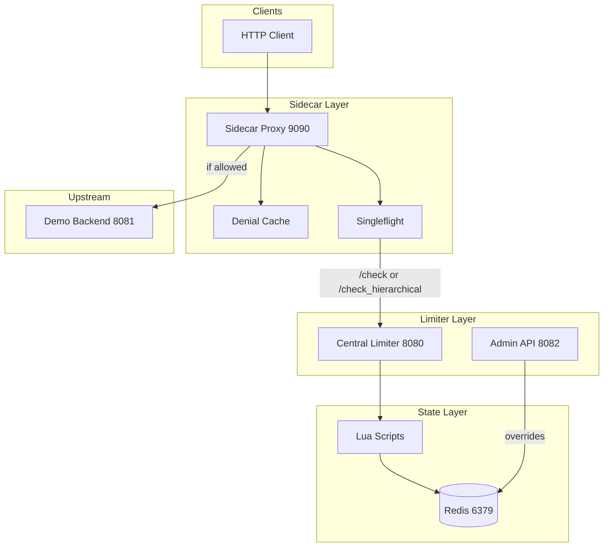
```mermaid
flowchart TB
    subgraph clients [Clients]
        C[HTTP Client]
    end

    subgraph sidecar_layer [Sidecar Layer]
        SC["Sidecar Proxy 9090"]
        CACHE[Denial Cache]
        SF[Singleflight]
    end

    subgraph limiter_layer [Limiter Layer]
        LM["Central Limiter 8080"]
        ADM["Admin API 8082"]
    end

    subgraph state [State Layer]
        RD[(Redis 6379)]
        LUA[Lua Scripts]
    end

    subgraph upstream [Upstream]
        BE["Demo Backend 8081"]
    end

    C --> SC
    SC --> CACHE
    SC --> SF
    SF -->|"/check or /check_hierarchical"| LM
    LM --> LUA
    LUA --> RD
    ADM -->|overrides| RD
    SC -->|if allowed| BE
```

### Docker Compose Topology

When you run `docker compose up`, four services start on a shared bridge network:

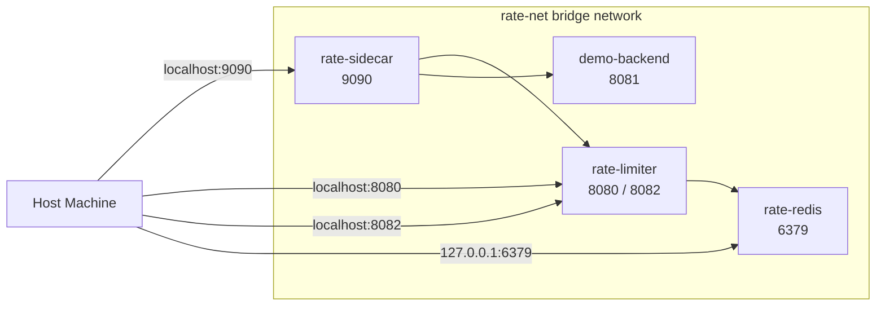
```mermaid
flowchart LR
    subgraph rate-net [rate-net bridge network]
        REDIS[rate-redis<br/>6379]
        LIMITER[rate-limiter<br/>8080 / 8082]
        DEMO[demo-backend<br/>8081]
        SIDECAR[rate-sidecar<br/>9090]
    end

    HOST[Host Machine]
    HOST -->|localhost:9090| SIDECAR
    HOST -->|localhost:8080| LIMITER
    HOST -->|localhost:8082| LIMITER
    HOST -->|127.0.0.1:6379| REDIS

    SIDECAR --> LIMITER
    SIDECAR --> DEMO
    LIMITER --> REDIS
```

| Service | Container | Port | Role |
|---------|-----------|------|------|
| Redis | `rate-redis` | 6379 | Quota state, override config, Lua execution |
| Limiter | `rate-limiter` | 8080, 8082 | Central enforcement + admin API |
| Sidecar | `rate-sidecar` | 9090 | Client-facing proxy |
| Demo | `demo-backend` | 8081 | Sample upstream API |

Prometheus and Grafana are included in `docker-compose.yml` but commented out — they pull large images and are not needed for core functionality. Config lives in `deploy/prometheus.yml` if you want to enable them.

---

## Components

### Central Limiter (`cmd/limiter/`)

This is the authoritative source of truth for all quota decisions. Sidecars call it over HTTP; they never touch Redis directly.

**What I put here:**

| File | Purpose |
|------|---------|
| `main.go` | HTTP server, route wiring, graceful shutdown |
| `config.go` | All env-driven configuration with strict-mode validation |
| `limiter.go` | `RateLimiter` interface that algorithms implement |
| `admin_api.go` | Runtime override CRUD on port 8082 |
| `ratelimit_http.go` | `Retry-After`, `X-RateLimit-*` header logic |
| `sliding_window.go` | In-memory sliding window (reference impl) |
| `token_bucket.go` | In-memory token bucket (reference impl) |

**HTTP endpoints:**

| Method | Path | Port | Auth | Description |
|--------|------|------|------|-------------|
| GET | `/health` | 8080 | None | Redis connectivity check |
| GET | `/check` | 8080 | Internal API key | Flat per-user limit check |
| GET | `/check_hierarchical` | 8080 | Internal API key | Four-level hierarchical check |
| GET | `/metrics` | 8080 | Optional API key | Prometheus scrape endpoint |
| POST/GET/DELETE | `/admin/limits/{level}/{id}` | 8082 | Admin API key | Runtime override CRUD |
| GET/DELETE | `/admin/idempotency/{scope}/{key}` | 8082 | Admin API key | Idempotency record inspect/purge |
| GET | `/admin/idempotency?user=&key=` | 8082 | Admin API key | Idempotency lookup by tenant+user |

### Sidecar Proxy (`cmd/sidecar/`)

The sidecar is what clients actually talk to. It handles identity resolution, caching, deduplication, and reverse-proxying to the upstream.

I chose a separate binary instead of middleware because:

- Any language/framework backend works without importing Go code
- The sidecar can be deployed, scaled, and restarted independently
- Cache and singleflight state stays local to each sidecar instance

### Demo Backend (`cmd/demo-backend/`)

A minimal HTTP server that returns `{"message": "Hello from backend"}`. It also exposes `POST /api/orders` with an execution counter (`GET /api/orders/count`) for idempotency demos. Replace it with your real API.

### Internal Packages (`internal/`)

| Package | Purpose |
|---------|---------|
| `auth` | API key middleware for internal and admin endpoints |
| `identity` | User ID resolution from `X-User-ID` header or query param |
| `idempotency` | Atomic claim/complete Lua scripts, fingerprinting, response capture |
| `limiter` | Redis-backed algorithms with embedded Lua scripts |
| `metrics` | Prometheus counters and histograms |
| `override` | Runtime limit override store with local TTL cache |
| `redis` | Redis client factory (pool size 100, min idle 10) |
| `telemetry` | OpenTelemetry provider, HTTP middleware, Redis tracing |

---

## Request Flows

### Allowed Request (Full Path)

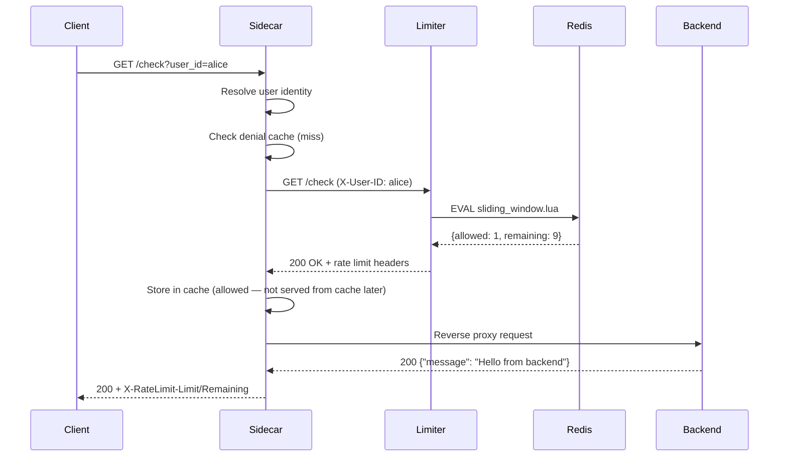
```mermaid
sequenceDiagram
    participant C as Client
    participant S as Sidecar
    participant L as Limiter
    participant R as Redis
    participant B as Backend

    C->>S: GET /check?user_id=alice
    S->>S: Resolve user identity
    S->>S: Check denial cache (miss)
    S->>L: GET /check (X-User-ID: alice)
    L->>R: EVAL sliding_window.lua
    R-->>L: {allowed: 1, remaining: 9}
    L-->>S: 200 OK + rate limit headers
    S->>S: Store in cache (allowed — not served from cache later)
    S->>B: Reverse proxy request
    B-->>S: 200 {"message": "Hello from backend"}
    S-->>C: 200 + X-RateLimit-Limit/Remaining
```

### Rejected Request (429)

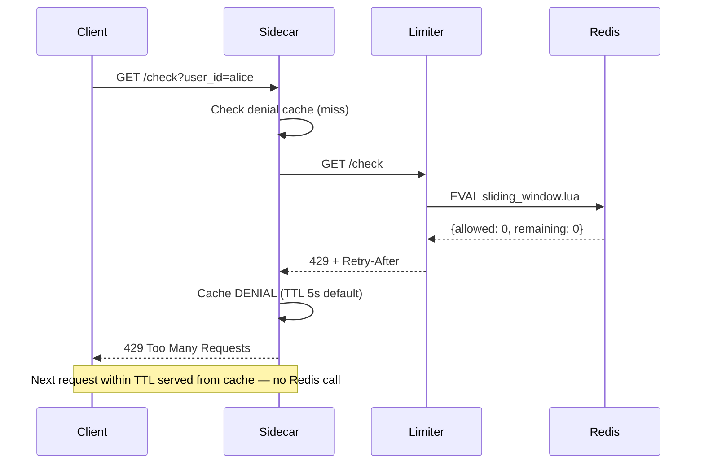
```mermaid
sequenceDiagram
    participant C as Client
    participant S as Sidecar
    participant L as Limiter
    participant R as Redis

    C->>S: GET /check?user_id=alice
    S->>S: Check denial cache (miss)
    S->>L: GET /check
    L->>R: EVAL sliding_window.lua
    R-->>L: {allowed: 0, remaining: 0}
    L-->>S: 429 + Retry-After
    S->>S: Cache DENIAL (TTL 5s default)
    S-->>C: 429 Too Many Requests

    Note over C,S: Next request within TTL served from cache — no Redis call
```

### Limiter Unavailable (503)

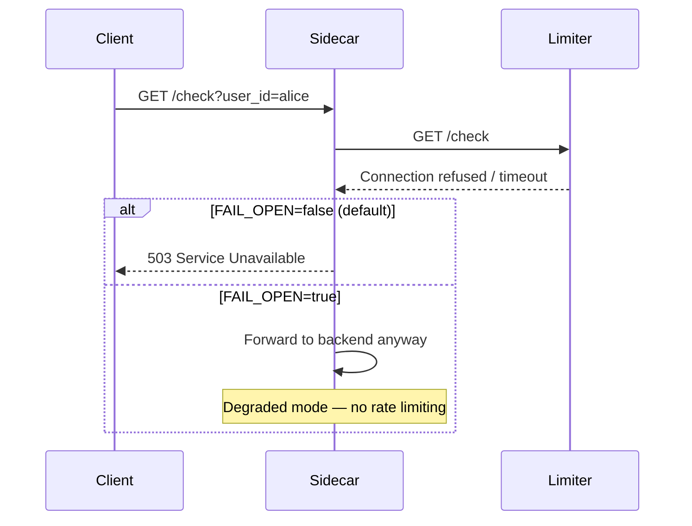
```mermaid
sequenceDiagram
    participant C as Client
    participant S as Sidecar
    participant L as Limiter

    C->>S: GET /check?user_id=alice
    S->>L: GET /check
    L-->>S: Connection refused / timeout

    alt FAIL_OPEN=false (default)
        S-->>C: 503 Service Unavailable
    else FAIL_OPEN=true
        S->>S: Forward to backend anyway
        Note over S: Degraded mode — no rate limiting
    end
```

I deliberately return **503 for infrastructure failures** and **429 for quota exhaustion**. Mixing them would let operators mistake a Redis outage for normal rate limiting.

---

## Rate Limiting Algorithms

I implemented five algorithms. Two are in-memory reference implementations; three are production Redis-backed.

### Algorithm Selection

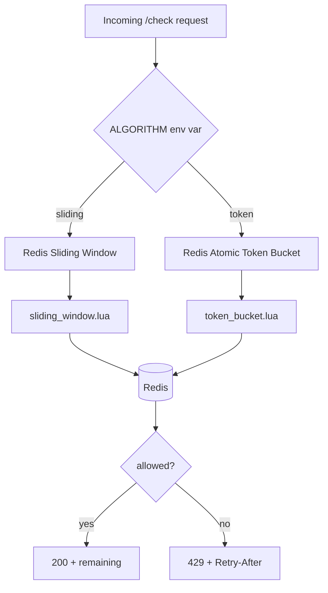
```mermaid
flowchart TD
    START[Incoming /check request] --> ALG{ALGORITHM env var}
    ALG -->|sliding| SW[Redis Sliding Window]
    ALG -->|token| TB[Redis Atomic Token Bucket]
    SW --> LUA1[sliding_window.lua]
    TB --> LUA2[token_bucket.lua]
    LUA1 --> REDIS[(Redis)]
    LUA2 --> REDIS
    REDIS --> RESULT{allowed?}
    RESULT -->|yes| OK[200 + remaining]
    RESULT -->|no| DENY[429 + Retry-After]
```

### 1. In-Memory Token Bucket (Reference)

Location: `cmd/limiter/token_bucket.go`

Used only for unit tests. Each user gets a bucket with a capacity and refill rate. Tokens refill continuously based on elapsed time.

```
Bucket (capacity=10, refill=1/sec)

Time 0:  [██████████] 10 tokens
Time 1:  [██████████] 10 tokens (refilled 1, capped at 10)
Request: [█████████ ] 9 tokens  → ALLOWED
Request: [█████████ ] 9 tokens  → ALLOWED (9 more times)
Request: [          ] 0 tokens  → DENIED
Time 2:  [█         ] 1 token   (refilled)
```

### 2. In-Memory Sliding Window (Reference)

Location: `cmd/limiter/sliding_window.go`

Stores timestamps of recent requests per user. Counts how many fall within the current window.

### 3. Redis Sliding Window (Production Default)

Location: `internal/limiter/redis_sliding_window.go` + `lua/sliding_window.lua`

Uses Redis sorted sets. Each request adds a timestamp member. Before counting, expired entries are removed.

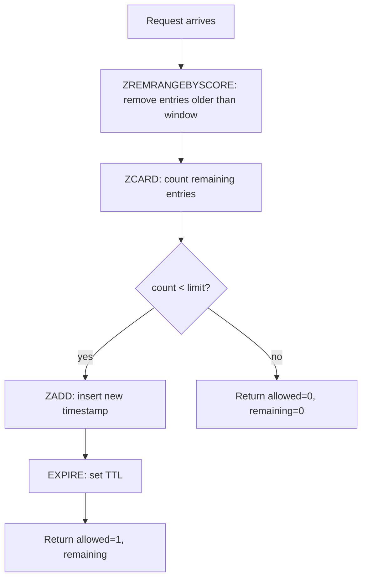
```mermaid
flowchart TD
    A[Request arrives] --> B[ZREMRANGEBYSCORE: remove entries older than window]
    B --> C[ZCARD: count remaining entries]
    C --> D{count < limit?}
    D -->|yes| E[ZADD: insert new timestamp]
    E --> F[EXPIRE: set TTL]
    F --> G[Return allowed=1, remaining]
    D -->|no| H[Return allowed=0, remaining=0]
```

**When I use this:** When I want a hard cap — "max 10 requests per 60 seconds." No smoothing, no burst beyond the window.

Docker default: `CAPACITY=10`, `WINDOW_SEC=60`.

### 4. Redis Atomic Token Bucket (Production)

Location: `internal/limiter/redis_atomic_token_bucket.go` + `lua/token_bucket.lua`

Same token bucket logic as the in-memory version, but the entire read-refill-check-write cycle runs inside a Lua script.

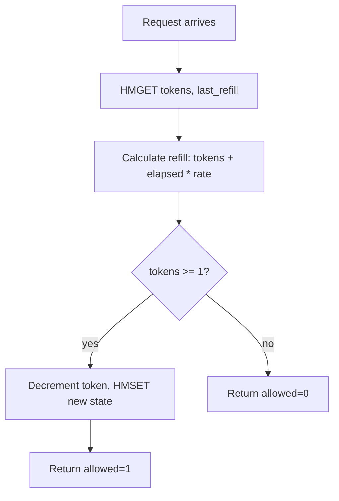
```mermaid
flowchart TD
    A[Request arrives] --> B[HMGET tokens, last_refill]
    B --> C[Calculate refill: tokens + elapsed * rate]
    C --> D{tokens >= 1?}
    D -->|yes| E[Decrement token, HMSET new state]
    E --> F[Return allowed=1]
    D -->|no| G[Return allowed=0]
```

**When I use this:** When I want smooth refill — "10 tokens, refill 1 per second." Allows bursts up to capacity, then steady rate.

Set `ALGORITHM=token` to use this.

### 5. Non-Atomic Redis Token Bucket (Intentionally Broken)

Location: `internal/limiter/redis_token_bucket.go`

This uses separate `HGET`/`HSET` calls without Lua. I keep it in the codebase as a demonstration of why atomicity matters — the race condition is visible under concurrent load. See `tests/legacy/race_demo.go`.

---

## Hierarchical Quota Enforcement

Flat per-user limits are not enough for multi-tenant systems. I built a four-level hierarchy where a request must pass every level to be allowed.

### Hierarchy Structure

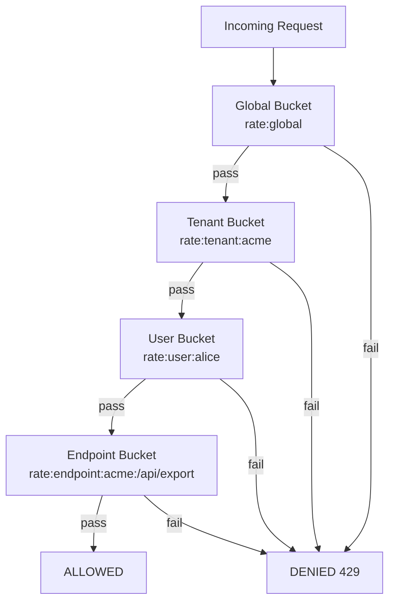
```mermaid
flowchart TD
    REQ[Incoming Request] --> G[Global Bucket<br/>rate:global]
    G -->|pass| T[Tenant Bucket<br/>rate:tenant:acme]
    T -->|pass| U[User Bucket<br/>rate:user:alice]
    U -->|pass| E[Endpoint Bucket<br/>rate:endpoint:acme:/api/export]
    E -->|pass| OK[ALLOWED]
    G -->|fail| DENY[DENIED 429]
    T -->|fail| DENY
    U -->|fail| DENY
    E -->|fail| DENY
```

### How the Lua Script Works

All four levels are checked and decremented in a single atomic Lua call (`lua/hierarchical.lua`):

```
Phase 1: For each level (global → tenant → user → endpoint)
  1. Read current tokens and last_refill from Redis hash
  2. Refill: tokens = min(capacity, tokens + elapsed * refill_rate)
  3. If tokens < 1 after refill → mark as denied
  4. Write refilled state back

Phase 2: If ALL levels passed
  - Decrement each level by 1
  - Return remaining = min(all levels) - 1

If ANY level failed
  - Do NOT decrement any level
  - Return allowed=0
```

This prevents partial commits — you cannot consume a user token if the tenant bucket is empty.

### Default Capacities (docker-compose)

| Level | Redis Key Pattern | Capacity | Refill Rate |
|-------|-------------------|----------|-------------|
| Global | `rate:global` | 1,000,000 | 10,000/sec |
| Tenant | `rate:tenant:{id}` | 100,000 | 1,000/sec |
| User | `rate:user:{id}` | 100 | 1/sec |
| Endpoint | `rate:endpoint:{tenant}:{path}` | 10 | 0.5/sec |

Enable with `USE_HIERARCHICAL=true` on the sidecar (calls `/check_hierarchical`) or `ENABLE_HIERARCHICAL=true` on the limiter.

---

## Sidecar Proxy

The sidecar is the most opinionated part of the design. Here is what I built and why.

### Denial-Only Cache

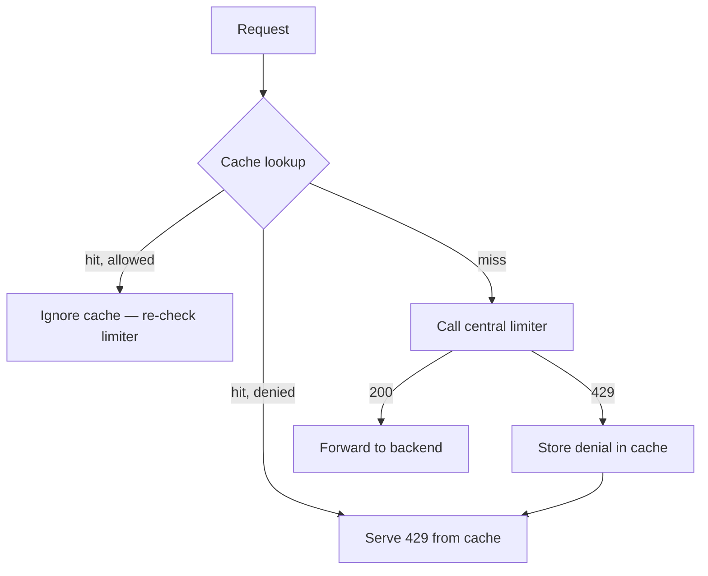
```mermaid
flowchart TD
    REQ[Request] --> CACHE{Cache lookup}
    CACHE -->|hit, denied| SERVE429[Serve 429 from cache]
    CACHE -->|hit, allowed| IGNORE[Ignore cache — re-check limiter]
    CACHE -->|miss| LIMITER[Call central limiter]
    LIMITER -->|429| STORE_DENY[Store denial in cache]
    LIMITER -->|200| PROXY[Forward to backend]
    STORE_DENY --> SERVE429
```

I only cache denials because:

- Denials are stable — if you are over quota, you stay over quota for a few seconds
- Allowances are not stable — caching "allowed" would let users bypass quota entirely
- Under abuse (millions of 429s), caching denials protects Redis from repeated identical checks

Default cache TTL: 5 seconds (configurable via sidecar env).

### Singleflight Deduplication

When 100 goroutines hit the sidecar for the same user simultaneously, without singleflight that is 100 Redis round-trips. With `golang.org/x/sync/singleflight`, they collapse into one:

```
100 concurrent requests for user "alice"
  → 1 limiter call
  → 99 waiters share the result
```

This matters under flash traffic and hot-key scenarios.

### Path Allowlist

The sidecar only proxies paths matching `ALLOWED_PATHS` (default: `/`). Everything else gets 404. This prevents the sidecar from accidentally becoming an open proxy.

---

## Idempotency Layer

I added a Stripe-style idempotency layer on the sidecar so client retries never double-execute upstream work or burn quota twice. State lives in Redis and every claim runs through atomic Lua — the same correctness model as the rate limiter.

### Why Sidecar, Not the App?

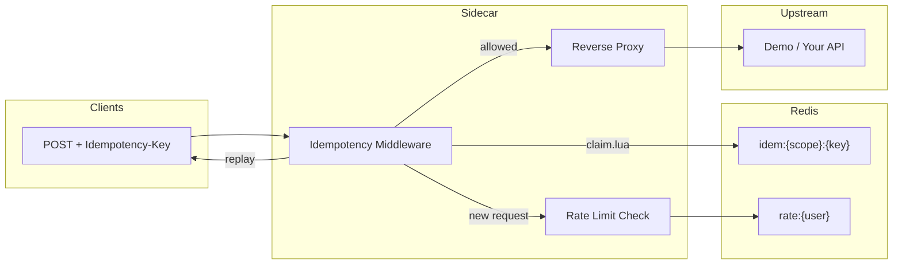
```mermaid
flowchart LR
    subgraph clients [Clients]
        C[POST + Idempotency-Key]
    end

    subgraph sidecar [Sidecar]
        IDEM[Idempotency Middleware]
        RL[Rate Limit Check]
        PX[Reverse Proxy]
    end

    subgraph state [Redis]
        IDK["idem:{scope}:{key}"]
        RATE["rate:{user}"]
    end

    subgraph upstream [Upstream]
        API[Demo / Your API]
    end

    C --> IDEM
    IDEM -->|claim.lua| IDK
    IDEM -->|new request| RL
    RL --> RATE
    IDEM -->|allowed| PX
    PX --> API
    IDEM -->|replay| C
```

The backend stays unchanged. Any sidecar in the fleet shares the same Redis idempotency state, so retries hit any instance and still get the cached response.

### Request State Machine

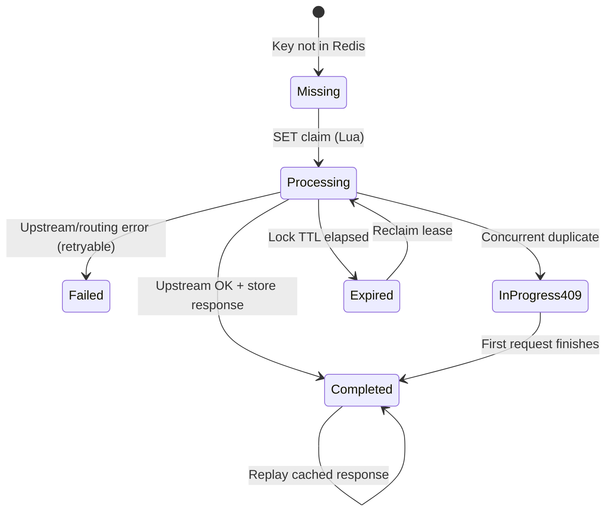
```mermaid
stateDiagram-v2
    [*] --> Missing: Key not in Redis
    Missing --> Processing: SET claim (Lua)
    Processing --> Completed: Upstream OK + store response
    Processing --> Failed: Upstream/routing error (retryable)
    Processing --> InProgress409: Concurrent duplicate
    Processing --> Expired: Lock TTL elapsed
    Expired --> Processing: Reclaim lease
    Completed --> Completed: Replay cached response
    InProgress409 --> Completed: First request finishes
```

### Client Contract

Send `Idempotency-Key` on `POST`, `PUT`, or `PATCH`:

```http
POST /api/orders HTTP/1.1
Idempotency-Key: pay_7f3a9c2e-4b11
X-User-ID: alice
X-Tenant-ID: acme
Content-Type: application/json

{"amount": 1000, "currency": "INR"}
```

| Outcome | HTTP | `X-Idempotency-Status` | Upstream Called? | Quota Consumed? |
|---------|------|------------------------|------------------|-----------------|
| First request | upstream status | `created` | Yes | Yes |
| Duplicate (completed) | cached status | `replayed` | No | No |
| In progress | `409 Conflict` | `in_progress` | No | No |
| Same key, different body | `422` | `hash_mismatch` | No | No |

Request bodies are fingerprinted with `SHA256(method + path + sorted_query + body)` so a key cannot be reused with a different payload (including differing query strings).

### Fencing Tokens (Lease Safety)

Each claim assigns a **fence token** stored in Redis. Only the holder of the matching token may call `complete` or `fail`. If a processing lease expires and another worker reclaims the key, the stale worker's completion is rejected — preventing duplicate payment execution after ownership transfer.

```
Worker A claims key     → fence_token = A
Lease expires
Worker B reclaims key   → fence_token = B
Worker A completes      → rejected (stale fence)
Worker B completes      → accepted
```

### Redis Schema

```
idem:{scope}:{key}        # HASH — status, hash, headers, metadata
idem:body:{scope}:{key}   # STRING — response body when > 64 KB
scope = SHA256(tenant|user)[:32]
```

| Field | Description |
|-------|-------------|
| `status` | `processing` \| `completed` |
| `request_hash` | Fingerprint of method + path + body |
| `http_status` | Cached response code |
| `resp_headers` | JSON (whitelisted headers only) |
| `lock_until` | Processing lease deadline (ms) |

| TTL Phase | Default | Purpose |
|-----------|---------|---------|
| Processing lock | 60s | Recover if worker crashes mid-request |
| Completed record | 24h | Client retry window (Stripe-style) |

### 100-Way Race Handling

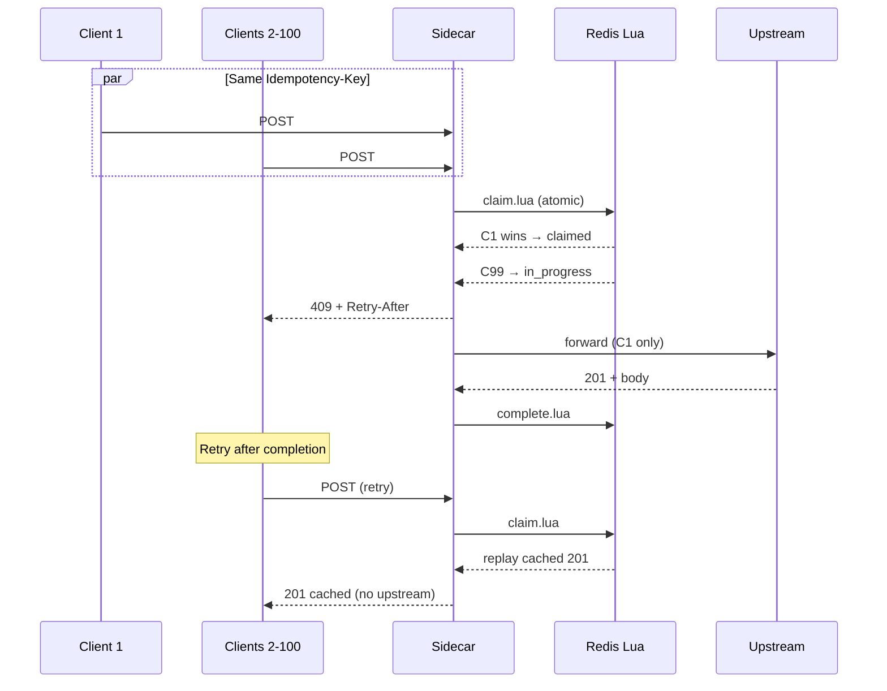
```mermaid
sequenceDiagram
    participant C1 as Client 1
    participant C99 as Clients 2-100
    participant SC as Sidecar
    participant R as Redis Lua
    participant U as Upstream

    par Same Idempotency-Key
        C1->>SC: POST
        C99->>SC: POST
    end
    SC->>R: claim.lua (atomic)
    R-->>SC: C1 wins → claimed
    R-->>SC: C99 → in_progress
    SC-->>C99: 409 + Retry-After
    SC->>U: forward (C1 only)
    U-->>SC: 201 + body
    SC->>R: complete.lua
    Note over C99: Retry after completion
    C99->>SC: POST (retry)
    SC->>R: claim.lua
    R-->>SC: replay cached 201
    SC-->>C99: 201 cached (no upstream)
```

### Example

```bash
# First call — upstream executes once
curl -X POST http://localhost:9090/api/orders \
  -H "Content-Type: application/json" \
  -H "X-User-ID: alice" \
  -H "Idempotency-Key: pay-001" \
  -d '{"amount": 1000}'

# Duplicate — replayed from Redis (check execution count stays at 1)
curl -X POST http://localhost:9090/api/orders \
  -H "Content-Type: application/json" \
  -H "X-User-ID: alice" \
  -H "Idempotency-Key: pay-001" \
  -d '{"amount": 1000}'

curl http://localhost:8081/api/orders/count
```

### Sidecar Environment

| Variable | Default | Description |
|----------|---------|-------------|
| `ENABLE_IDEMPOTENCY` | `false` | Turn on idempotency middleware |
| `REDIS_ADDR` | — | Required when idempotency enabled |
| `IDEMPOTENCY_LOCK_TTL_MS` | `60000` | Processing lease |
| `IDEMPOTENCY_COMPLETED_TTL_MS` | `86400000` | 24h retention |
| `IDEMPOTENCY_FAIL_OPEN` | `false` | Redis down → proceed without dedup |

Docker Compose enables idempotency by default on the sidecar.

See `internal/idempotency/` and `benchmarks/idempotency/summary.md` for implementation and benchmark details.

---

## Distributed Circuit Breaker

Production-grade three-state circuit breaker protecting Redis, the central limiter, and payment gateways. State is shared in Redis so every sidecar and limiter instance sees the same health picture.

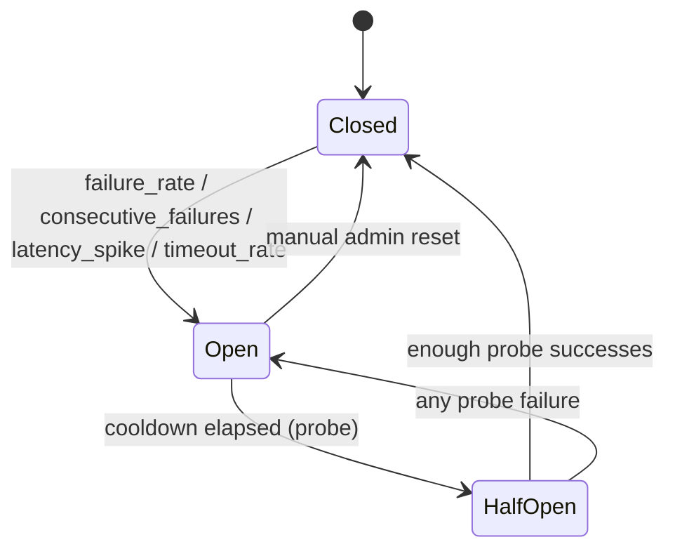
```mermaid
stateDiagram-v2
    [*] --> Closed
    Closed --> Open: failure_rate / consecutive_failures / latency_spike / timeout_rate
    Open --> HalfOpen: cooldown elapsed (probe)
    HalfOpen --> Closed: enough probe successes
    HalfOpen --> Open: any probe failure
    Open --> Closed: manual admin reset
```

### State Machine

| State | Traffic | Behavior |
|-------|---------|----------|
| **Closed** | Normal | Track failure rate, timeouts, latency EMA |
| **Open** | Blocked | Fast-fail; no upstream/Redis calls |
| **Half-Open** | Probe only | Limited requests test recovery |

### Trip Conditions (Closed → Open)

Any of:

- Rolling **failure rate** ≥ `CB_FAILURE_RATE` (after `CB_MIN_SAMPLES`)
- **Consecutive failures** ≥ `CB_CONSECUTIVE_FAILURES`
- **Latency spike** — request latency and EMA both ≥ `CB_LATENCY_THRESHOLD_MS`
- **Timeout rate** ≥ `CB_TIMEOUT_RATE`

### Recovery (Open → Half-Open → Closed)

1. After `CB_OPEN_COOLDOWN_MS`, the next `Allow()` transitions to **half-open**
2. Up to `CB_HALF_OPEN_MAX_PROBES` probe requests permitted
3. `CB_HALF_OPEN_SUCCESS_REQUIRED` successes → **closed**
4. Any probe failure → **open** again

### Redis Schema

```
cb:{target}                    HASH
  state                        closed | open | half_open
  success_count, failure_count, timeout_count, latency_spike_count
  total_count, consecutive_failures
  latency_ema_ms
  opened_at, half_open_at
  half_open_calls, half_open_successes
  updated_at
```

**Targets:** `redis` (limiter→Redis), `central-limiter` (sidecar→limiter), `gateway-a|b|c` (routing)

### Integration Points

| Component | Target | When |
|-----------|--------|------|
| Limiter `/check` | `redis` | Before/after Redis Lua |
| Sidecar | `central-limiter` | Before/after limiter HTTP |
| Gateway router | `gateway-{id}` | Before/after upstream call |

### Environment Variables

| Variable | Default | Description |
|----------|---------|-------------|
| `CB_FAILURE_RATE` | `0.5` | Open above this failure rate |
| `CB_MIN_SAMPLES` | `10` | Min samples before rate-based trip |
| `CB_CONSECUTIVE_FAILURES` | `5` | Trip after N failures in a row |
| `CB_LATENCY_THRESHOLD_MS` | `500` | Latency spike threshold |
| `CB_TIMEOUT_RATE` | `0.3` | Open above this timeout rate |
| `CB_OPEN_COOLDOWN_MS` | `30000` | Wait before half-open probes |
| `CB_HALF_OPEN_MAX_PROBES` | `3` | Max concurrent probes |
| `CB_HALF_OPEN_SUCCESS_REQUIRED` | `2` | Successes needed to close |
| `CB_EMA_ALPHA` | `0.2` | Latency EMA smoothing |
| `CIRCUIT_FAIL_OPEN` | `false` | When `true`, Redis errors on Allow bypass the breaker (dangerous) |
| `ENABLE_CIRCUIT_BREAKER` | `true` | Sidecar limiter CB (needs `REDIS_ADDR`) |

### Observability

| Metric | Labels | Description |
|--------|--------|-------------|
| `circuit_breaker_state` | `target` | 0=closed, 1=open, 2=half_open |
| `circuit_breaker_transitions_total` | `target, from, to` | State changes |
| `circuit_breaker_rejections_total` | `target, state` | Fast-fail count |
| `circuit_breaker_outcomes_total` | `target, outcome` | success/failure/timeout/latency_spike |
| `circuit_breaker_failure_rate` | `target` | Rolling failure ratio |
| `circuit_breaker_latency_ema_ms` | `target` | Latency EMA |
| `circuit_breaker_redis_duration_seconds` | — | Lua latency histogram |

### Admin API

```bash
# List all circuits
curl -H "X-API-Key: $ADMIN_API_KEY" http://localhost:8082/admin/circuit

# Inspect one target
curl -H "X-API-Key: $ADMIN_API_KEY" http://localhost:8082/admin/circuit/redis

# Force close (ops recovery)
curl -X DELETE -H "X-API-Key: $ADMIN_API_KEY" http://localhost:8082/admin/circuit/gateway-c
```

### Production Tradeoffs

| Choice | Benefit | Cost |
|--------|---------|------|
| **Redis-backed state** | Consistent across fleet | Extra Redis round-trip per Allow/Record |
| **Lua atomicity** | No race on transitions | Script maintenance |
| **Half-open probes** | Gradual recovery | Brief risk window on flaky deps |
| **Fail-closed default** | Outage does not amplify traffic | Set `CIRCUIT_FAIL_OPEN=true` only for dev |
| **Sliding window decay** | Adapts to changing traffic | Can delay trip on intermittent errors |
| **Separate targets** | Isolated blast radius | More keys to monitor |

See `internal/circuitbreaker/` and `benchmarks/circuitbreaker/summary.md`.

---

## Redis Sentinel High Availability

Automatic failover for Redis using Sentinel quorum, master election, replica promotion, and go-redis `FailoverClient` reconnection.

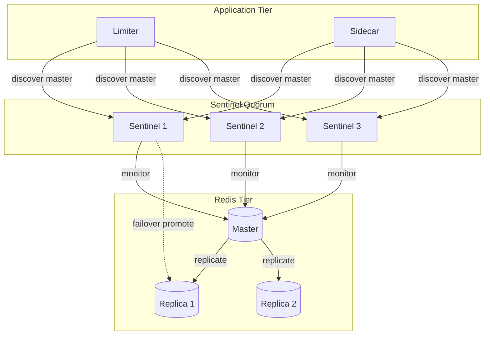
```mermaid
flowchart TB
    subgraph apps [Application Tier]
        L[Limiter]
        SC[Sidecar]
    end

    subgraph sentinel [Sentinel Quorum]
        S1[Sentinel 1]
        S2[Sentinel 2]
        S3[Sentinel 3]
    end

    subgraph redis [Redis Tier]
        M[(Master)]
        R1[(Replica 1)]
        R2[(Replica 2)]
    end

    L & SC -->|discover master| S1 & S2 & S3
    S1 & S2 & S3 -->|monitor| M
    M -->|replicate| R1 & R2
    S1 -.->|failover promote| R1
```

### Failure & Recovery Flow

| Step | What happens |
|------|----------------|
| 1. Detection | Sentinels mark master down after `down-after-milliseconds` (5s) |
| 2. Election | Quorum (2/3) elects a leader sentinel |
| 3. Promotion | Best replica promoted to master |
| 4. Client | `FailoverClient` queries Sentinels, reconnects to new master |
| 5. Recovery | Old master rejoins as replica when restarted |

### Docker HA Stack

```bash
# Dev (single Redis)
docker compose up --build

# Production-like Sentinel HA
docker compose -f docker-compose.yml -f docker-compose.ha.yml --profile ha up --build
```

### Environment Variables

| Variable | Default | Description |
|----------|---------|-------------|
| `REDIS_MODE` | `standalone` | `standalone` or `sentinel` |
| `REDIS_ADDR` | `localhost:6379` | Standalone address |
| `REDIS_MASTER_NAME` | `mymaster` | Sentinel master name |
| `REDIS_SENTINEL_ADDRS` | — | Comma-separated sentinel hosts |
| `REDIS_PASSWORD` | — | Master/replica password |
| `REDIS_SENTINEL_PASSWORD` | same as password | Sentinel auth |

### Health & Observability

`GET /health` returns Redis role and replication:

```json
{
  "status": "healthy",
  "redis": {
    "mode": "sentinel",
    "connected": true,
    "role": "master",
    "replication": "role=master slaves=2"
  }
}
```

Metrics: `redis_failover_reconnects_total`

See `deploy/redis/`, `internal/redis/`, `benchmarks/sentinel/summary.md`.

### Operational Tradeoffs

| Choice | Benefit | Cost |
|--------|---------|------|
| **Sentinel (3+)** | Automatic failover, no K8s required | Extra processes to operate |
| **2 replicas** | Read scaling + failover candidates | Memory ×3 |
| **AOF everysec** | Durability with low overhead | Sub-second data loss window on crash |
| **FailoverClient** | Transparent reconnect | Brief write unavailability during election |

---

## Audit Trail

Immutable log of every rate-limit decision for compliance, debugging, and replay analysis.

### Stored Fields

| Field | Description |
|-------|-------------|
| `request_id` | `X-Request-ID` correlation |
| `tenant_id` | `X-Tenant-ID` or `default` |
| `user_id` | Authenticated user |
| `decision` | `allowed`, `denied`, `error` |
| `reason` | Human-readable cause |
| `handler` | `check` or `hierarchical` |
| `timestamp_ms` | Unix epoch ms |

### Redis Schema

```
audit:event:{id}           HASH — full event payload
audit:idx:ts               ZSET — global time index
audit:idx:tenant:{tenant}  ZSET — per-tenant index
audit:idx:user:{user}      ZSET — per-user index
audit:idx:req:{request_id} STRING — latest event for request
```

Retention: `AUDIT_RETENTION_HOURS` (default 168h) + `AUDIT_MAX_EVENTS` cap with Lua trim.

### Admin API (`:8082`)

```bash
# Search with filters
curl -H "X-API-Key: $ADMIN_API_KEY" \
  "http://localhost:8082/admin/audit?tenant_id=default&decision=denied&limit=50"

# Get one event
curl -H "X-API-Key: $ADMIN_API_KEY" http://localhost:8082/admin/audit/{id}

# Replay / forensic payload
curl -H "X-API-Key: $ADMIN_API_KEY" \
  "http://localhost:8082/admin/audit/replay?id={id}"

# Index stats
curl -H "X-API-Key: $ADMIN_API_KEY" http://localhost:8082/admin/audit/stats
```

### Observability

| Metric | Description |
|--------|-------------|
| `audit_events_total{decision,handler}` | Recorded decisions |
| `audit_append_duration_seconds` | Write latency |
| `audit_search_duration_seconds` | Query latency |

### Scalability Considerations

| Aspect | Approach |
|--------|----------|
| **Write path** | Bounded worker pool (default 4 workers, 4096 queue) — no per-event goroutines |
| **Indexes** | ZSET per dimension — O(log N) range queries; trim purges all indexes |
| **Retention** | TTL on events + ZSET trim in Lua |
| **Cardinality** | Per-tenant/user indexes grow with tenants — shard by tenant prefix at scale |
| **Replay** | Returns stored decision + hint; does not re-execute Lua |

Env: `ENABLE_AUDIT_TRAIL`, `AUDIT_RETENTION_HOURS`, `AUDIT_MAX_EVENTS`, `AUDIT_ASYNC`, `AUDIT_QUEUE_SIZE`, `AUDIT_WORKERS`

See `internal/audit/` and `benchmarks/audit/summary.md`.

---

## Intelligent Traffic Routing

Juspay-style payment gateway routing: the sidecar continuously scores Gateway A/B/C on latency, error rate, and health, then routes traffic with weighted selection and automatic failover.

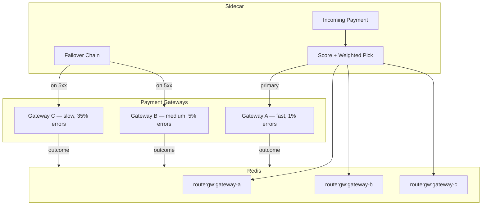
```mermaid
flowchart TB
    subgraph sidecar [Sidecar]
        RQ[Incoming Payment]
        SEL[Score + Weighted Pick]
        FO[Failover Chain]
    end

    subgraph redis [Redis]
        GA["route:gw:gateway-a"]
        GB["route:gw:gateway-b"]
        GC["route:gw:gateway-c"]
    end

    subgraph gateways [Payment Gateways]
        A[Gateway A — fast, 1% errors]
        B[Gateway B — medium, 5% errors]
        C[Gateway C — slow, 35% errors]
    end

    RQ --> SEL
    SEL --> GA & GB & GC
    SEL -->|primary| A
    FO -->|on 5xx| B
    FO -->|on 5xx| C
    A & B & C -->|outcome| redis
```

### Routing Algorithm

1. **Collect** — every upstream response records latency + success/failure in Redis (Lua atomic)
2. **Score** — composite routing score per gateway
3. **Select** — weighted random among healthy gateways
4. **Failover** — on 5xx/timeout, try next-highest score (up to `ROUTING_MAX_FAILOVER_TRIES`)
5. **Circuit break** — three-state breaker (`closed`/`open`/`half_open`) via `internal/circuitbreaker`

### Scoring Model

```
routing_score = weight × latency_factor × health_factor × error_factor

latency_factor = min(2.0, target_latency_ms / latency_ema_ms)
health_factor  = health_score / 100
error_factor   = max(0.05, 1 - error_rate × 2.0)
```

| Signal | Source | Effect |
|--------|--------|--------|
| Latency EMA | Per-request measurement | Faster gateways score higher |
| Error rate | Sliding window in Redis | High errors reduce score; circuit breaker trips separately |
| Health score | Computed 0–100 | Below 20 → excluded |
| Static weight | Config | Merchant/PG preference |

### Redis Schema

```
route:index                    SET of gateway IDs
route:gw:{id}                  HASH
  id, url, weight, enabled
  latency_ema_ms, success_count, error_count
  health_score, updated_at, total_requests

cb:{gateway-id}                HASH (circuit breaker — see Circuit Breaker section)
```

### Example

```bash
# Route payment (sidecar picks best gateway)
curl -X POST http://localhost:9090/api/payments \
  -H "Content-Type: application/json" \
  -H "X-User-ID: merchant-1" \
  -d '{"amount": 500}'

# Response headers:
# X-Gateway-ID: gateway-a
# X-Gateway-Score: 142.50
# X-Gateway-Failover: true   (if failover occurred)

# Admin: view live scores
curl http://localhost:8082/admin/routing/gateways \
  -H "X-API-Key: dev-key-change-in-prod"
```

### Environment

| Variable | Default | Description |
|----------|---------|-------------|
| `ENABLE_ROUTING` | `false` | Enable intelligent routing |
| `GATEWAYS` | — | `id\|url\|weight,...` |
| `ROUTING_TARGET_LATENCY_MS` | `100` | Latency target for scoring |
| `ROUTING_CIRCUIT_ERROR_RATE` | `0.5` | Open circuit above this error rate |
| `ROUTING_CIRCUIT_MIN_SAMPLES` | `10` | Min samples before circuit trips |
| `ROUTING_PROBE_INTERVAL_SEC` | `15` | Background health probe interval |

Docker Compose runs `gateway-a`, `gateway-b`, `gateway-c` simulators with routing enabled.

See `internal/routing/` and `benchmarks/routing/summary.md`.

---

## Admin API and Runtime Overrides

I separated the admin API onto port 8082 so it can be network-isolated from the hot `/check` path in production.

### Override Flow

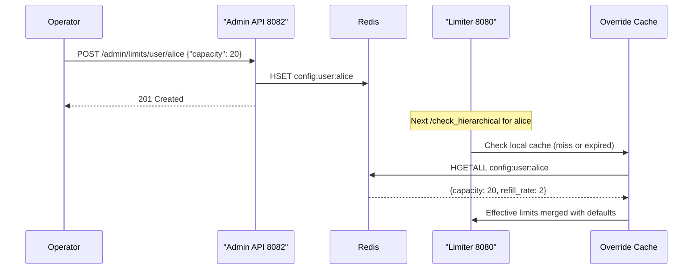
```mermaid
sequenceDiagram
    participant OP as Operator
    participant ADM as "Admin API 8082"
    participant R as Redis
    participant L as "Limiter 8080"
    participant S as Override Cache

    OP->>ADM: POST /admin/limits/user/alice {"capacity": 20}
    ADM->>R: HSET config:user:alice
    ADM-->>OP: 201 Created

    Note over L: Next /check_hierarchical for alice
    L->>S: Check local cache (miss or expired)
    S->>R: HGETALL config:user:alice
    R-->>S: {capacity: 20, refill_rate: 2}
    S->>L: Effective limits merged with defaults
```

### Supported Override Levels

| Level | Path | Example |
|-------|------|---------|
| Global | `/admin/limits/global/default` | Platform-wide cap change |
| Tenant | `/admin/limits/tenant/{id}` | Bump quota for customer "acme" |
| User | `/admin/limits/user/{id}` | Unblock a specific user |
| Endpoint | `/admin/limits/endpoint/{tenant\|path}` | Restrict expensive endpoint |

Override cache TTL defaults to 5 seconds (`OVERRIDE_CACHE_TTL_MS=5000`). Changes propagate within seconds, not instantly — a deliberate trade-off to avoid hammering Redis on every check.

### Example Commands

```bash
# Give alice a higher limit
curl -X POST http://localhost:8082/admin/limits/user/alice \
  -H "X-API-Key: dev-key-change-in-prod" \
  -H "Content-Type: application/json" \
  -d '{"capacity": 20, "refill_rate": 2}'

# Read current override
curl http://localhost:8082/admin/limits/user/alice \
  -H "X-API-Key: dev-key-change-in-prod"

# Remove override (revert to defaults)
curl -X DELETE http://localhost:8082/admin/limits/user/alice \
  -H "X-API-Key: dev-key-change-in-prod"
```

### Idempotency Admin (Debug)

Read-only inspection and manual purge of stuck keys. Uses the same `X-API-Key` as limit overrides.

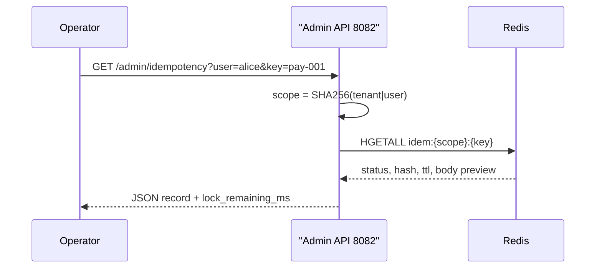
```mermaid
sequenceDiagram
    participant OP as Operator
    participant ADM as "Admin API 8082"
    participant R as Redis

    OP->>ADM: GET /admin/idempotency?user=alice&key=pay-001
    ADM->>ADM: scope = SHA256(tenant|user)
    ADM->>R: HGETALL idem:{scope}:{key}
    R-->>ADM: status, hash, ttl, body preview
    ADM-->>OP: JSON record + lock_remaining_ms
```

| Method | Path | Description |
|--------|------|-------------|
| GET | `/admin/idempotency?user={id}&key={key}&tenant={id}` | Lookup by tenant + user (scope computed) |
| GET | `/admin/idempotency/{scope}/{key}` | Direct lookup by Redis scope |
| DELETE | `/admin/idempotency/{scope}/{key}` | Purge stuck processing key |

```bash
# Lookup by user (tenant defaults to "default")
curl "http://localhost:8082/admin/idempotency?user=alice&key=pay-001" \
  -H "X-API-Key: dev-key-change-in-prod"

# Direct scope lookup
curl http://localhost:8082/admin/idempotency/{scope}/pay-001 \
  -H "X-API-Key: dev-key-change-in-prod"

# Delete stuck key (ops recovery)
curl -X DELETE http://localhost:8082/admin/idempotency/{scope}/pay-001 \
  -H "X-API-Key: dev-key-change-in-prod"
```

---

## Security Model

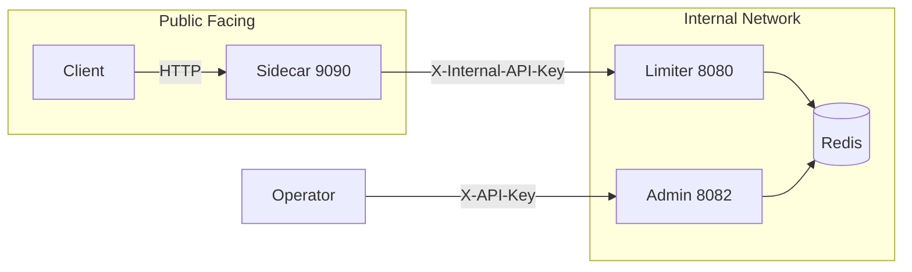
```mermaid
flowchart LR
    subgraph public [Public Facing]
        CLIENT[Client]
        SIDECAR["Sidecar 9090"]
    end

    subgraph internal [Internal Network]
        LIMITER["Limiter 8080"]
        ADMIN["Admin 8082"]
        REDIS[(Redis)]
    end

    CLIENT -->|HTTP| SIDECAR
    SIDECAR -->|X-Internal-API-Key| LIMITER
    OP[Operator] -->|X-API-Key| ADMIN
    LIMITER --> REDIS
    ADMIN --> REDIS
```

| Control | Env Variable | Default | Purpose |
|---------|-------------|---------|---------|
| Internal API key | `INTERNAL_API_KEY` | empty (dev warning) | Protects `/check` endpoints |
| Admin API key | `ADMIN_API_KEY` | `dev-key-change-in-prod` | Protects override CRUD |
| Metrics auth | `METRICS_REQUIRE_AUTH` | `false` | Lock down `/metrics` |
| Strict security | `STRICT_SECURITY` | `false` | Fail startup without internal key |
| Query user ID | `ALLOW_QUERY_USER_ID` | `false` | Allow `?user_id=` (dev only) |
| TLS | `TLS_CERT_FILE`, `TLS_KEY_FILE` | empty | Enable HTTPS |

**Identity resolution:** In this demo, `X-User-ID` is accepted from the client for simplicity. **In production, identity must be derived from verified JWT claims** (or equivalent mTLS/service identity) at an upstream auth gateway — never trust client-supplied user headers on a payment path. Query string `user_id` is opt-in for local testing only and can be spoofed.

### Production Hardening Checklist

| Concern | Demo behavior | Production expectation |
|---------|---------------|------------------------|
| **User identity** | `X-User-ID` header from client | JWT validated upstream; sidecar receives trusted identity |
| **Admin API (`:8082`)** | Exposed in docker-compose | Bind to internal network only (VPC, loopback, or mesh); never public internet |
| **Circuit breaker** | Fail-closed on Redis errors | Opt into `CIRCUIT_FAIL_OPEN=true` only in dev |
| **Gateway routing** | Unknown circuit state → non-selectable | Traffic not routed to nodes with unreadable breaker state |

The admin port (`8082`) carries override CRUD, idempotency purge, circuit reset, and audit search. Treat it like a control plane: firewall, private subnet, and separate API key rotation — full RBAC is out of scope for this project but network isolation is not optional in production.

---

## Observability

### Prometheus Metrics

I intentionally kept label cardinality low. No per-user labels — that would OOM Prometheus under real traffic.

| Metric | Type | Labels |
|--------|------|--------|
| `rate_limiter_requests_total` | Counter | `handler`, `allowed` |
| `rate_limiter_requests_duration_seconds` | Histogram | `handler` |
| `rate_limiter_redis_duration_seconds` | Histogram | — |
| `rate_limiter_sidecar_cache_hits_total` | Counter | — |
| `rate_limiter_sidecar_cache_misses_total` | Counter | — |
| `idempotency_claims_total` | Counter | `result` (claimed, replay, in_progress, hash_mismatch, error) |
| `idempotency_completes_total` | Counter | — |
| `idempotency_redis_duration_seconds` | Histogram | — |
| `routing_decisions_total` | Counter | `gateway`, `failover` |
| `routing_outcomes_total` | Counter | `gateway`, `result` |
| `routing_gateway_health_score` | Gauge | `gateway` |
| `routing_failovers_total` | Counter | `gateway` |

Scrape endpoints:
- Limiter: `http://localhost:8080/metrics`
- Sidecar: `http://localhost:9090/metrics`

Prometheus config: `deploy/prometheus.yml`

### Health Checks

```bash
# Limiter health (checks Redis connectivity)
curl http://localhost:8080/health
# {"status":"healthy"} or 503 {"status":"unhealthy"}

# Sidecar health (checks limiter reachability)
curl http://localhost:9090/health
```

Docker Compose runs health checks on Redis and the limiter. The sidecar waits for the limiter to be healthy before starting.

### OpenTelemetry Tracing

Distributed traces flow across the full request path and export to Jaeger via OTLP HTTP.

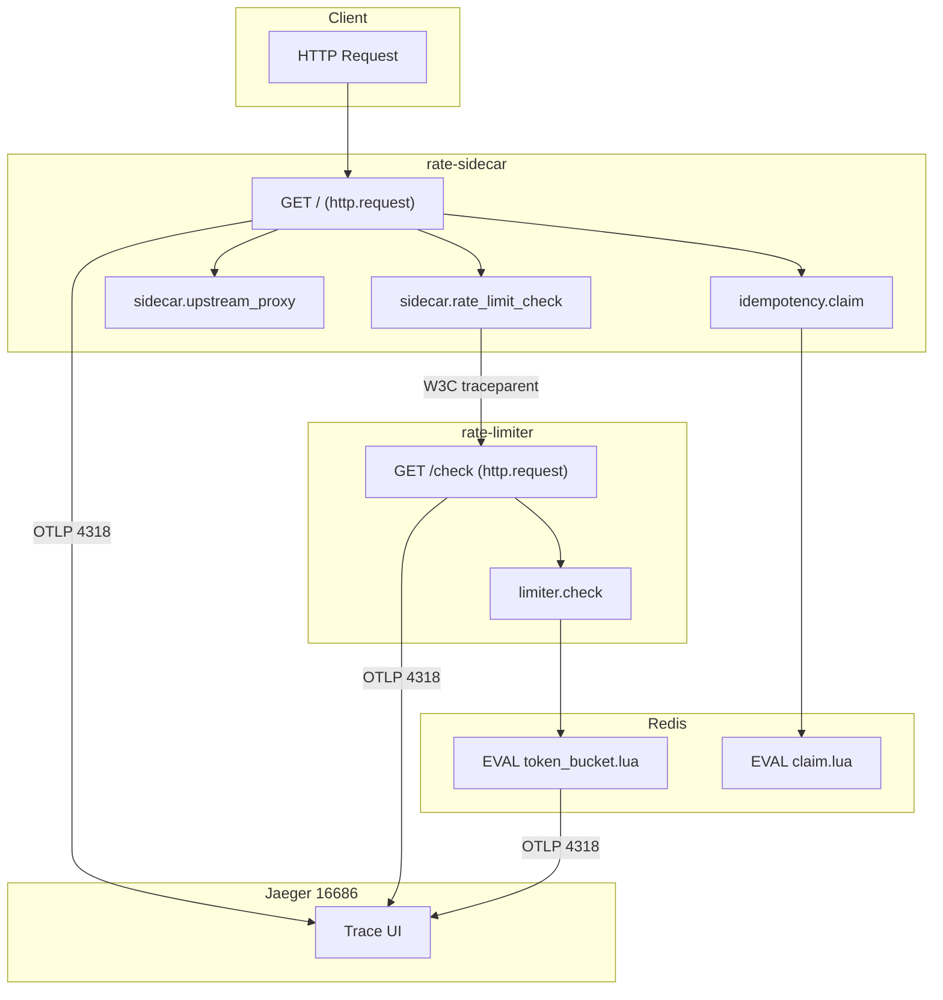
```mermaid
flowchart TB
    subgraph client [Client]
        C[HTTP Request]
    end

    subgraph sidecar [rate-sidecar]
        S1["GET / (http.request)"]
        S2[sidecar.rate_limit_check]
        S3[sidecar.upstream_proxy]
        S4[idempotency.claim]
    end

    subgraph limiter [rate-limiter]
        L1["GET /check (http.request)"]
        L2[limiter.check]
    end

    subgraph redis [Redis]
        R1["EVAL token_bucket.lua"]
        R2["EVAL claim.lua"]
    end

    subgraph jaeger ["Jaeger 16686"]
        UI[Trace UI]
    end

    C --> S1
    S1 --> S2
    S2 -->|W3C traceparent| L1
    L1 --> L2
    L2 --> R1
    S1 --> S4
    S4 --> R2
    S1 --> S3
    S1 & L1 & R1 -->|OTLP 4318| UI
```

#### Trace Hierarchy (latency breakdown)

| Span | Service | What it measures |
|------|---------|------------------|
| `GET /{path}` | sidecar / limiter | Total HTTP handler time |
| `sidecar.rate_limit_check` | sidecar | Outbound call to central limiter |
| `GET /check` | limiter | Limiter HTTP handler |
| `limiter.check` | limiter | Algorithm + Redis Lua |
| `redis.eval` | limiter / sidecar | Redis command (via redisotel) |
| `sidecar.upstream_proxy` | sidecar | Reverse proxy to backend |
| `idempotency.claim` / `complete` | sidecar | Idempotency Lua round-trip |

#### Correlation Headers

Every traced response includes:

| Header | Description |
|--------|-------------|
| `X-Request-ID` | Client correlation ID (generated if missing) |
| `X-Trace-ID` | OpenTelemetry trace ID (32-char hex) |
| `X-Span-ID` | Current span ID (16-char hex) |

W3C `traceparent` / `tracestate` propagate automatically between sidecar and limiter.

#### Folder Structure

```
internal/telemetry/
├── config.go       # OTEL_ENABLED, OTLP endpoint, sampling
├── provider.go     # TracerProvider + OTLP exporter (Jaeger)
├── middleware.go   # HTTP middleware, request IDs, child spans
└── redis.go        # redisotel instrumentation hook
```

#### Environment Variables

| Variable | Default | Description |
|----------|---------|-------------|
| `OTEL_ENABLED` | `false` | Enable tracing |
| `OTEL_SERVICE_NAME` | `rate-limiter` / `rate-sidecar` | Service name in Jaeger |
| `OTEL_EXPORTER_OTLP_ENDPOINT` | `http://localhost:4318` | OTLP HTTP collector |
| `OTEL_EXPORTER_OTLP_INSECURE` | `true` | Skip TLS for local Jaeger |
| `OTEL_TRACES_SAMPLER_ARG` | `1.0` | Trace sampling ratio (0.0–1.0) |

#### Run with Jaeger

```bash
docker compose up --build -d
# Generate traffic
curl -H "X-User-ID: alice" http://localhost:9090/
# Open Jaeger UI
# http://localhost:16686  →  Search service: rate-sidecar
```

Docker Compose starts Jaeger (`:16686` UI, `:4318` OTLP) with tracing enabled on limiter and sidecar.

---

## Benchmark Suite

I built a full benchmark pipeline because "it works on my machine" is not a performance claim.

### Test Types

```mermaid
flowchart LR
    subgraph tests [k6 Tests]
        T1[Throughput<br/>100-10000 RPS]
        T2[Saturation<br/>1500-4000 RPS]
        T3[Hot-Key<br/>10 users @ 5000 RPS]
        T4[Enforcement<br/>single user 500/min]
        T5[Idempotency Race<br/>100 VUs, 1 key]
        T6[Idempotency Replay<br/>50 VUs, cached key]
    end

    subgraph output [Analysis]
        JSON[results/*.json]
        PARSE[parse-results.py]
        GRAPHS[generate-graphs.py]
    end

    T1 --> JSON
    T2 --> JSON
    T3 --> JSON
    T4 --> JSON
    T5 --> JSON
    T6 --> JSON
    JSON --> PARSE
    PARSE --> GRAPHS
```

| Test | Script | What It Proves |
|------|--------|----------------|
| Throughput | `benchmarks/throughput/throughput-test.js` | Latency at increasing load |
| Saturation | `benchmarks/saturation/saturation-test.js` | Exact point where system collapses |
| Hot-key | `benchmarks/hot-key/hot-key-test.js` | Redis contention under shared keys |
| Enforcement | `benchmarks/enforcement/enforcement-test.js` | Limits are actually enforced |
| Idempotency race | `benchmarks/idempotency/idempotency-race.js` | 100 concurrent same key → 1 execution |
| Idempotency replay | `benchmarks/idempotency/idempotency-replay.js` | Cached replay throughput |

### Idempotency Results (Docker Compose, local)

| Test | Scenario | Key Result |
|------|----------|------------|
| Race | 100 VUs, 1 `Idempotency-Key` | **1 upstream execution**, p95 claim **14.9 ms**, 14% `409` in-progress |
| Replay | 50 VUs, 30s, pre-seeded key | **~942 RPS**, p95 **5.7 ms**, **0% errors**, no upstream calls |

```bash
k6 run benchmarks/idempotency/idempotency-race.js
k6 run benchmarks/idempotency/idempotency-replay.js
go test ./internal/idempotency/... -v
```

See `benchmarks/idempotency/summary.md` for full numbers.

### Rate Limiter Results on My Machine (i9-14900HX, 32GB RAM)

| Target RPS | Actual RPS | p99 | Error Rate | Verdict |
|------------|------------|-----|------------|---------|
| 100 | 100 | 11 ms | 0% | Healthy |
| 1,000 | 1,000 | 3.2 ms | 0% | Max sustainable |
| 5,000 | 1,353 | 3.5 s | 10% | Saturated |
| 10,000 | 1,082 | 4.3 s | 15% | Collapsed |

**Key finding:** The system sustains roughly **1,000 actual RPS** with p99 under 100ms. Beyond that, latency grows exponentially and 503 errors appear — the system stops accepting work rather than silently degrading.

Hot-key and enforcement tests confirm correctness: 99%+ rejection rates when limits are exceeded, with sub-25ms p99 even under heavy 429 traffic.

See `benchmarks/summary.md`, `benchmarks/methodology.md`, and `benchmarks/environment.md` for full details.

---

## Chaos Engineering

I wrote chaos tests to verify the system behaves correctly when things break — not just when everything is healthy.

```mermaid
flowchart TD
    subgraph scenarios [Failure Scenarios]
        R[Redis container killed]
        N[Sidecar network disconnected]
        L[High latency injected]
    end

    subgraph expected [Expected Behavior]
        E1[503 to clients — fail closed]
        E2[Recovery after restart]
        E3[No quota corruption]
    end

    R --> E1
    R --> E2
    N --> E1
    L --> E3
```

| Test | Script | What It Does |
|------|--------|--------------|
| Redis failure | `chaos/chaos_test.ps1` | Kills Redis, expects 503, restarts, verifies recovery |
| Network partition | `chaos/network_partition.py` | Disconnects sidecar from Docker network |
| High latency | `chaos/high_latency.py` | Injects delay, verifies no state corruption |

---

## Trade-offs

Every design decision in this project has a cost. Here is an honest accounting.

| Decision | Why I Chose It | What It Costs |
|----------|----------------|---------------|
| **Central limiter service** | Single source of truth, consistent enforcement | Extra network hop on every request |
| **Sidecar proxy** | Backend stays unaware of rate limiting | Another container to deploy and monitor |
| **Redis + Lua atomicity** | No race conditions under concurrency | External dependency; Redis outage = 503 |
| **Denial-only cache** | Prevents quota bypass via stale "allowed" cache | Allowed requests always hit Redis |
| **Single Redis instance** | Simple local/dev deployment | No HA failover in default setup |
| **Hierarchical 4-level limits** | SaaS-grade quota model | More complex config and Lua script |
| **Separate admin port (8082)** | Network isolation for override API | Two ports to secure and expose |
| **503 vs 429 separation** | Clear failure modes for operators | Clients must handle both status codes |
| **Low-cardinality metrics** | Prometheus stays stable under load | No per-user observability |
| **Runtime overrides with TTL cache** | Fast admin changes without redeploy | Up to 5s propagation delay |
| **Query param user ID (dev only)** | Easy local testing | Spoofable if left enabled in production |
| **Redis idempotency store** | Fleet-wide dedup without app changes | Extra Redis memory per key; 24h TTL |
| **409 for in-progress** | Simple client retry contract | Clients must backoff and retry |
| **Denial-only idempotency scope** | Tenant + user isolation | Keys not global across tenants |
| **OTLP tracing to Jaeger** | End-to-end latency breakdown | Extra network hop per span batch; sampling required at scale |

---

## Project Structure

```
.
├── benchmarks/              k6 load tests, parse-results.py, graph generation
│   ├── throughput/          Fixed RPS latency tests
│   ├── saturation/          Fine-grained saturation sweep
│   ├── hot-key/             Shared-key contention test
│   ├── enforcement/         Single-user limit correctness test
│   ├── idempotency/         Race + replay k6 tests
│   ├── routing/             Gateway distribution tests
│   ├── circuitbreaker/      Circuit breaker load tests
│   ├── sentinel/            HA failover notes
│   ├── metrics/             docker stats collection scripts
│   └── graphs/              generate-graphs.py (PNG output gitignored)
│
├── chaos/                   Fault injection scripts
│   ├── chaos_test.ps1       Redis kill + recovery
│   ├── network_partition.py Sidecar network isolation
│   └── high_latency.py      Latency injection
│
├── cmd/
│   ├── limiter/             Central rate limiter + admin API (8080 / 8082)
│   ├── sidecar/             Sidecar proxy (9090)
│   ├── demo-backend/        Sample upstream API
│   └── gateway-sim/           Simulated payment gateways for routing demos
│
├── deploy/
│   ├── prometheus.yml       Prometheus scrape config
│   └── redis/               Redis + Sentinel configs for HA profile
│
├── docs/                    Engineering documentation (start at docs/README.md)
│   ├── architecture/        System design by subsystem
│   ├── deep-dives/          Implementation journals
│   ├── decisions/           ADRs (why Redis, Lua, sidecar, etc.)
│   ├── failure-modes/       Outage and edge-case behavior
│   ├── benchmarks/          Methodology and results writeups
│   ├── operations/          Deployment, monitoring, runbooks
│   ├── interviews/          System design interview prep
│   └── diagrams/            Mermaid diagrams (render on GitHub)
│
├── dockerfiles/
│   ├── Dockerfile.limiter
│   ├── Dockerfile.sidecar
│   ├── Dockerfile.demo
│   └── Dockerfile.gateway
│
├── internal/
│   ├── audit/               Audit trail store + Lua
│   ├── auth/                API key middleware
│   ├── circuitbreaker/      Distributed circuit breaker
│   ├── identity/            User ID resolution
│   ├── idempotency/         Idempotency store + Lua scripts
│   ├── routing/             Intelligent gateway routing + scoring
│   ├── limiter/             Redis algorithms + Lua scripts
│   ├── metrics/             Prometheus instrumentation
│   ├── override/            Runtime override store
│   ├── redis/               Redis client (standalone + Sentinel)
│   └── telemetry/           OpenTelemetry → Jaeger (OTLP)
│
├── tests/
│   └── legacy/              Race condition demo
│
├── docker-compose.yml       Default stack (Redis, limiter, sidecar, demo)
├── docker-compose.ha.yml    Sentinel HA overlay (--profile ha)
├── LICENSE
├── go.mod
└── README.md
```

---

## Documentation

The root README covers setup, APIs, and quick starts. The [`docs/`](docs/README.md) folder is the engineering record: architecture, ADRs, failure modes, benchmarks, runbooks, and diagrams.

| Start here | Contents |
|------------|----------|
| [docs/README.md](docs/README.md) | Master index and reading order |
| [docs/architecture/overview.md](docs/architecture/overview.md) | Data plane vs control plane |
| [docs/diagrams/](docs/diagrams/README.md) | All Mermaid diagrams (GitHub-renderable) |
| [docs/operations/deployment.md](docs/operations/deployment.md) | Docker Compose and HA deployment |
| [docs/operations/runbooks.md](docs/operations/runbooks.md) | Incident response playbooks |

---

## Running the System

### Prerequisites

- Go 1.25+
- Docker and Docker Compose
- k6 (for load testing)
- Python 3 + matplotlib (for benchmark graphs)

### Option 1: Docker Compose (Recommended)

This starts Redis, Jaeger, limiter, sidecar, and demo backend together.

```bash
git clone https://github.com/RUDRA-PRATAP-SINGH01/Distributed-Rate-Limiter.git
cd Distributed-Rate-Limiter

docker compose up -d --build
```

Wait for all containers to be healthy:

```bash
docker compose ps
```

Verify the full path works:

```bash
# Should return backend response
curl "http://localhost:9090/check?user_id=alice"

# Check limiter health
curl http://localhost:8080/health

# Check Prometheus metrics
curl http://localhost:8080/metrics

# View distributed traces (Jaeger UI)
# http://localhost:16686
```

Shutdown and clean up:

```bash
docker compose down -v
```

### Option 2: Run Locally (Without Docker)

You need a running Redis instance.

```bash
# Terminal 1: Redis (or use an existing instance)
docker run -d -p 6379:6379 redis:7-alpine redis-server --requirepass dev-redis-password

# Terminal 2: Limiter
export REDIS_ADDR=localhost:6379
export REDIS_PASSWORD=dev-redis-password
export INTERNAL_API_KEY=dev-internal-key
export ALLOW_QUERY_USER_ID=true
go run ./cmd/limiter

# Terminal 3: Demo backend
go run ./cmd/demo-backend

# Terminal 4: Sidecar
export UPSTREAM_URL=http://localhost:8081
export RATE_LIMITER_URL=http://localhost:8080
export INTERNAL_API_KEY=dev-internal-key
export ALLOW_QUERY_USER_ID=true
go run ./cmd/sidecar
```

Test:

```bash
curl "http://localhost:9090/check?user_id=alice"
```

### Environment Variables Reference

**Limiter:**

| Variable | Default | Description |
|----------|---------|-------------|
| `PORT` | `8080` | Main HTTP port |
| `REDIS_ADDR` | `localhost:6379` | Redis address |
| `REDIS_PASSWORD` | empty | Redis password |
| `ALGORITHM` | `token` | `token` or `sliding` |
| `CAPACITY` | `10` | Max tokens/requests |
| `REFILL_RATE` | `1.0` | Tokens per second (token bucket) |
| `WINDOW_SEC` | `60` | Window size (sliding window) |
| `ENABLE_HIERARCHICAL` | `true` | Enable `/check_hierarchical` |
| `INTERNAL_API_KEY` | empty | Protects `/check` endpoints |
| `ADMIN_API_KEY` | `dev-key-change-in-prod` | Protects admin API |
| `ADMIN_PORT` | `8082` | Admin API port |

**Sidecar:**

| Variable | Default | Description |
|----------|---------|-------------|
| `PORT` | `9090` | Sidecar HTTP port |
| `UPSTREAM_URL` | `http://localhost:8081` | Backend to proxy to |
| `RATE_LIMITER_URL` | `http://localhost:8080` | Central limiter URL |
| `INTERNAL_API_KEY` | empty | Key sent to limiter |
| `FAIL_OPEN` | `false` | Allow requests when limiter is down |
| `USE_HIERARCHICAL` | `false` | Use hierarchical checks |
| `ALLOWED_PATHS` | `/` | Comma-separated path allowlist |
| `ALLOW_QUERY_USER_ID` | `false` | Accept `?user_id=` param |

---

## Running Tests

### Unit Tests

```bash
go test ./...
```

With race detector:

```bash
go test -race ./...
```

### Quick Load Test

```bash
k6 run benchmarks/load-test.js
```

This hits the sidecar with 50 VUs for 40 seconds. It treats 429 as success and only flags real failures (503, timeouts).

### Full Benchmark Suite

```bash
# Requires docker compose up and k6 installed
.\benchmarks\run-all.ps1
```

This runs throughput, saturation, hot-key, and enforcement tests with docker stats collection, then generates parsed tables and graphs.

Saturation sweep only:

```bash
.\benchmarks\run-saturation.ps1
```

Parse existing results:

```bash
python benchmarks/parse-results.py
python benchmarks/graphs/generate-graphs.py
```

### Chaos Tests

Requires the full Docker Compose stack running.

```powershell
# Redis failure and recovery
.\chaos\chaos_test.ps1

# Network partition
python chaos/network_partition.py

# High latency injection
python chaos/high_latency.py
```

---

## License

This project is licensed under the MIT License. See [LICENSE](LICENSE) for details.
