# Distributed Rate Limiter

[](https://opensource.org/licenses/MIT)

A distributed rate limiting platform I built in Go, Redis, and Lua. It enforces traffic quotas across multiple server instances, supports hierarchical multi-tenant limits, and ships with a sidecar proxy, runtime configuration API, Prometheus metrics, load benchmarks, and chaos tests.

I started this project because I wanted to understand how production systems like API gateways and SaaS platforms actually enforce limits at scale — not just a single-process token bucket, but something that stays correct when you have ten sidecars and a million requests per minute.

---

## Table of Contents

- [The Problem I Was Solving](#the-problem-i-was-solving)
- [How I Arrived at This Architecture](#how-i-arrived-at-this-architecture)
- [System Architecture](#system-architecture)
- [Components](#components)
- [Request Flows](#request-flows)
- [Rate Limiting Algorithms](#rate-limiting-algorithms)
- [Hierarchical Quota Enforcement](#hierarchical-quota-enforcement)
- [Sidecar Proxy](#sidecar-proxy)
- [Admin API and Runtime Overrides](#admin-api-and-runtime-overrides)
- [Security Model](#security-model)
- [Observability](#observability)
- [Benchmark Suite](#benchmark-suite)
- [Chaos Engineering](#chaos-engineering)
- [Trade-offs](#trade-offs)
- [Project Structure](#project-structure)
- [Running the System](#running-the-system)
- [Running Tests](#running-tests)
- [License](#license)

---

## The Problem I Was Solving

Every backend eventually needs rate limiting. The naive approach — a `map[string]int` in your application — works until you deploy a second instance. Then you have two problems:

1. **Race conditions.** Two goroutines on two servers both read `count=9`, both increment to 10, both allow the request. You just served 11 when the limit was 10.
2. **Split brain.** Each instance has its own counter. A user gets 10 requests per instance, not 10 total.

I needed a limiter that:

- Works across multiple processes and machines
- Never loses updates under concurrent load
- Supports different quota levels (platform, tenant, user, endpoint)
- Can be deployed without modifying application code
- Fails predictably when Redis goes down
- Can be tuned at runtime without redeploying

---

## How I Arrived at This Architecture

This was not designed upfront. I iterated through several approaches and kept what worked.

### Iteration 1: In-memory limiter in the app

I started with token bucket and sliding window implementations in pure Go (`cmd/limiter/token_bucket.go`, `cmd/limiter/sliding_window.go`). These are still in the repo as reference implementations with unit tests. They proved the algorithm logic but obviously cannot scale horizontally.

```
App Instance A          App Instance B
┌──────────────┐        ┌──────────────┐
│ map[user]int │        │ map[user]int │   ← independent state
└──────────────┘        └──────────────┘
```

**Decision:** Move state out of the application.

### Iteration 2: Redis without atomicity

I moved counters to Redis using plain `GET`/`SET`. Under load testing, this immediately showed lost updates — exactly the race condition I was trying to fix, just moved to a different layer.

**Decision:** All quota mutations must be atomic. Redis Lua scripts execute atomically on the server — no other command can interleave.

### Iteration 3: Central limiter service

Instead of embedding Redis calls in every application, I split the system into:

- A **central limiter** that owns all quota logic and Redis state
- A **sidecar proxy** that sits in front of each application and calls the limiter

This mirrors how Envoy/Istio sidecars work. The backend never imports rate limiting code.

```
Before (embedded):  Client → App (limiter + business logic)
After (sidecar):    Client → Sidecar → Limiter → Redis
                              ↓ (if allowed)
                           Backend
```

**Decision:** Sidecar pattern. Separation of concerns. Backend stays clean.

### Iteration 4: Hierarchical limits

Flat per-user limits were not enough. In a multi-tenant SaaS, you need:

- A global ceiling so the platform never melts
- Per-tenant caps so one customer cannot consume everything
- Per-user caps for abuse prevention
- Per-endpoint caps because `/export` costs 100x more than `/health`

I implemented all four levels in a single Lua script so the check-and-decrement is still atomic.

### Iteration 5: Denial-only caching

I initially cached both allowed and denied responses in the sidecar. A reviewer (and my own load tests) showed the bug: if you cache "allowed", an attacker can freeze their quota at "allowed" forever without consuming tokens.

**Decision:** Only cache 429 denials. Allowed requests always re-check Redis.

### Iteration 6: Benchmarks and chaos tests

Once the core system worked, I built a k6 benchmark suite to find the actual saturation point of the system, and chaos scripts to verify behavior when Redis dies or the network partitions. Numbers without failure testing are not useful.

---

## System Architecture

### High-Level Overview

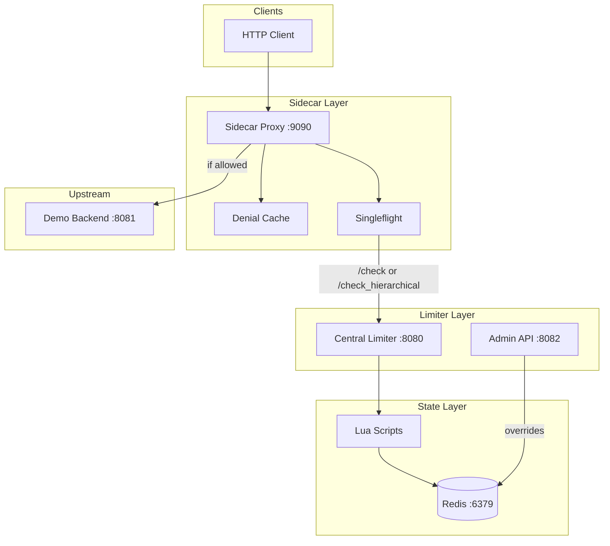

### Docker Compose Topology

When you run `docker compose up`, four services start on a shared bridge network:

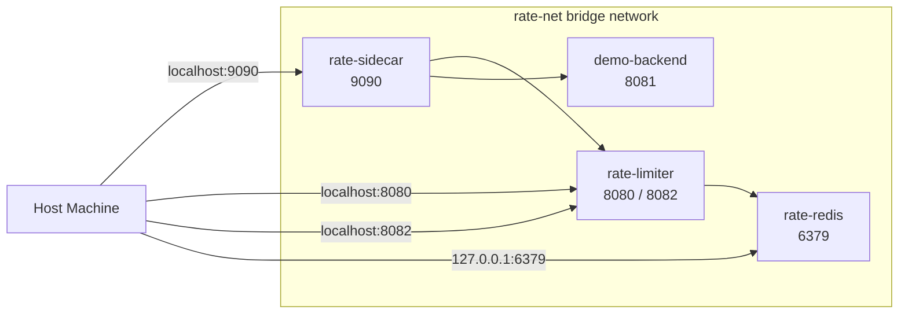

| Service | Container | Port | Role |
|---------|-----------|------|------|
| Redis | `rate-redis` | 6379 | Quota state, override config, Lua execution |
| Limiter | `rate-limiter` | 8080, 8082 | Central enforcement + admin API |
| Sidecar | `rate-sidecar` | 9090 | Client-facing proxy |
| Demo | `demo-backend` | 8081 | Sample upstream API |

Prometheus and Grafana are included in `docker-compose.yml` but commented out — they pull large images and are not needed for core functionality. Config lives in `deploy/prometheus.yml` if you want to enable them.

---

## Components

### Central Limiter (`cmd/limiter/`)

This is the authoritative source of truth for all quota decisions. Sidecars call it over HTTP; they never touch Redis directly.

**What I put here:**

| File | Purpose |
|------|---------|
| `main.go` | HTTP server, route wiring, graceful shutdown |
| `config.go` | All env-driven configuration with strict-mode validation |
| `limiter.go` | `RateLimiter` interface that algorithms implement |
| `admin_api.go` | Runtime override CRUD on port 8082 |
| `ratelimit_http.go` | `Retry-After`, `X-RateLimit-*` header logic |
| `sliding_window.go` | In-memory sliding window (reference impl) |
| `token_bucket.go` | In-memory token bucket (reference impl) |

**HTTP endpoints:**

| Method | Path | Port | Auth | Description |
|--------|------|------|------|-------------|
| GET | `/health` | 8080 | None | Redis connectivity check |
| GET | `/check` | 8080 | Internal API key | Flat per-user limit check |
| GET | `/check_hierarchical` | 8080 | Internal API key | Four-level hierarchical check |
| GET | `/metrics` | 8080 | Optional API key | Prometheus scrape endpoint |
| POST/GET/DELETE | `/admin/limits/{level}/{id}` | 8082 | Admin API key | Runtime override CRUD |

### Sidecar Proxy (`cmd/sidecar/`)

The sidecar is what clients actually talk to. It handles identity resolution, caching, deduplication, and reverse-proxying to the upstream.

I chose a separate binary instead of middleware because:

- Any language/framework backend works without importing Go code
- The sidecar can be deployed, scaled, and restarted independently
- Cache and singleflight state stays local to each sidecar instance

### Demo Backend (`cmd/demo-backend/`)

A minimal HTTP server that returns `{"message": "Hello from backend"}`. It exists to prove the full proxy path works end-to-end. Replace it with your real API.

### Internal Packages (`internal/`)

| Package | Purpose |
|---------|---------|
| `auth` | API key middleware for internal and admin endpoints |
| `identity` | User ID resolution from `X-User-ID` header or query param |
| `limiter` | Redis-backed algorithms with embedded Lua scripts |
| `metrics` | Prometheus counters and histograms |
| `override` | Runtime limit override store with local TTL cache |
| `redis` | Redis client factory (pool size 100, min idle 10) |

---

## Request Flows

### Allowed Request (Full Path)

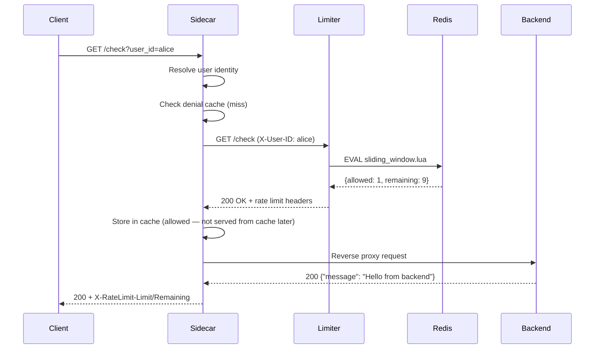

### Rejected Request (429)

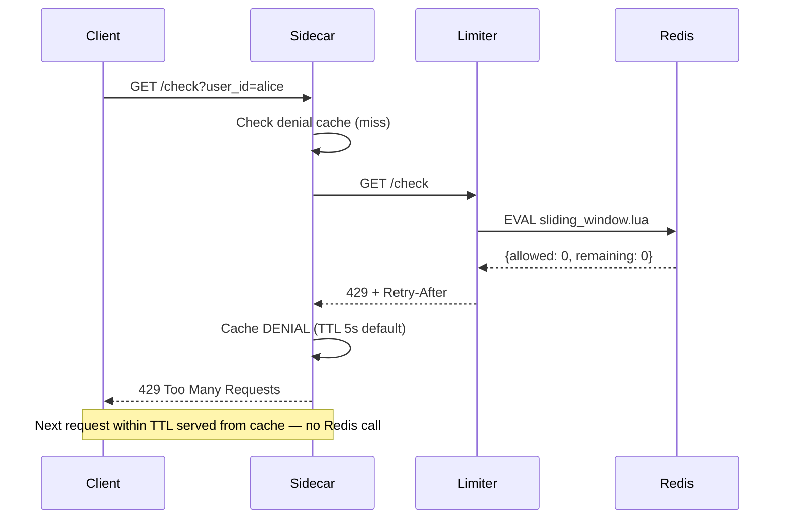

### Limiter Unavailable (503)

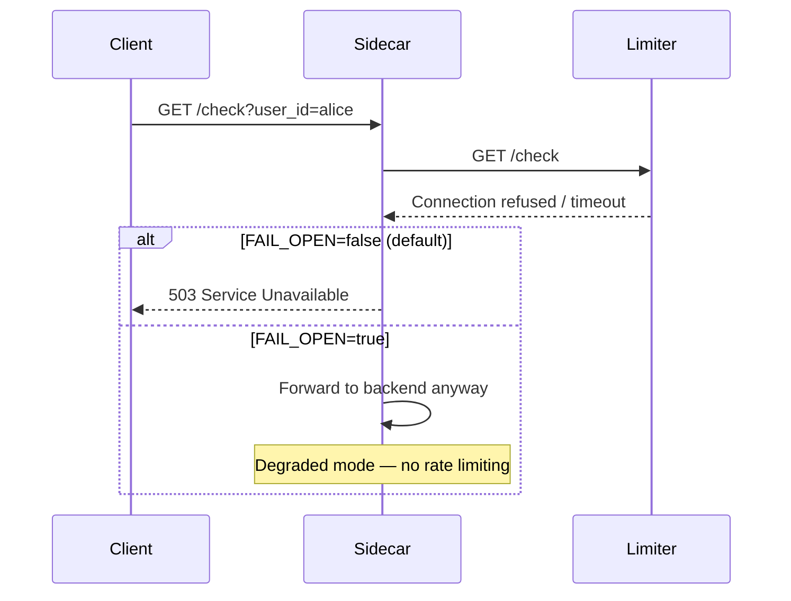

I deliberately return **503 for infrastructure failures** and **429 for quota exhaustion**. Mixing them would let operators mistake a Redis outage for normal rate limiting.

---

## Rate Limiting Algorithms

I implemented five algorithms. Two are in-memory reference implementations; three are production Redis-backed.

### Algorithm Selection

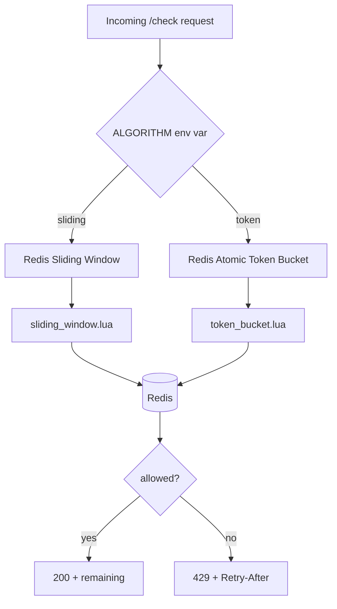

### 1. In-Memory Token Bucket (Reference)

Location: `cmd/limiter/token_bucket.go`

Used only for unit tests. Each user gets a bucket with a capacity and refill rate. Tokens refill continuously based on elapsed time.

```
Bucket (capacity=10, refill=1/sec)

Time 0:  [██████████] 10 tokens
Time 1:  [██████████] 10 tokens (refilled 1, capped at 10)
Request: [█████████ ] 9 tokens  → ALLOWED
Request: [█████████ ] 9 tokens  → ALLOWED (9 more times)
Request: [          ] 0 tokens  → DENIED
Time 2:  [█         ] 1 token   (refilled)
```

### 2. In-Memory Sliding Window (Reference)

Location: `cmd/limiter/sliding_window.go`

Stores timestamps of recent requests per user. Counts how many fall within the current window.

### 3. Redis Sliding Window (Production Default)

Location: `internal/limiter/redis_sliding_window.go` + `lua/sliding_window.lua`

Uses Redis sorted sets. Each request adds a timestamp member. Before counting, expired entries are removed.

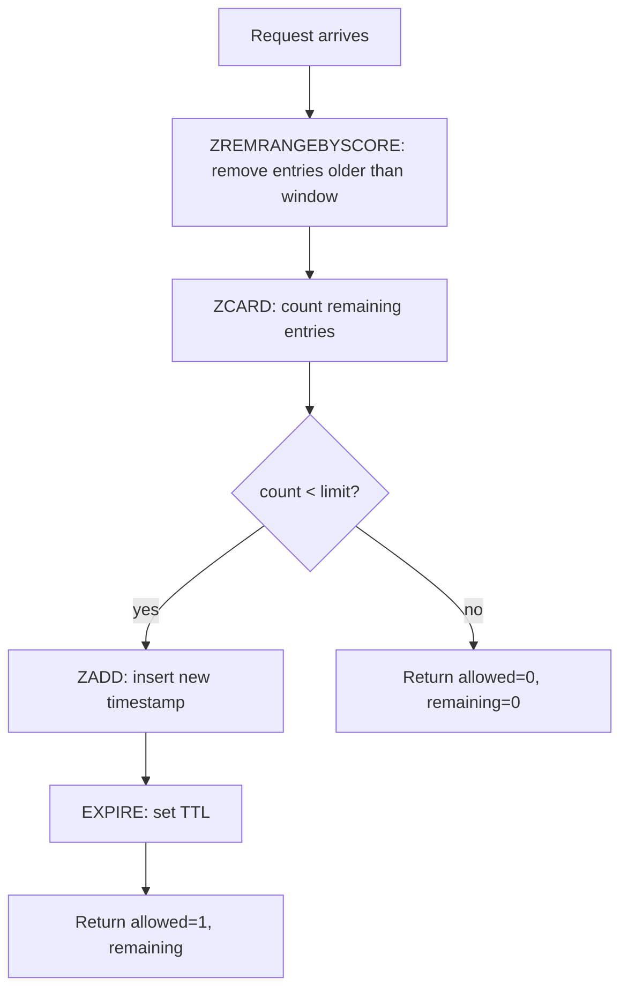

**When I use this:** When I want a hard cap — "max 10 requests per 60 seconds." No smoothing, no burst beyond the window.

Docker default: `CAPACITY=10`, `WINDOW_SEC=60`.

### 4. Redis Atomic Token Bucket (Production)

Location: `internal/limiter/redis_atomic_token_bucket.go` + `lua/token_bucket.lua`

Same token bucket logic as the in-memory version, but the entire read-refill-check-write cycle runs inside a Lua script.

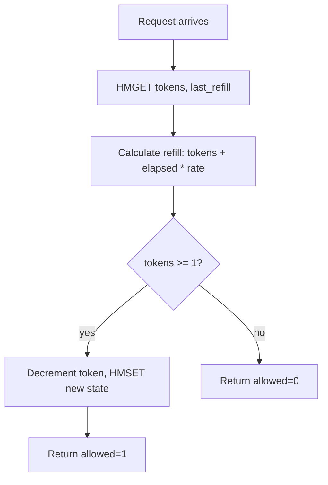

**When I use this:** When I want smooth refill — "10 tokens, refill 1 per second." Allows bursts up to capacity, then steady rate.

Set `ALGORITHM=token` to use this.

### 5. Non-Atomic Redis Token Bucket (Intentionally Broken)

Location: `internal/limiter/redis_token_bucket.go`

This uses separate `HGET`/`HSET` calls without Lua. I keep it in the codebase as a demonstration of why atomicity matters — the race condition is visible under concurrent load. See `tests/legacy/race_demo.go`.

---

## Hierarchical Quota Enforcement

Flat per-user limits are not enough for multi-tenant systems. I built a four-level hierarchy where a request must pass every level to be allowed.

### Hierarchy Structure

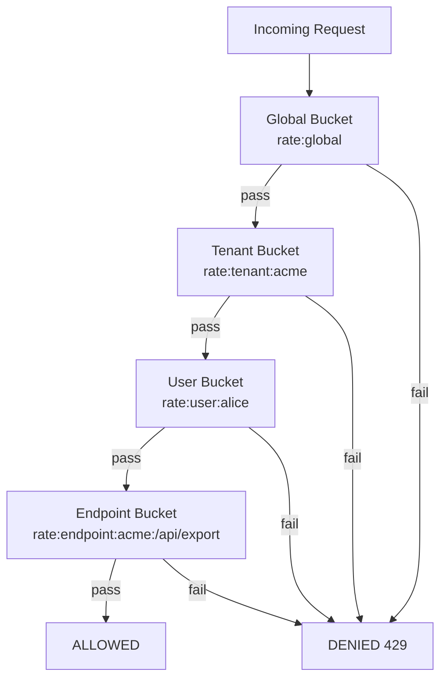

### How the Lua Script Works

All four levels are checked and decremented in a single atomic Lua call (`lua/hierarchical.lua`):

```
Phase 1: For each level (global → tenant → user → endpoint)
  1. Read current tokens and last_refill from Redis hash
  2. Refill: tokens = min(capacity, tokens + elapsed * refill_rate)
  3. If tokens < 1 after refill → mark as denied
  4. Write refilled state back

Phase 2: If ALL levels passed
  - Decrement each level by 1
  - Return remaining = min(all levels) - 1

If ANY level failed
  - Do NOT decrement any level
  - Return allowed=0
```

This prevents partial commits — you cannot consume a user token if the tenant bucket is empty.

### Default Capacities (docker-compose)

| Level | Redis Key Pattern | Capacity | Refill Rate |
|-------|-------------------|----------|-------------|
| Global | `rate:global` | 1,000,000 | 10,000/sec |
| Tenant | `rate:tenant:{id}` | 100,000 | 1,000/sec |
| User | `rate:user:{id}` | 100 | 1/sec |
| Endpoint | `rate:endpoint:{tenant}:{path}` | 10 | 0.5/sec |

Enable with `USE_HIERARCHICAL=true` on the sidecar (calls `/check_hierarchical`) or `ENABLE_HIERARCHICAL=true` on the limiter.

---

## Sidecar Proxy

The sidecar is the most opinionated part of the design. Here is what I built and why.

### Denial-Only Cache

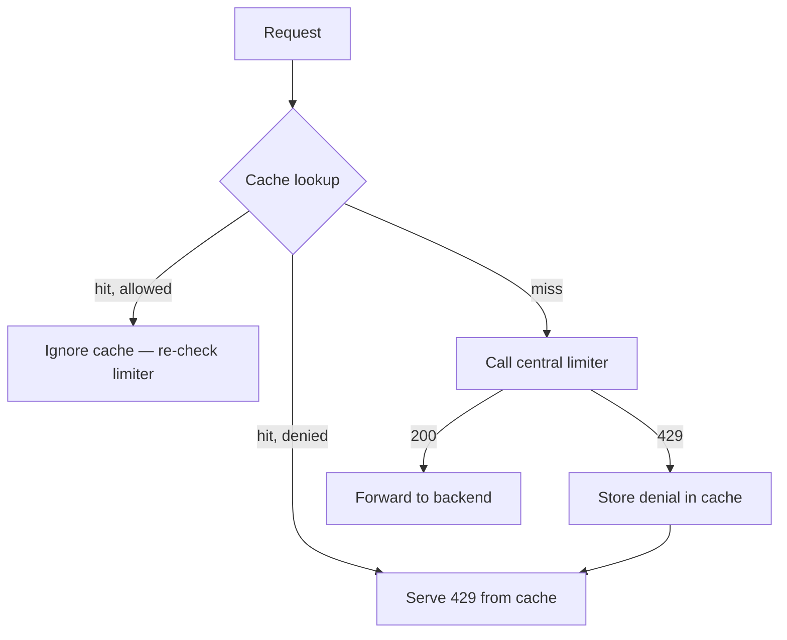

I only cache denials because:

- Denials are stable — if you are over quota, you stay over quota for a few seconds
- Allowances are not stable — caching "allowed" would let users bypass quota entirely
- Under abuse (millions of 429s), caching denials protects Redis from repeated identical checks

Default cache TTL: 5 seconds (configurable via sidecar env).

### Singleflight Deduplication

When 100 goroutines hit the sidecar for the same user simultaneously, without singleflight that is 100 Redis round-trips. With `golang.org/x/sync/singleflight`, they collapse into one:

```
100 concurrent requests for user "alice"
  → 1 limiter call
  → 99 waiters share the result
```

This matters under flash traffic and hot-key scenarios.

### Path Allowlist

The sidecar only proxies paths matching `ALLOWED_PATHS` (default: `/`). Everything else gets 404. This prevents the sidecar from accidentally becoming an open proxy.

---

## Admin API and Runtime Overrides

I separated the admin API onto port 8082 so it can be network-isolated from the hot `/check` path in production.

### Override Flow


### Supported Override Levels

| Level | Path | Example |
|-------|------|---------|
| Global | `/admin/limits/global/default` | Platform-wide cap change |
| Tenant | `/admin/limits/tenant/{id}` | Bump quota for customer "acme" |
| User | `/admin/limits/user/{id}` | Unblock a specific user |
| Endpoint | `/admin/limits/endpoint/{tenant\|path}` | Restrict expensive endpoint |

Override cache TTL defaults to 5 seconds (`OVERRIDE_CACHE_TTL_MS=5000`). Changes propagate within seconds, not instantly — a deliberate trade-off to avoid hammering Redis on every check.

### Example Commands

```bash
# Give alice a higher limit
curl -X POST http://localhost:8082/admin/limits/user/alice \
  -H "X-API-Key: dev-key-change-in-prod" \
  -H "Content-Type: application/json" \
  -d '{"capacity": 20, "refill_rate": 2}'

# Read current override
curl http://localhost:8082/admin/limits/user/alice \
  -H "X-API-Key: dev-key-change-in-prod"

# Remove override (revert to defaults)
curl -X DELETE http://localhost:8082/admin/limits/user/alice \
  -H "X-API-Key: dev-key-change-in-prod"
```

---

## Security Model

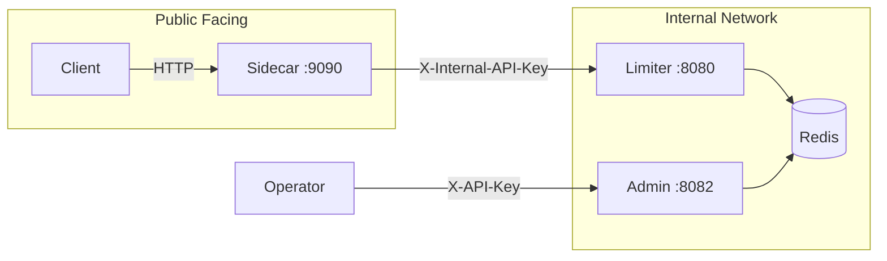

| Control | Env Variable | Default | Purpose |
|---------|-------------|---------|---------|
| Internal API key | `INTERNAL_API_KEY` | empty (dev warning) | Protects `/check` endpoints |
| Admin API key | `ADMIN_API_KEY` | `dev-key-change-in-prod` | Protects override CRUD |
| Metrics auth | `METRICS_REQUIRE_AUTH` | `false` | Lock down `/metrics` |
| Strict security | `STRICT_SECURITY` | `false` | Fail startup without internal key |
| Query user ID | `ALLOW_QUERY_USER_ID` | `false` | Allow `?user_id=` (dev only) |
| TLS | `TLS_CERT_FILE`, `TLS_KEY_FILE` | empty | Enable HTTPS |

**Identity resolution:** Production traffic should arrive with `X-User-ID` set by an upstream auth gateway (JWT validated before the sidecar). Query string `user_id` is opt-in for local testing only — clients can spoof it.

---

## Observability

### Prometheus Metrics

I intentionally kept label cardinality low. No per-user labels — that would OOM Prometheus under real traffic.

| Metric | Type | Labels |
|--------|------|--------|
| `rate_limiter_requests_total` | Counter | `handler`, `allowed` |
| `rate_limiter_requests_duration_seconds` | Histogram | `handler` |
| `rate_limiter_redis_duration_seconds` | Histogram | — |
| `rate_limiter_sidecar_cache_hits_total` | Counter | — |
| `rate_limiter_sidecar_cache_misses_total` | Counter | — |

Scrape endpoints:
- Limiter: `http://localhost:8080/metrics`
- Sidecar: `http://localhost:9090/metrics`

Prometheus config: `deploy/prometheus.yml`

### Health Checks

```bash
# Limiter health (checks Redis connectivity)
curl http://localhost:8080/health
# {"status":"healthy"} or 503 {"status":"unhealthy"}

# Sidecar health (checks limiter reachability)
curl http://localhost:9090/health
```

Docker Compose runs health checks on Redis and the limiter. The sidecar waits for the limiter to be healthy before starting.

---

## Benchmark Suite

I built a full benchmark pipeline because "it works on my machine" is not a performance claim.

### Test Types

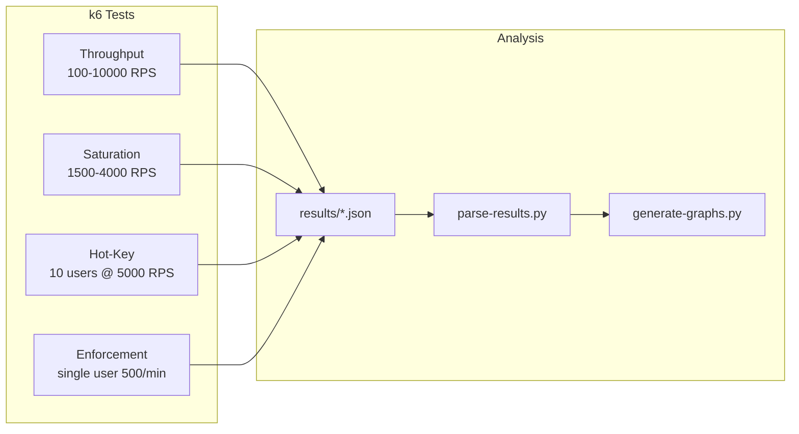

| Test | Script | What It Proves |
|------|--------|----------------|
| Throughput | `benchmarks/throughput/throughput-test.js` | Latency at increasing load |
| Saturation | `benchmarks/saturation/saturation-test.js` | Exact point where system collapses |
| Hot-key | `benchmarks/hot-key/hot-key-test.js` | Redis contention under shared keys |
| Enforcement | `benchmarks/enforcement/enforcement-test.js` | Limits are actually enforced |

### Results on My Machine (i9-14900HX, 32GB RAM)

| Target RPS | Actual RPS | p99 | Error Rate | Verdict |
|------------|------------|-----|------------|---------|
| 100 | 100 | 11 ms | 0% | Healthy |
| 1,000 | 1,000 | 3.2 ms | 0% | Max sustainable |
| 5,000 | 1,353 | 3.5 s | 10% | Saturated |
| 10,000 | 1,082 | 4.3 s | 15% | Collapsed |

**Key finding:** The system sustains roughly **1,000 actual RPS** with p99 under 100ms. Beyond that, latency grows exponentially and 503 errors appear — the system stops accepting work rather than silently degrading.

Hot-key and enforcement tests confirm correctness: 99%+ rejection rates when limits are exceeded, with sub-25ms p99 even under heavy 429 traffic.

See `benchmarks/summary.md`, `benchmarks/methodology.md`, and `benchmarks/environment.md` for full details.

---

## Chaos Engineering

I wrote chaos tests to verify the system behaves correctly when things break — not just when everything is healthy.

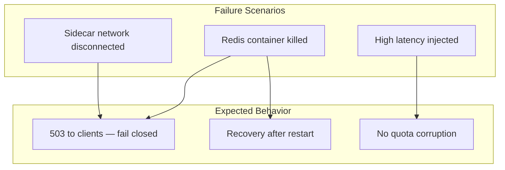

| Test | Script | What It Does |
|------|--------|--------------|
| Redis failure | `chaos/chaos_test.ps1` | Kills Redis, expects 503, restarts, verifies recovery |
| Network partition | `chaos/network_partition.py` | Disconnects sidecar from Docker network |
| High latency | `chaos/high_latency.py` | Injects delay, verifies no state corruption |

---

## Trade-offs

Every design decision in this project has a cost. Here is an honest accounting.

| Decision | Why I Chose It | What It Costs |
|----------|----------------|---------------|
| **Central limiter service** | Single source of truth, consistent enforcement | Extra network hop on every request |
| **Sidecar proxy** | Backend stays unaware of rate limiting | Another container to deploy and monitor |
| **Redis + Lua atomicity** | No race conditions under concurrency | External dependency; Redis outage = 503 |
| **Denial-only cache** | Prevents quota bypass via stale "allowed" cache | Allowed requests always hit Redis |
| **Single Redis instance** | Simple local/dev deployment | No HA failover in default setup |
| **Hierarchical 4-level limits** | SaaS-grade quota model | More complex config and Lua script |
| **Separate admin port (8082)** | Network isolation for override API | Two ports to secure and expose |
| **503 vs 429 separation** | Clear failure modes for operators | Clients must handle both status codes |
| **Low-cardinality metrics** | Prometheus stays stable under load | No per-user observability |
| **Runtime overrides with TTL cache** | Fast admin changes without redeploy | Up to 5s propagation delay |
| **Query param user ID (dev only)** | Easy local testing | Spoofable if left enabled in production |

---

## Project Structure

```
.
├── benchmarks/              k6 load tests, parse-results.py, graph generation
│   ├── throughput/          Fixed RPS latency tests
│   ├── saturation/          Fine-grained saturation sweep
│   ├── hot-key/             Shared-key contention test
│   ├── enforcement/         Single-user limit correctness test
│   ├── metrics/             docker stats collection scripts
│   └── graphs/              generate-graphs.py (PNG output gitignored)
│
├── chaos/                   Fault injection scripts
│   ├── chaos_test.ps1       Redis kill + recovery
│   ├── network_partition.py Sidecar network isolation
│   └── high_latency.py      Latency injection
│
├── cmd/
│   ├── limiter/             Central rate limiter binary
│   ├── sidecar/             Sidecar proxy binary
│   └── demo-backend/        Sample upstream API
│
├── deploy/
│   └── prometheus.yml       Prometheus scrape config
│
├── dockerfiles/
│   ├── Dockerfile.limiter
│   ├── Dockerfile.sidecar
│   └── Dockerfile.demo
│
├── internal/
│   ├── auth/                API key middleware
│   ├── identity/            User ID resolution
│   ├── limiter/             Redis algorithms + Lua scripts
│   ├── metrics/             Prometheus instrumentation
│   ├── override/            Runtime override store
│   └── redis/               Redis client factory
│
├── tests/
│   └── legacy/              Race condition demo
│
├── docker-compose.yml
├── go.mod
└── README.md
```

---

## Running the System

### Prerequisites

- Go 1.25+
- Docker and Docker Compose
- k6 (for load testing)
- Python 3 + matplotlib (for benchmark graphs)

### Option 1: Docker Compose (Recommended)

This starts Redis, limiter, sidecar, and demo backend together.

```bash
git clone https://github.com/RUDRA-PRATAP-SINGH01/Distributed-Rate-Limiter.git
cd Distributed-Rate-Limiter

docker compose up -d --build
```

Wait for all containers to be healthy:

```bash
docker compose ps
```

Verify the full path works:

```bash
# Should return backend response
curl "http://localhost:9090/check?user_id=alice"

# Check limiter health
curl http://localhost:8080/health

# Check Prometheus metrics
curl http://localhost:8080/metrics
```

Shutdown and clean up:

```bash
docker compose down -v
```

### Option 2: Run Locally (Without Docker)

You need a running Redis instance.

```bash
# Terminal 1: Redis (or use an existing instance)
docker run -d -p 6379:6379 redis:7-alpine redis-server --requirepass dev-redis-password

# Terminal 2: Limiter
export REDIS_ADDR=localhost:6379
export REDIS_PASSWORD=dev-redis-password
export INTERNAL_API_KEY=dev-internal-key
export ALLOW_QUERY_USER_ID=true
go run ./cmd/limiter

# Terminal 3: Demo backend
go run ./cmd/demo-backend

# Terminal 4: Sidecar
export UPSTREAM_URL=http://localhost:8081
export RATE_LIMITER_URL=http://localhost:8080
export INTERNAL_API_KEY=dev-internal-key
export ALLOW_QUERY_USER_ID=true
go run ./cmd/sidecar
```

Test:

```bash
curl "http://localhost:9090/check?user_id=alice"
```

### Environment Variables Reference

**Limiter:**

| Variable | Default | Description |
|----------|---------|-------------|
| `PORT` | `8080` | Main HTTP port |
| `REDIS_ADDR` | `localhost:6379` | Redis address |
| `REDIS_PASSWORD` | empty | Redis password |
| `ALGORITHM` | `token` | `token` or `sliding` |
| `CAPACITY` | `10` | Max tokens/requests |
| `REFILL_RATE` | `1.0` | Tokens per second (token bucket) |
| `WINDOW_SEC` | `60` | Window size (sliding window) |
| `ENABLE_HIERARCHICAL` | `true` | Enable `/check_hierarchical` |
| `INTERNAL_API_KEY` | empty | Protects `/check` endpoints |
| `ADMIN_API_KEY` | `dev-key-change-in-prod` | Protects admin API |
| `ADMIN_PORT` | `8082` | Admin API port |

**Sidecar:**

| Variable | Default | Description |
|----------|---------|-------------|
| `PORT` | `9090` | Sidecar HTTP port |
| `UPSTREAM_URL` | `http://localhost:8081` | Backend to proxy to |
| `RATE_LIMITER_URL` | `http://localhost:8080` | Central limiter URL |
| `INTERNAL_API_KEY` | empty | Key sent to limiter |
| `FAIL_OPEN` | `false` | Allow requests when limiter is down |
| `USE_HIERARCHICAL` | `false` | Use hierarchical checks |
| `ALLOWED_PATHS` | `/` | Comma-separated path allowlist |
| `ALLOW_QUERY_USER_ID` | `false` | Accept `?user_id=` param |

---

## Running Tests

### Unit Tests

```bash
go test ./...
```

With race detector:

```bash
go test -race ./...
```

### Quick Load Test

```bash
k6 run benchmarks/load-test.js
```

This hits the sidecar with 50 VUs for 40 seconds. It treats 429 as success and only flags real failures (503, timeouts).

### Full Benchmark Suite

```bash
# Requires docker compose up and k6 installed
.\benchmarks\run-all.ps1
```

This runs throughput, saturation, hot-key, and enforcement tests with docker stats collection, then generates parsed tables and graphs.

Saturation sweep only:

```bash
.\benchmarks\run-saturation.ps1
```

Parse existing results:

```bash
python benchmarks/parse-results.py
python benchmarks/graphs/generate-graphs.py
```

### Chaos Tests

Requires the full Docker Compose stack running.

```powershell
# Redis failure and recovery
.\chaos\chaos_test.ps1

# Network partition
python chaos/network_partition.py

# High latency injection
python chaos/high_latency.py
```

---

## License

This project is licensed under the MIT License. See [LICENSE](LICENSE) for details.
