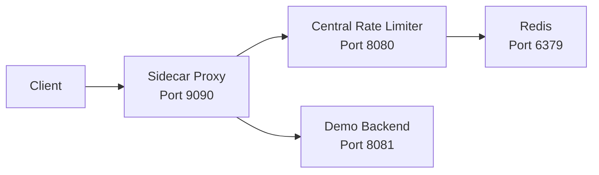

# Distributed Rate Limiter

[](https://opensource.org/licenses/MIT)

A distributed rate limiter built in Go using Redis and atomic Lua scripts. The system combines a central rate-limiting service, a sidecar proxy with denial caching, Prometheus observability, load testing, and chaos testing to provide a resilient and scalable traffic-control layer.

**Use Cases**

* API rate limiting
* Multi-tenant quota enforcement
* DDoS mitigation
* Service mesh sidecar integration
* Microservice traffic protection

---

#  Features

| Category       | Features                                                   |
| -------------- | ---------------------------------------------------------- |
| Core Algorithm | Atomic Redis + Lua Token Bucket                            |
| Distributed    | Multiple limiter instances share state through Redis       |
| Sidecar Proxy  | Denial-only local cache for reduced limiter load           |
| Performance    | Low-latency request validation with Redis atomic execution |
| Observability  | Prometheus metrics and health endpoints                    |
| Resilience     | Fail-open / fail-closed modes                              |
| Testing        | Unit tests, k6 load testing, chaos testing                 |
| Deployment     | Docker Compose support                                     |

---

# 🏛️ Architecture

### Components

* **Client** (Web / Mobile / API Consumer)
* **Sidecar Proxy** (Port 9090)
* **Central Rate Limiter** (Port 8080)
* **Redis** (Port 6379)
* **Demo Backend** (Port 8081)

### High-Level Architecture



### Request Flow (Allowed Request)

1. Client sends request to sidecar.
2. Sidecar checks local denial cache.
3. Cache miss triggers request to central limiter.
4. Limiter executes Redis Lua script atomically.
5. Redis returns token availability.
6. Request is allowed.
7. Sidecar forwards traffic to backend.
8. Backend response is returned to client.

### Request Flow (Denied Request)

1. Client sends request.
2. Sidecar forwards to limiter.
3. Token bucket is exhausted.
4. Limiter returns denial.
5. Sidecar caches denial for 30ms.
6. Client receives HTTP 429.
7. Subsequent requests may be served directly from cache.

### Failure Handling

| Failure Scenario    | Behaviour                  |
| ------------------- | -------------------------- |
| Redis unavailable   | 503 fail-closed            |
| Network partition   | Timeout / 503              |
| Redis latency spike | Request timeout protection |
| Cache corruption    | Automatic expiration       |

---

#  Project Structure

```text
.
├── chaos/
│   ├── chaos_test.ps1
│   ├── high_latency.py
│   └── network_partition.py
│
├── cmd/
│   ├── demo-backend/
│   │   └── main.go
│   │
│   └── sidecar/
│       └── main.go
│
├── dockerfiles/
│   ├── Dockerfile.demo
│   ├── Dockerfile.limiter
│   └── Dockerfile.sidecar
│
├── internal/
│   ├── limiter/
│   │   ├── lua/
│   │   │   └── token_bucket.lua
│   │   ├── redis_atomic_token_bucket.go
│   │   └── redis_token_bucket.go
│   │
│   ├── metrics/
│   │   └── metrics.go
│   │
│   └── redis/
│       └── client.go
│
├── tests/
│   └── legacy/
│       └── race_demo.go
│
├── .gitignore
├── config.go
├── docker-compose.yml
├── go.mod
├── go.sum
├── LICENSE
├── limiter.go
├── load-test.js
├── main.go
├── README.md
├── sliding_window.go
├── sliding_window_test.go
├── token_bucket.go
└── token_bucket_test.go
```

---

#  Quick Start

## Prerequisites

* Go 1.24+
* Docker
* Docker Compose

---

## Run with Docker Compose

### 1. Clone Repository

```bash
git clone https://github.com/RUDRA-PRATAP-SINGH01/Distributed-rate-limiter.git

cd Distributed-rate-limiter
```

### 2. Start Services

```bash
docker compose up -d
```

### 3. Verify Containers

```bash
docker ps
```

Expected services:

* Redis
* Central Rate Limiter
* Sidecar Proxy
* Demo Backend

### 4. Test Rate Limiting

```bash
curl "http://localhost:9090/check?user_id=alice"
```

Send multiple requests:

```bash
for i in {1..15}; do
  curl "http://localhost:9090/check?user_id=alice"
done
```

Expected:

* Initial requests return success
* Requests beyond the limit return HTTP 429

### 5. Check Metrics

```bash
curl http://localhost:8080/metrics
```

### 6. Health Check

```bash
curl http://localhost:8080/health
```

### 7. Stop Services

```bash
docker compose down -v
```

---

## Run Locally

### Start Redis

```bash
docker run -d \
  --name rate-redis \
  -p 6379:6379 \
  redis
```

### Start Central Limiter

```bash
go run .
```

### Start Demo Backend

```bash
go run ./cmd/demo-backend
```

### Start Sidecar

Linux / macOS:

```bash
export UPSTREAM_URL=http://localhost:8081
export RATE_LIMITER_URL=http://localhost:8080
export PORT=9090

go run cmd/sidecar/main.go
```

Windows PowerShell:

```powershell
$env:UPSTREAM_URL="http://localhost:8081"
$env:RATE_LIMITER_URL="http://localhost:8080"
$env:PORT="9090"

go run cmd/sidecar/main.go
```

### Test

```bash
curl "http://localhost:9090/check?user_id=alice"
```

---

#  Configuration

## Central Limiter

| Variable    | Default        | Description             |
| ----------- | -------------- | ----------------------- |
| PORT        | 8080           | HTTP port               |
| REDIS_ADDR  | localhost:6379 | Redis address           |
| CAPACITY    | 10             | Token bucket capacity   |
| REFILL_RATE | 1.0            | Tokens added per second |

## Sidecar

| Variable         | Default  | Description                          |
| ---------------- | -------- | ------------------------------------ |
| UPSTREAM_URL     | Required | Protected backend URL                |
| RATE_LIMITER_URL | Required | Limiter endpoint                     |
| PORT             | 9090     | Sidecar port                         |
| FAIL_OPEN        | false    | Allow traffic if limiter unavailable |
| RATE_LIMIT       | 10       | Rate limit header value              |

---

#  Observability

Metrics Endpoint:

```text
/metrics
```

Health Endpoint:

```text
/health
```

Metrics collected:

* Total Requests
* Allowed Requests
* Denied Requests
* Redis Latency
* Cache Hits
* Cache Misses
* Request Duration

---

#  Testing

## Unit Tests

```bash
go test -v ./...
```

## Race Detection

```bash
go test -race ./...
```

## Load Testing

```bash
k6 run load-test.js
```

Sample Results:

```text
P99 latency < 12ms
Error rate < 1%
Status validation 100%
```

---

## Chaos Testing

### Redis Failure

```powershell
.\chaos\chaos_test.ps1
```

Expected:

```text
Redis unavailable -> 503
Redis restored -> service recovery
```

### Network Partition

```bash
python chaos/network_partition.py
```

Expected:

```text
Limiter unreachable -> timeout / 503
Network restored -> recovery
```

### High Latency

```bash
python chaos/high_latency.py
```

Expected:

```text
Injected latency handled within timeout limits
```

