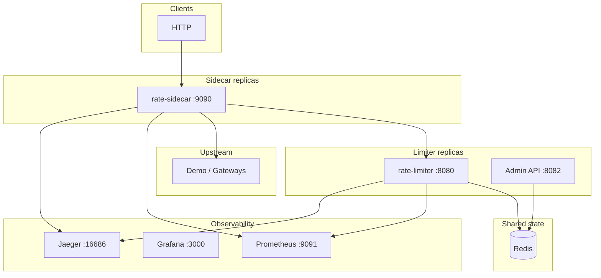

# Distributed Rate Limiter — Documentation Portal

Production-oriented Go rate limiting platform: central limiter + Redis Lua + optional sidecar proxy.

**Sources of truth:** `cmd/**`, `internal/**`, tests, `benchmarks/results/a1de9ec-final/`, `docker-compose.yml`, `deploy/**`.

---

## Architecture at a glance

Quota enforcement is **Redis-authoritative** and **Lua-atomic**. Sidecar denial cache and singleflight are **process-local optimizations** that must not weaken global quota (SOURCE + TEST).

---

## Reading order

### New contributors

1. [architecture/system-overview.md](architecture/system-overview.md)
2. [architecture/request-lifecycle.md](architecture/request-lifecycle.md)
3. [correctness/distributed-invariants.md](correctness/distributed-invariants.md)
4. [testing/test-strategy.md](testing/test-strategy.md)

### System designers

1. [architecture/limiter-architecture.md](architecture/limiter-architecture.md)
2. [architecture/sidecar-architecture.md](architecture/sidecar-architecture.md)
3. [architecture/redis-architecture.md](architecture/redis-architecture.md)
4. [architecture/override-consistency.md](architecture/override-consistency.md)
5. [architecture/idempotency-architecture.md](architecture/idempotency-architecture.md)
6. [limitations.md](limitations.md)

### Operators

1. [operations/deployment.md](operations/deployment.md)
2. [operations/configuration.md](operations/configuration.md)
3. [operations/runbooks.md](operations/runbooks.md)
4. [observability/health-and-readiness.md](observability/health-and-readiness.md)
5. [failure-modes/recovery-behavior.md](failure-modes/recovery-behavior.md)

### Performance reviewers

1. [benchmarks/final-benchmark-report.md](benchmarks/final-benchmark-report.md)
2. [benchmarks/methodology.md](benchmarks/methodology.md)
3. [benchmarks/performance-analysis.md](benchmarks/performance-analysis.md)
4. [correctness/multi-replica-correctness.md](correctness/multi-replica-correctness.md)

---

## Documentation map

| Area | Canonical doc |
|------|----------------|
| System overview | [architecture/system-overview.md](architecture/system-overview.md) |
| Request paths | [architecture/request-lifecycle.md](architecture/request-lifecycle.md) |
| Limiter | [architecture/limiter-architecture.md](architecture/limiter-architecture.md) |
| Sidecar | [architecture/sidecar-architecture.md](architecture/sidecar-architecture.md) |
| Redis / Lua | [architecture/redis-architecture.md](architecture/redis-architecture.md) |
| Hierarchical quotas | [architecture/hierarchical-limiting.md](architecture/hierarchical-limiting.md) |
| Admin overrides | [architecture/override-consistency.md](architecture/override-consistency.md) |
| Idempotency | [architecture/idempotency-architecture.md](architecture/idempotency-architecture.md) |
| Circuit breaker | [architecture/circuit-breaker-architecture.md](architecture/circuit-breaker-architecture.md) |
| Routing | [architecture/routing-architecture.md](architecture/routing-architecture.md) |
| Audit trail | [architecture/audit-trail-architecture.md](architecture/audit-trail-architecture.md) |
| Observability | [architecture/observability-architecture.md](architecture/observability-architecture.md) |
| Shutdown | [architecture/shutdown-lifecycle.md](architecture/shutdown-lifecycle.md) |
| Algorithms | [algorithms/](algorithms/) |
| Correctness | [correctness/](correctness/) |
| Metrics / traces / logs | [observability/](observability/) |
| Failures | [failure-modes/](failure-modes/) |
| Operations | [operations/](operations/) |
| Security | [security/](security/) |
| Testing | [testing/](testing/) |
| Benchmarks | [benchmarks/](benchmarks/) |
| CI | [ci/continuous-integration.md](ci/continuous-integration.md) |
| Open audit findings (agent brief) | [audit/open-findings.md](audit/open-findings.md) — remaining: 6 Critical, 9 High, 0 Medium |
| Limitations | [limitations.md](limitations.md) |

---

## Verified headline numbers (localhost Docker, commit `a1de9ec`)

| Claim | Value | Evidence |
|-------|-------|----------|
| Sustainable sidecar e2e throughput | ~872 actual RPS @ 1000 target, p99 11 ms | BENCHMARK-PROVEN |
| Multi-sidecar quota (cap=10) | 60 concurrent → 10 allowed / 50 denied | RUNTIME-PROVEN |
| Idempotency burst (2 sidecars) | 40 parallel → 1×200, 39×409 | RUNTIME-PROVEN |
| CB half-open bound | 64 concurrent → 3 admitted, 61×503 | RUNTIME-PROVEN |
| Redis outage (sidecar) | ~1003–1006 ms → 503 | RUNTIME-PROVEN |
| Limiter outage (sidecar) | ~504 ms → 503 | RUNTIME-PROVEN |
| 15 min soak @ 300 RPS | 299 actual RPS, p99 10 ms, 0 errors | BENCHMARK-PROVEN |

Not universal production capacity — see [limitations.md](limitations.md).
