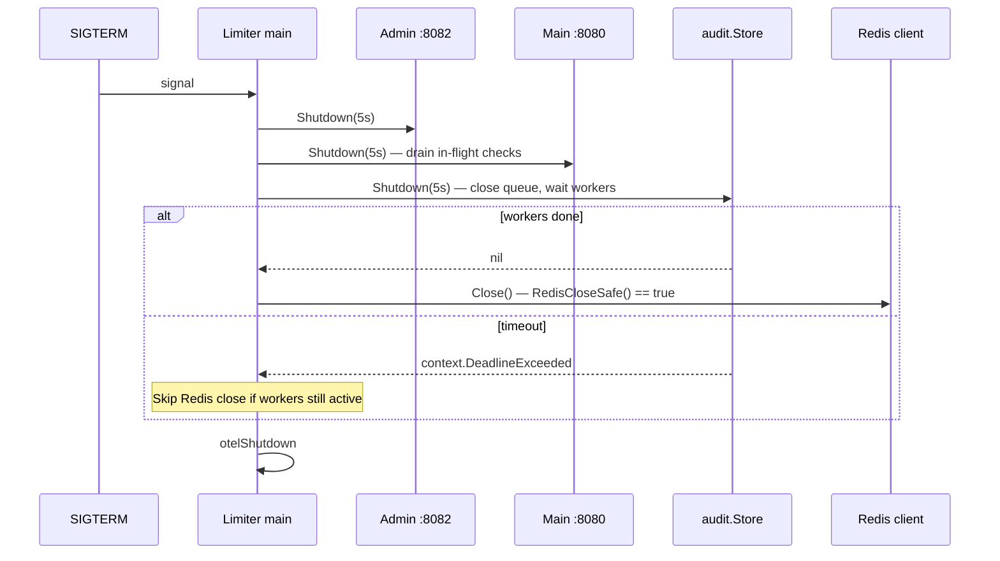

# Audit Trail Architecture

The limiter can persist an audit record for every allow/deny decision in Redis (`ENABLE_AUDIT_TRAIL`, default on). The hot path is decoupled via **async workers + bounded queue**; on shutdown, the queue drains before Redis close.

---

## Data model

| Key | Type | Purpose |
|-----|------|---------|
| `audit:event:{uuid}` | HASH | Full event payload |
| `audit:idx:ts` | ZSET | Time-range search |
| `audit:idx:tenant:{id}` | ZSET | Tenant filter |
| `audit:idx:user:{id}` | ZSET | User filter |
| `audit:idx:req:{requestID}` | STRING | Point lookup |

Append: `append.lua` — atomic event write + index ZADD + retention trim (`AUDIT_MAX_EVENTS`, `AUDIT_RETENTION_HOURS`).

---

## Async pipeline

```mermaid
flowchart LR
  H["/check handler"] -->|Record()| Q{queue full?}
  Q -->|no| CH["chan RecordInput (buffered)"]
  Q -->|yes| DROP[metrics: audit_dropped]
  CH --> W1[worker 1]
  CH --> W2[worker 2]
  CH --> WN[worker N]
  W1 & W2 & WN --> LUA["append.lua → Redis"]
```

### Defaults (`internal/audit/config.go`)

| Setting | Default | Env |
|---------|---------|-----|
| `Async` | `true` | `AUDIT_ASYNC=false` disables |
| `Workers` | **4** | `AUDIT_WORKERS` |
| `QueueSize` | **4096** | `AUDIT_QUEUE_SIZE` |
| `Retention` | 7 days | `AUDIT_RETENTION_HOURS` |
| `MaxEvents` | 100000 | `AUDIT_MAX_EVENTS` |

`Record()` async mode:

1. `ensureWorkers()` — once, spawns N goroutines
2. `select` on queue — success → return immediately (latency off hot path)
3. `default` on full queue → `RecordAuditDropped()`, event lost (bounded memory)

Sync mode (`AUDIT_ASYNC=false`): inline `record()` — tests/benchmarks.

---

## Worker lifecycle

```go
func (s *Store) worker() {
    for in := range s.queue {
        _, _ = s.record(context.Background(), in)
    }
}
```

- Queue created lazily on first async `Record`
- `Shutdown` closes queue → workers drain remaining → exit
- Post-shutdown `Record` → dropped (state != `stateRunning`)

---

## Shutdown integration (limiter)



**Ordering (`cmd/limiter/main.go`):**

1. Admin server shutdown
2. Main HTTP server shutdown (in-flight `/check` complete)
3. **Audit drain** (if async enabled)
4. OpenTelemetry flush
5. Redis close **only if** `auditStore.RedisCloseSafe()`

`RedisCloseSafe()` → `state == stateStopped` for async audit.

Sidecar: no audit store — limiter only.

---

## Search & admin

- `GET /admin/audit` — query by tenant, user, time range, decision
- `GET /admin/audit/{id}` — single event + replay hint
- Metrics: `audit_append_duration_seconds`, `audit_events_total`, `audit_dropped_total`

---

## Failure modes

| Scenario | Behavior |
|----------|----------|
| Queue full | Drop + metric (no unbounded RAM) |
| Redis append error | Worker logs error; event lost |
| Shutdown timeout | `ctx.Err()`; retry `Shutdown` with fresh context |
| Record after shutdown | Silently dropped |

Tests: `internal/audit/shutdown_test.go` — drain, ordering, idempotent shutdown, race stress.

---

## Source references

| File | Role |
|------|------|
| `internal/audit/store.go` | Record, search |
| `internal/audit/shutdown.go` | Worker drain |
| `internal/audit/lua/append.lua` | Atomic append |
| `internal/audit/shutdown.go` | Graceful drain |
