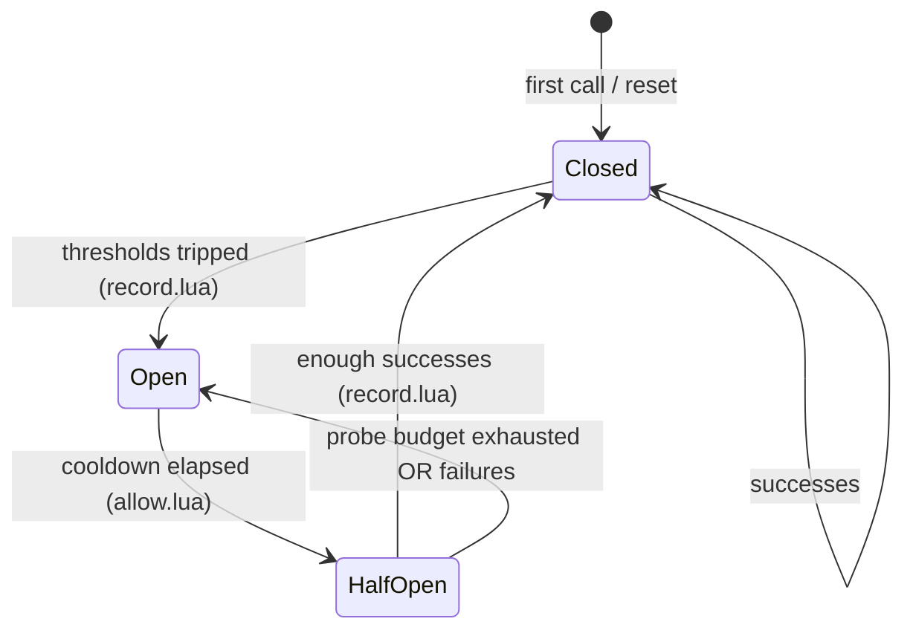
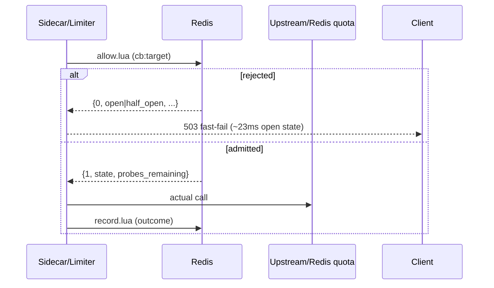

# Circuit Breaker Architecture

The distributed circuit breaker stores state in Redis hash `cb:{target}`. **Pre-call** `allow.lua` gates traffic; **post-call** `record.lua` updates metrics and transitions. Fleet-wide half-open probe budget **`HalfOpenMaxProbes=3`** (default).

---

## States



| State | `allow.lua` behavior |
|-------|---------------------|
| **closed** | Allow all (`{1, 0, -1}`) |
| **open** | Reject until `now - opened_at >= open_cooldown_ms` (default 30 s) |
| **half_open** | Allow up to `half_open_max_probes` concurrent probes |

State codes: `0=closed`, `1=open`, `2=half_open`.

---

## `allow.lua` — global probe bound

```lua
-- KEYS[1] = cb:{target}
-- ARGV: now_ms, open_cooldown_ms, half_open_max_probes

if state == 'half_open' then
  if probes >= max_probes then
    -- reopen — cooldown retry
    return {0, 1, 0}
  end
  HINCRBY half_open_calls 1
  return {1, 2, max_probes - probes - 1}
end
```

**Global bound:** across all processes sharing Redis — even with 32 concurrent callers, at most **3** simultaneous half-open admissions (`TestHalfOpenConcurrentProbeBound`, `-race`).

Default config (`internal/circuitbreaker/config.go`):

| Field | Default | Env |
|-------|---------|-----|
| `HalfOpenMaxProbes` | **3** | `CB_HALF_OPEN_MAX_PROBES` |
| `HalfOpenSuccessRequired` | 2 | `CB_HALF_OPEN_SUCCESS_REQUIRED` |
| `OpenCooldownMs` | 30000 | `CB_OPEN_COOLDOWN_MS` |
| `FailureRateThreshold` | 0.5 | `CB_FAILURE_RATE` |
| `MinSamples` | 10 | `CB_MIN_SAMPLES` |
| `ConsecutiveFailures` | 5 | `CB_CONSECUTIVE_FAILURES` |

Probe budget exhaust → circuit **reopens** (not stuck half-open forever).

---

## `record.lua` — post-call transitions

Outcomes: `success`, `failure`, `timeout`, `latency_spike`.

- Rolling counters + latency EMA (`CB_EMA_ALPHA`, default 0.2)
- Counter halving when `total_count` grows (memory bound)
- Open transition: failure rate, consecutive failures, timeout rate, latency spikes
- Half-open → closed: `half_open_successes >= half_open_success_required`

---

## Targets

| Target | Component | Guards |
|--------|-----------|--------|
| `cb:redis` | Limiter | Redis Lua before quota |
| `cb:central-limiter` | Sidecar | HTTP to limiter |
| `cb:{gatewayID}` | Sidecar routing | Per-gateway upstream |

429 responses **do not** trip breaker (quota, not infra failure).

---

## Call sequence



---

## Fail-open danger

`CIRCUIT_FAIL_OPEN=true` → Redis errors allow traffic (default **false**). Avoid in production.

---

## Runtime evidence

| Test | Result |
|------|--------|
| 32 workers half-open | admitted ≤ 3 (TEST-PROVEN) |
| 64 concurrent /check, seeded half-open | 3 admitted, 61×503 (RUNTIME) |
| Open state latency | ~23 ms → 503 |

---

## Source references

| File | Role |
|------|------|
| `internal/circuitbreaker/store.go` | Allow/Record/Reset |
| `internal/circuitbreaker/lua/allow.lua` | Pre-call gate |
| `internal/circuitbreaker/lua/record.lua` | Transitions |
| `internal/circuitbreaker/config.go` | Defaults |
| `docs/diagrams/circuit-breaker.md` | Visual |
