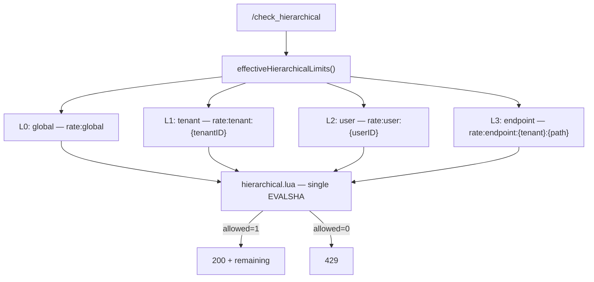

# Hierarchical Limiting Architecture

Hierarchical rate limiting **चार stacked token buckets** को एक ही Redis Lua round-trip में evaluate करता है। सभी levels approve करें तभी कोई level से token deduct होता है — **partial commit impossible**।

---

## चार-स्तरीय merge



### Level semantics

| Level | Redis key | Default source | Override key |
|-------|-----------|----------------|--------------|
| 0 Global | `rate:global` | `GLOBAL_CAPACITY`, `GLOBAL_REFILL_RATE` | `config:global:default` |
| 1 Tenant | `rate:tenant:{tenantID}` | `TENANT_*` env | `config:tenant:{tenantID}` |
| 2 User | `rate:user:{userID}` | `USER_*` env | `config:user:{userID}` |
| 3 Endpoint | `rate:endpoint:{tenantID}:{endpoint}` | `ENDPOINT_*` env | `config:endpoint:{tenant\|endpoint}` |

`tenantID` / `userID` headers से आते हैं (`identity` package); endpoint query param `?endpoint=/api/v1/foo`।

---

## Endpoint keys — tenant isolation

Endpoint bucket **tenant-scoped** है:

```
rate:endpoint:{tenantID}:{path}
```

दो tenants same path (`/api/login`) share **नहीं** करते — override ID भी `tenantID + "|" + endpoint` (`override.EndpointOverrideID`)।

Admin path example: `POST /admin/limits/endpoint/default%7C%2Fapi%2Fv1%2Fresource`

Sidecar hierarchical mode में denial cache key भी `tenant + user + path` scope करता है (`cmd/sidecar/main.go` — `cacheKey`)।

---

## Lua merge algorithm (`hierarchical.lua`)

1. **Read phase:** हर level पर `HMGET tokens, last_refill` → elapsed time से refill।
2. **Check phase:** कोई भी level `floor(tokens) < requested` → `allowed=0`।
3. **Write phase:**
   - Allowed → सभी levels से `requested` deduct + `EXPIRE 3600`।
   - Denied → tokens refill state persist (no deduct)।
4. **Return:** `{allowed, remaining}` — `remaining` = tightest level का floor minus request।

```go
// internal/limiter/hierarchical.go — AllowWithParams
keys := []string{globalKey, tenantKey, userKey, endpointKey}
capacities, refillRates := effectiveHierarchicalLimits(...)
```

---

## Override merge (`effectiveHierarchicalLimits`)

हर `/check_hierarchical` call पर:

1. `store.RefreshGeneration(ctx)` — `config:generation` check।
2. Per-level: env default → Redis override (अगर exists)।
3. Capacities + refill rates Lua को pass।

`X-RateLimit-Limit` header = **सबसे छोटी capacity** across levels (bottleneck दिखाने के लिए)।

---

## Request flow

```
Client → Sidecar (optional) → GET /check_hierarchical?endpoint=...
  → auth (INTERNAL_API_KEY)
  → RefreshGeneration + override merge
  → hierarchical.lua (4 KEYS, 10 ARGV)
  → audit record (async)
  → JSON {allowed, remaining}
```

Flat `/check` hierarchical path use **नहीं** करता — अलग algorithm/env।

---

## Benchmark note (`bench-progress.log`)

`hierarchical-1000` @ target 1000:

| Metric | Value |
|--------|-------|
| Actual RPS | **870.2** |
| p99 | **34.17 ms** |
| 200 / 429 | 440 / 60474 |

High 429 rate **by design** — benchmark endpoint capacity configured ताकि majority requests endpoint level पर deny हों; latency path still healthy।

---

## Correctness guarantees

| Property | Mechanism |
|----------|-----------|
| No partial deduct | Single Lua script |
| Cross-replica consistency | Shared Redis keys |
| Override visibility | Generation-validated cache (see `override-consistency.md`) |
| Fail-closed on Redis error | HTTP 503, no silent allow |

---

## Source references

| File | Role |
|------|------|
| `internal/limiter/hierarchical.go` | Go wrapper |
| `internal/limiter/lua/hierarchical.lua` | Atomic 4-level logic |
| `cmd/limiter/main.go` | `/check_hierarchical` handler |
| `cmd/limiter/admin_api.go` | `effectiveHierarchicalLimits` |
| `docs/algorithms/hierarchical-rate-limiting.md` | Algorithm deep dive |
