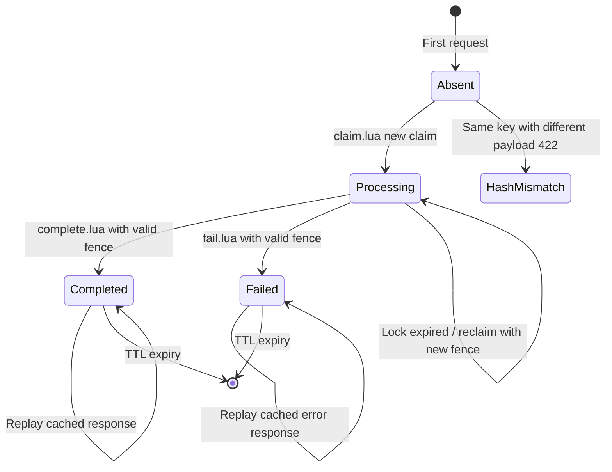
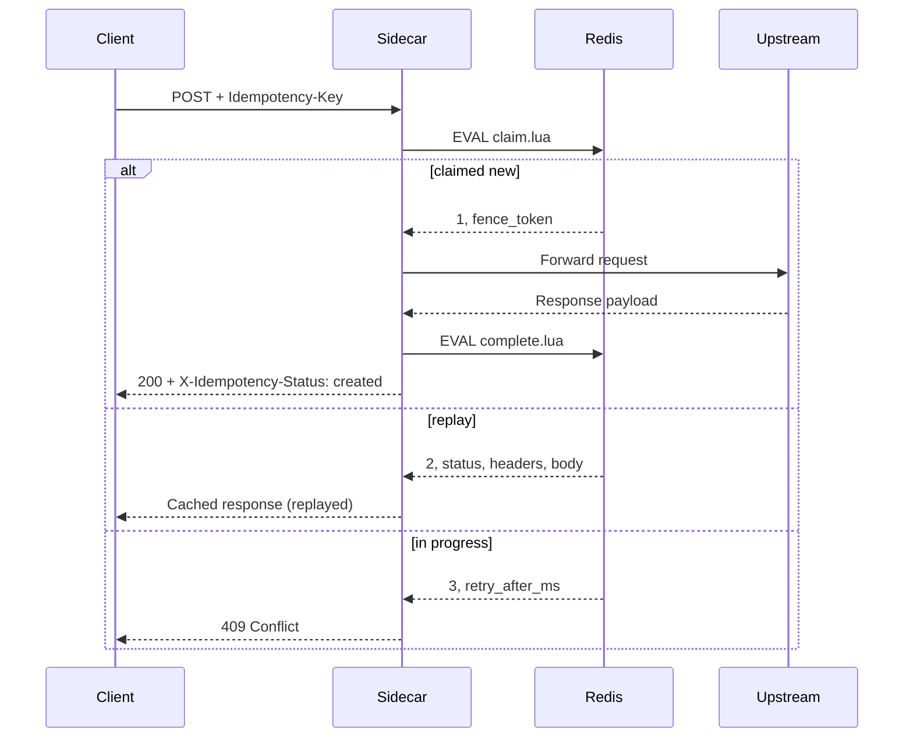

# Idempotency Architecture

For mutating requests (`POST`, `PUT`, `PATCH`, `DELETE` + `Idempotency-Key`), the sidecar layer implements a **distributed claim → execute → complete** flow. Guarantee: **duplicate suppression + cached replay + fencing** — **NOT exactly-once** upstream execution.

---

## State machine



### Redis record (`idem:{scope}:{key}`)

| Field | Purpose |
|-------|---------|
| `status` | `processing` \| `completed` \| `failed` |
| `request_hash` | Body fingerprint — mismatch → 422 |
| `fence_token` | UUID per claim/reclaim owner |
| `lock_until` | Processing lease (`IDEMPOTENCY_LOCK_TTL_MS`) |
| `http_status`, `resp_headers`, `resp_body` / `body_ref` | Cached response |

Large bodies: `idem:body:{scope}:{key}` STRING when > inline threshold (default 64 KiB).

---

## Request flow



Scope = `SHA256(tenant|user)` prefix (32 hex chars) — prevents cross-tenant key collision.

---

## Fencing tokens

1. Go `Claim()` generates a fresh UUID.
2. `claim.lua` stores `fence_token` on new claim or expired-lock reclaim.
3. `complete.lua` / `fail.lua`:
   - `status == processing` required
   - `fence_token` must match ARGV
   - mismatch → `{0}` → Go `ErrStaleFence`
4. Stale holder (crashed worker, reclaimed lock) cannot complete old execution.

**Purpose:** after reclaim, the old completer cannot silently succeed.

---

## NOT exactly-once

| Scenario | Behavior |
|----------|----------|
| Happy path | One upstream call, one completion |
| Concurrent duplicates | 1× claim winner, N×409 in-progress |
| Crash **after** upstream, **before** `Complete` | Lock expires → reclaim → **second upstream possible** |
| Replay after complete | Cached response, zero upstream |

**Crash window:** owner dead during `processing` lease TTL + upstream already mutated → at-least-once upstream side effects possible. Documented limitation, not hidden.

---

## HTTP outcomes

| Code | Meaning |
|------|---------|
| 200 + `X-Idempotency-Status: created` | Fresh execution |
| 200 + `replayed` | Cached success |
| 409 + `in_progress` | Another holder active |
| 422 | Key reused with different request hash |
| 503 | Redis unavailable |

Key validation: `ValidateKey()` — empty / too long → error before Lua (k6 script issues).

---

## Benchmark evidence

### k6 `idempotency-race` (`bench-progress.log`) — **invalid**

```
total=100  rps=3.3  200=10  errors=90 (422)
```

The script sent an invalid idempotency key format — **422 validation failures**, not an architecture test.

### Runtime proof — **valid**

40 parallel POST, same GUID key, 2 sidecars:

| Result | Count |
|--------|-------|
| 200 (upstream executed) | **1** |
| 409 (in-progress / lost race) | **39** |

Evidence: `benchmarks/testing/concurrency-and-race-testing.md`, RUNTIME-PROVEN.

Unit: `TestClaimSingleWinnerUnderConcurrency` — 1 claim, 99 in_progress (TEST-PROVEN).

---

## Circuit breaker coupling

Idempotency enabled → sidecar `cb:central-limiter` guard on limiter HTTP; optional per-gateway CB when routing on.

---

## Source references

| File | Role |
|------|------|
| `internal/idempotency/store.go` | Claim/Complete/Fail |
| `internal/idempotency/lua/*.lua` | Atomic semantics |
| `cmd/sidecar/main.go` | `serveIdempotent`, `forwardIdempotent` |
| `internal/idempotency/store.go` | Claim/Complete/Fail |
| `docs/limitations.md` | Explicit non-guarantees |
