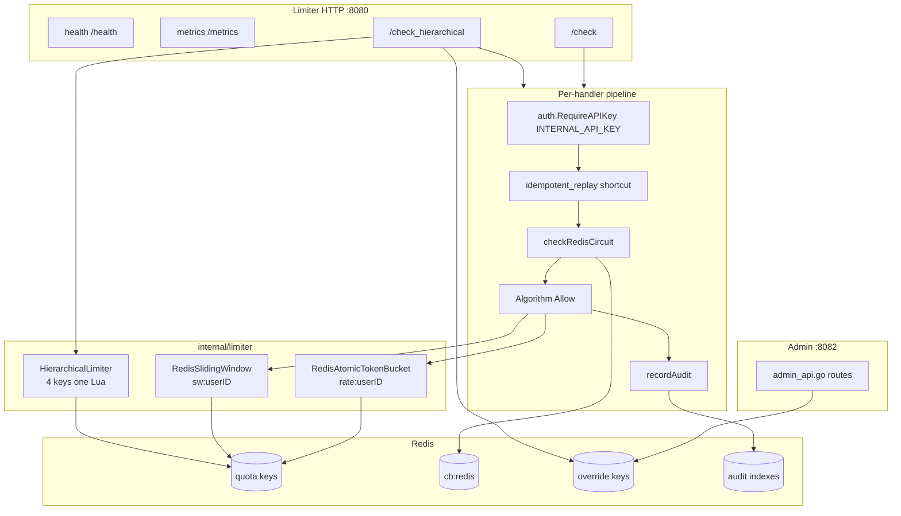

# Limiter Architecture

## Purpose

This document describes the internal structure of the central rate limiter (`cmd/limiter`): `/check` and `/check_hierarchical` handlers, swappable quota algorithms, Redis circuit guard (`cb:redis`), and audit trail emission. Readers should understand enforcement logic, failure modes, and the boundaries of admin integration.

## Executive Summary

The `rate-limiter` process holds fleet-wide **authoritative quota**. The sidecar queries it via HTTP `GET`; the limiter makes atomic decisions by running Lua scripts in Redis. There are two hot-path endpoints: **flat** `/check` (per-user, algorithm env-selected) and **hierarchical** `/check_hierarchical` (four stacked token buckets, admin overrides merged). Each check is preceded by the `cb:redis` circuit guard; each decision is followed by optional audit append. The Admin API runs on a separate HTTP server at `:8082` — network-isolated from the hot path at `:8080`.

## Architecture

### Algorithm selection (`ALGORITHM` env)

| Value | Implementation | Redis key pattern | Semantics |
|-------|----------------|-------------------|-----------|
| `token` (default) | `RedisAtomicTokenBucket` | `rate:{userID}` | Continuous refill + deduct |
| `sliding` | `RedisSlidingWindow` | `sw:{userID}` | Sliding-window log (ZSET of request timestamps); no reset instant |
| hierarchical (flag) | `HierarchicalLimiter` | `rate:global`, `rate:tenant:*`, `rate:user:*`, `rate:endpoint:*` | All four must allow |

Default compose: `ALGORITHM=sliding`, `ENABLE_HIERARCHICAL=true` (`docker-compose.yml`).

### `/check` handler flow

1. `identity.ResolveUserID` — `X-User-ID` header or query (`ALLOW_QUERY_USER_ID`)
2. `?idempotent_replay=true` → synthetic `allowed:true` **without Redis** (trusted shortcut)
3. `checkRedisCircuit` → `cb:redis` `allow.lua`
4. `limiterInstance.Allow(ctx, userID)` → token or sliding Lua
5. `recordRedisCircuit` on error
6. Response: 200 + JSON, 429 + `Retry-After`, or 503
7. `recordAudit` — `allowed` / `denied` / `error`

### `/check_hierarchical` handler flow

1. Identity + `tenantID` (header/query, default `default`) + `endpoint` query (default `default`)
2. `idempotent_replay` shortcut with `effectiveHierarchicalLimits` capacities
3. Redis circuit guard
4. Keys: `rate:global`, `rate:tenant:{tenant}`, `rate:user:{user}`, `rate:endpoint:{tenant}:{endpoint}`
5. `effectiveHierarchicalLimits` — env defaults + Redis overrides via `override.Store`
6. `hierarchicalLimiter.AllowWithParams` — single `hierarchical.lua` EVAL
7. `remaining` = tightest bucket; audit with `Handler: "hierarchical"`

**Important:** Flat `/check` does **not** use the override store (SOURCE-PROVEN, `docs/limitations.md`).

## State Ownership

| State | Key / structure | Writer | Reader |
|-------|-----------------|--------|--------|
| Flat token bucket | `rate:{userID}` hash | `token_bucket.lua` | `/check` |
| Sliding window | `sw:{userID}` ZSET | `sliding_window.lua` | `/check` |
| Hierarchical buckets | 4× `rate:*` hashes | `hierarchical.lua` | `/check_hierarchical` |
| Runtime overrides | override Redis keys + `config:generation` | Admin API `:8082` | `effectiveHierarchicalLimits` |
| Override local cache | `sync.Map` in limiter process | `override.Store.RefreshGeneration` | hierarchical path only |
| Redis circuit | `cb:redis` hash | `record.lua` / `allow.lua` | `checkRedisCircuit` |
| Audit events | `audit:event:{id}` + secondary indexes | `audit.append.lua` | Admin `/admin/audit` |

## Implementation Evidence

| File / Symbol | Responsibility |
|---------------|----------------|
| `cmd/limiter/main.go` | Startup, mux, `/check`, `/check_hierarchical`, graceful shutdown |
| `cmd/limiter/config.go` — `LoadConfig` | `PORT`, `ALGORITHM`, hierarchical capacities, `ADMIN_PORT` |
| `cmd/limiter/circuit.go` — `checkRedisCircuit`, `recordRedisCircuit` | Redis CB guard + outcome recording |
| `cmd/limiter/audit_record.go` — `recordAudit` | Telemetry request ID injection, async fire |
| `cmd/limiter/admin_api.go` — `effectiveHierarchicalLimits`, `startAdminServer` | Override merge + admin server |
| `internal/limiter/redis_atomic_token_bucket.go` — `Allow` | `lua/token_bucket.lua` |
| `internal/limiter/redis_sliding_window.go` — `Allow` | `lua/sliding_window.lua` |
| `internal/limiter/hierarchical.go` — `AllowWithParams` | `lua/hierarchical.lua` |
| `internal/circuitbreaker/store.go` — `Allow`, `Record` | `lua/allow.lua`, `lua/record.lua` |
| `internal/circuitbreaker/types.go` — `TargetRedis` | Constant `"redis"` |
| `internal/audit/store.go` — `Record`, `Shutdown` | Async queue, `lua/append.lua` |
| `internal/override/override.go` | Generation-validated cache |
| `internal/limiter/lua/*.lua` | Atomic quota + CB + audit scripts |

## Correctness Invariants

1. **Startup fail-fast**: Redis `Ping` failure → process exit (`main.go` lines 53–55) — unhealthy limiter does not start.
2. **Lua atomicity**: Token refill + deduct in one `EVAL` — multi-sidecar race safe.
3. **Hierarchical all-or-nothing**: Four keys in one script; partial deduction impossible (`hierarchical.go` comment).
4. **Circuit before quota**: Open `cb:redis` → 503, Redis quota Lua **does not** run.
5. **429 only on explicit deny**: Redis error → 503, not 429.
6. **INTERNAL_API_KEY**: Empty key → dev warning, endpoints unauthenticated (`config.go`).
7. **Audit best-effort**: Async queue full → drop, request path unaffected (`audit/store.go`).

## Failure Semantics

### Redis circuit guard (`checkRedisCircuit`)

| Condition | HTTP | JSON fields |
|-----------|------|-------------|
| `Allow` error, `CIRCUIT_FAIL_OPEN=false` | 503 | `error`, `circuit_state: unavailable` |
| Circuit open / half-open exhausted | 503 | `circuit_state: open` / `half_open` |
| `CIRCUIT_FAIL_OPEN=true` on Allow error | Proceed to quota Lua | — |

`recordRedisCircuit` classifies Lua errors via `circuitbreaker.ClassifyError` and updates `cb:redis`.

### Quota Lua failure

- Response: 503 `Rate limiter unavailable` (flat) or `Hierarchical rate limiter unavailable`
- Audit: `DecisionError`, reason `check: redis unavailable` / `hierarchical: redis unavailable`
- Circuit: failure recorded

### Health endpoint

- Redis disconnected → 503 `status: unhealthy` + `redis` object
- Connected → 200 `status: healthy` + replication info (`redisclient.CheckHealth`)

## Concurrency

- HTTP handlers stateless; Go `net/http` per-connection goroutines.
- Redis Lua serializes conflicting operations per key (single-threaded Redis primary).
- Audit async mode: bounded channel + worker pool; `Record` non-blocking enqueue or drop.
- Override cache: `sync.Map` — per-replica; `RefreshGeneration` before hierarchical merge.
- `TestLimiter` concurrency tests exist (`cmd/limiter/concurrency_test.go`) — parallel `/check` safety.

## Operational Behavior

| Env var | Default | Effect |
|---------|---------|--------|
| `PORT` | 8080 | Hot path listener |
| `ADMIN_PORT` | 8082 | Admin listener (`EnableAdminAPI`) |
| `ALGORITHM` | `token` | `sliding` in compose |
| `ENABLE_HIERARCHICAL` | `true` | Registers `/check_hierarchical` |
| `ENABLE_AUDIT_TRAIL` | compose `true` | Audit store active |
| `AUDIT_ASYNC` | env-driven | Async workers + shutdown drain |
| `OVERRIDE_CACHE_TTL_MS` | 5000 | Local override cache TTL |
| `CIRCUIT_FAIL_OPEN` | `false` | Redis CB error bypass |
| `METRICS_REQUIRE_AUTH` | `false` | Prometheus scrape auth |

Server timeouts: `ReadTimeout=5s`, `WriteTimeout=10s`, `IdleTimeout=120s` (`main.go`).

Shutdown: admin server + main server 5s drain; audit `Shutdown` if async enabled.

## Verified Evidence

| Claim | Type | Source |
|------|--------|-------|
| Redis down → 503 on `/check` | TEST-PROVEN | `cmd/limiter/redis_failure_test.go` |
| Hierarchical four-key evaluation | SOURCE-PROVEN | `main.go` lines 287–303 |
| `/check` ignores overrides | SOURCE-PROVEN | `docs/limitations.md` |
| Token bucket Lua key `rate:{userID}` | SOURCE-PROVEN | `redis_atomic_token_bucket.go:39` |
| Sliding window key `sw:{userID}` | SOURCE-PROVEN | `redis_sliding_window.go:38` |
| Circuit target `redis` | SOURCE-PROVEN | `circuitbreaker/types.go` |
| Admin on separate port | SOURCE-PROVEN | `main.go` comment + `startAdminServer` |
| Check handler tests | TEST-PROVEN | `cmd/limiter/check_handler_test.go`, `hierarchical_handler_test.go` |

## Known Limitations

- **Flat path no overrides**: Admin `PUT /admin/limits/user/{id}` merges only on the hierarchical path.
- **Redis Cluster**: Hierarchical 4-key Lua not atomically safe without hash-tag redesign.
- **Audit durability**: Async drop on overload/shutdown — no external SIEM outbox (`docs/limitations.md`).
- **`idempotent_replay=true`**: Quota bypass shortcut — not used in sidecar standard flow; misuse risk if key leaks.
- **Single Redis**: Default topology — CB + quota + audit share fate.
- Benchmark throughput numbers are not in this document — see `docs/benchmarks/` (BENCHMARK-PROVEN).
