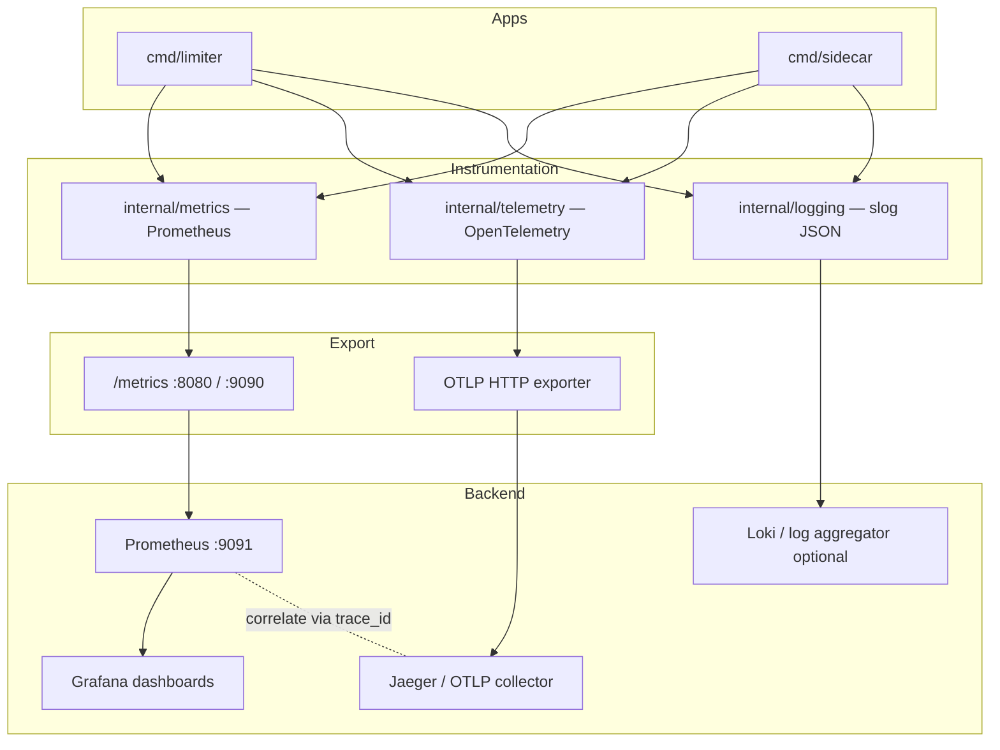

# Observability Architecture

तीन pillars — **metrics**, **traces**, **structured logs** — एक correlated stack। Design goal: production debug without per-user metric labels (OOM safe)।

---

## Stack diagram



---

## Metrics (`internal/metrics`)

Prometheus client — **low-cardinality labels only**।

| Metric | Type | Labels |
|--------|------|--------|
| `rate_limiter_requests_total` | Counter | `handler`, `allowed` |
| `rate_limiter_requests_duration_seconds` | Histogram | `handler` |
| `rate_limiter_redis_duration_seconds` | Histogram | — |
| `rate_limiter_sidecar_cache_hits_total` | Counter | — |
| `idempotency_claims_total` | Counter | `result` |
| `circuit_breaker_state` | Gauge | `target`, `state` |
| `routing_gateway_health_score` | Gauge | `gateway_id` |
| `audit_events_total` | Counter | `decision`, `handler` |

**Never label by:** `user_id`, `tenant_id`, path variants, idempotency keys。

Scrape: limiter `:8080/metrics`, sidecar `:9090/metrics` (optional `METRICS_API_KEY`)।

---

## Traces (`internal/telemetry`)

| Component | Detail |
|-----------|--------|
| Init | `telemetry.Init()` — OTLP HTTP, Jaeger-compatible |
| Sampler | `ParentBased(TraceIDRatioBased)` — `OTEL_SAMPLE_RATIO` |
| Propagation | W3C `tracecontext` + `baggage` |
| HTTP | `telemetry.Middleware` — inbound spans |
| Outbound | `HTTPTransport` wraps limiter/upstream calls |
| Redis | `InstrumentRedis` — command-level spans |

Representative span names:

| Location | Span |
|----------|------|
| `cmd/limiter/main.go` | `limiter.check`, `limiter.check_hierarchical` |
| `cmd/sidecar/main.go` | `sidecar.proxy`, `sidecar.rate_limit_check`, `sidecar.idempotency` |
| `internal/idempotency/store.go` | `idempotency.claim`, `complete`, `fail` |
| `internal/routing/router.go` | `sidecar.intelligent_route` |

Shutdown: `otelShutdown(ctx)` **after** HTTP drain, span batch flush (10 s timeout)।

---

## Structured logs (`internal/logging`)

- `log/slog` JSON to stdout
- Fields: `component`, `operation`, `error`, trace correlation when OTEL active
- **No** full request bodies; sensitive headers redacted (`docs/security/sensitive-data-policy.md`)

Example flow: deny decision → metric `allowed=false` + span event + slog warn with `request_id`。

---

## Health & readiness

| Endpoint | Checks |
|----------|--------|
| Limiter `/health` | Redis ping, optional deps |
| Sidecar `/health` | Limiter `/health` mandatory; Redis if idempotency/routing |

Readiness fails → orchestrator removes pod from LB before SIGTERM drain。

---

## Grafana

Pre-built panels (`docs/observability/grafana-dashboards.md`): request rates, Redis latency, CB state, routing scores, idempotency outcomes, audit drops。

---

## Correlation model

```
trace_id (OTEL) ← propagated via HTTP headers
request_id (X-Request-ID) ← audit index + logs
handler label ← metrics dimension
```

Incident workflow: Grafana alert on p99 → Jaeger trace → slog request_id → `GET /admin/audit?request_id=...`。

---

## Source references

| File | Role |
|------|------|
| `internal/metrics/metrics.go` | Prometheus definitions |
| `internal/telemetry/provider.go` | OTLP setup |
| `internal/telemetry/middleware.go` | HTTP spans |
| `docs/observability/metrics.md` | Metric catalog |
| `docs/observability/tracing.md` | Trace catalog |
| `internal/telemetry` | OTEL provider, middleware, Redis spans |
