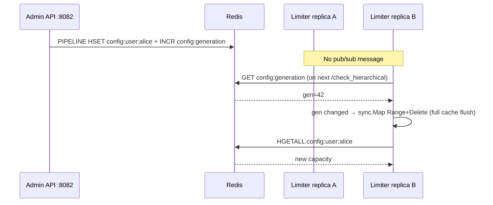

# Override Consistency Architecture

Runtime limit overrides admin API से Redis में लिखे जाते हैं। Cross-replica consistency **`config:generation` counter** + per-replica local cache invalidation से होती है — **Pub/Sub नहीं**, और केवल **hierarchical path** पर apply।

---

## Problem

Admin एक replica पर override लिखे → दूसरे limiter replicas को तुरंत दिखना चाहिए, बिना redeploy। Pub/Sub miss (network gap, subscriber down) risk है; pure TTL wait slow है।

---

## Solution: generation-validated cache



### Redis keys

| Key | Write trigger |
|-----|---------------|
| `config:{level}:{id}` | `SetOverride` / `DeleteOverride` |
| `config:generation` | Same pipeline में atomic `INCR` |

Levels: `global`, `tenant`, `user`, `endpoint` (endpoint id = `tenant|path`)।

---

## `RefreshGeneration` (`internal/override/override.go`)

```go
func (s *Store) RefreshGeneration(ctx context.Context) {
    gen, err := s.rdb.Get(ctx, generationKey).Int64()
    // Redis error → return without advancing (stale cache persists)
    if gen == s.localGeneration.Load() { return }
    s.cache.Range(func(k, _ any) bool { s.cache.Delete(k); return true })
    s.localGeneration.Store(gen)
}
```

**Call site:** `effectiveHierarchicalLimits()` — हर `/check_hierarchical` से **पहले**, multiple override levels read करने से पहले एक बार।

### Local cache (`sync.Map`)

- Key: full Redis key (`config:user:alice`)
- Value: `{cfg, expiry}` — `OVERRIDE_CACHE_TTL_MS` (default **5000 ms**)
- Generation bump → **entire cache flushed** (not per-key selective)
- Writer replica (`SetOverride`) locally भी generation advance + single key delete

---

## NOT Pub/Sub — जानबूझकर

| Approach | Verdict |
|----------|---------|
| Redis Pub/Sub broadcast | Rejected — missed messages, extra moving parts |
| Fixed TTL only | Rejected — up to TTL staleness after write |
| **Poll `config:generation`** | Chosen — one GET per hierarchical check, deterministic |

Trade-off: one extra Redis `GET` per hierarchical request vs instant push।

---

## Hierarchical only

| Path | Overrides applied? |
|------|-------------------|
| `/check_hierarchical` | **Yes** — `effectiveHierarchicalLimits` |
| Flat `/check` (sliding/token) | **No** — static env `CAPACITY` / `WINDOW_SEC` only |
| Sidecar flat mode | No override merge |
| Sidecar hierarchical mode | Limiter side merge |

Admin API `:8082` (`cmd/limiter/admin_api.go`) — `X-API-Key: ADMIN_API_KEY`।

---

## Visibility guarantees

| Guarantee | Detail |
|-----------|--------|
| Same replica after write | Immediate (local generation + key delete) |
| Other replica | Next successful `RefreshGeneration` after admin write |
| Redis GET failure | Stale cache until next successful refresh or `OVERRIDE_CACHE_TTL_MS` per-key expiry |
| Not instant global | No cross-replica push; bounded by check frequency |

**Tests:** `TestOverrideSetVisibleAcrossReplicas` — write on A, `RefreshGeneration` on B → visible (TEST-PROVEN)।

---

## Write atomicity

```go
pipe.HSet(ctx, key, "capacity", ..., "refill_rate", ...)
incr := pipe.Incr(ctx, generationKey)
pipe.Exec(ctx)
```

Override data और generation bump **एक pipeline** — readers never see new generation with old override data।

---

## Operational checks

```bash
# Current generation
redis-cli GET config:generation

# After admin POST, from each limiter pod:
curl -H "X-API-Key: $INTERNAL_API_KEY" \
  "http://limiter:8080/check_hierarchical?endpoint=/api/v1/foo" \
  -H "X-User-ID: test"
```

---

## Source references

| File | Role |
|------|------|
| `internal/override/override.go` | Store, generation, cache |
| `cmd/limiter/admin_api.go` | CRUD + `effectiveHierarchicalLimits` |
| `docs/correctness/multi-replica-correctness.md` | Cross-replica evidence |
