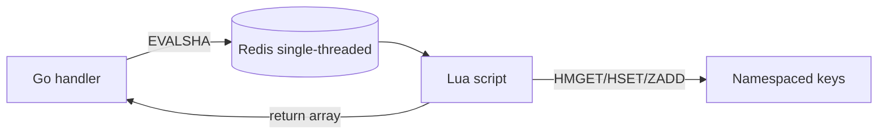

# Redis Architecture

Redis is this system's **authoritative coordination layer** — quota, idempotency, circuit breaker, routing metrics, audit, and runtime overrides all flow through one `UniversalClient` (`internal/redis`). Every hot-path invariant stays **atomic in Lua scripts**; the Go side uses `redis.NewScript` + `EVALSHA`.

---

## Client factory (`internal/redis`)

| Concern | Implementation |
|---------|----------------|
| Modes | `standalone` (default) or `sentinel` (`FailoverClient`) |
| Pool | `PoolSize=100`, `MinIdleConns=10` (defaults) |
| Config | `LoadConfigFromEnv()` — `REDIS_MODE`, `REDIS_ADDR`, `REDIS_SENTINEL_ADDRS`, `REDIS_MASTER_NAME`, … |
| Health | `Ping()`, `Describe()` |
| Shutdown | `Close()` — limiter sidecar ordering after audit drain |

### Timeout budget (`internal/redis/timeouts.go`)

Deterministic outage budget — **no command-level retry** (default):

| Setting | Default | Env override |
|---------|---------|--------------|
| `DialTimeout` | 500 ms | `REDIS_DIAL_TIMEOUT_MS` |
| `ReadTimeout` | 500 ms | `REDIS_READ_TIMEOUT_MS` |
| `WriteTimeout` | 500 ms | `REDIS_WRITE_TIMEOUT_MS` |
| `PoolTimeout` | 1 s | `REDIS_POOL_TIMEOUT_MS` |
| `DialerRetries` | 1 | `REDIS_DIALER_RETRIES` |
| `MaxRetries` | 0 (disabled) | `REDIS_MAX_RETRIES` |

`MaxRetries=0` → `-1` in go-redis (disabled). Sidecar Redis down → ~**1 s** bounded 503; limiter HTTP timeout ~**500 ms** — separate layers.

---

## Key namespaces

```
rate:*          — token bucket (HASH)
sw:*            — sliding window (ZSET)
config:*        — runtime overrides (HASH)
config:generation — monotonic invalidation counter (STRING/int)
idem:*          — idempotency metadata + body (HASH + STRING)
cb:*            — circuit breaker state (HASH)
route:*         — gateway registry + metrics (HASH + SET)
audit:*         — events + indexes (HASH + ZSET)
```

### Rate limiting

| Key | Type | Script | Handler |
|-----|------|--------|---------|
| `rate:{userID}` | HASH `tokens`, `last_refill` | `token_bucket.lua` | `/check` flat |
| `sw:{userID}` | ZSET (ts → id) | `sliding_window.lua` | `/check` when `ALGORITHM=sliding` |
| `rate:global` | HASH | `hierarchical.lua` | level 0 |
| `rate:tenant:{tenantID}` | HASH | same | level 1 |
| `rate:user:{userID}` | HASH | same | level 2 |
| `rate:endpoint:{tenantID}:{path}` | HASH | same | level 3 |

TTL: `EXPIRE 3600` on hierarchical/token keys (idle eviction).

### Configuration

| Key | Fields |
|-----|--------|
| `config:global:default` | `capacity`, `refill_rate` |
| `config:tenant:{id}` | same |
| `config:user:{id}` | same |
| `config:endpoint:{tenant\|path}` | same |
| `config:generation` | monotonic counter (INCR on write/delete) |

### Idempotency

| Key | Purpose |
|-----|---------|
| `idem:{scope}:{key}` | HASH — status, hash, fence_token, lock_until, response |
| `idem:body:{scope}:{key}` | STRING — large bodies (> inline threshold) |

Scope = first 16 bytes (hex) of `SHA256(tenant|user)`.

### Circuit breaker

| Key | Example targets |
|-----|-----------------|
| `cb:{target}` | `redis`, `central-limiter`, `{gatewayID}` |

### Routing

| Key | Type |
|-----|------|
| `route:gw:{id}` | HASH — url, weight, health_score, latency_ema_ms, counters |
| `route:index` | SET — gateway IDs |

### Audit

| Key | Type |
|-----|------|
| `audit:event:{uuid}` | HASH |
| `audit:idx:ts` | ZSET (time index) |
| `audit:idx:tenant:{id}` | ZSET |
| `audit:idx:user:{id}` | ZSET |
| `audit:idx:req:{requestID}` | STRING → event id |

---

## Lua scripts inventory

| Package | Script | Atomic operation |
|---------|--------|------------------|
| `internal/limiter/lua` | `token_bucket.lua` | refill + deduct |
| | `sliding_window.lua` | prune + count + add |
| | `hierarchical.lua` | 4-level merge (all-or-nothing) |
| `internal/idempotency/lua` | `claim.lua` | claim / replay / in-progress / reclaim |
| | `complete.lua` | fence-checked completion |
| | `fail.lua` | fence-checked failure record |
| `internal/circuitbreaker/lua` | `allow.lua` | closed/open/half-open gate |
| | `record.lua` | outcome + state transition |
| `internal/routing/lua` | `record_outcome.lua` | EMA + health_score |
| `internal/audit/lua` | `append.lua` | event + indexes + retention trim |

All scripts use `//go:embed` + `redis.NewScript()` — SHA1 cache at startup.

---

## NOSCRIPT handling

1. Normal path: `EVALSHA <sha>` — script cached server-side.
2. After `SCRIPT FLUSH`, cold Redis, or failover, Redis may return `NOSCRIPT`.
3. **go-redis `redis.Script`** automatically retries with the full script body — no explicit NOSCRIPT handler in application code.
4. Tests: `SCRIPT FLUSH` recovery SOURCE + TEST + RUNTIME proven.

**Operational note:** deliberate `SCRIPT FLUSH` is rare in production; transient NOSCRIPT is one extra round-trip, not a correctness break.

---

## Execution model



- Per-shard single-threaded execution → read-modify-write race-free in Lua.
- After Sentinel promotion scripts are unchanged; client reconnects via `FailoverClient`.
- `KEYS *` / full scan forbidden on hot path — CB admin scan `SCAN cb:*` only for ops.

---

## Observability hook

With `OTEL_ENABLED=true`, `telemetry.InstrumentRedis(rdb)` — Redis commands traced (`internal/telemetry/redis.go`).

---

## Source references

| File | Role |
|------|------|
| `internal/redis/client.go` | Factory + timeout application |
| `internal/redis/timeouts.go` | Defaults + env resolution |
| `internal/redis/config.go` | Mode, pool, env loading |
| `internal/redis/health.go` | Ping helper |
| `docs/diagrams/redis-layout.md` | Visual key layout |
