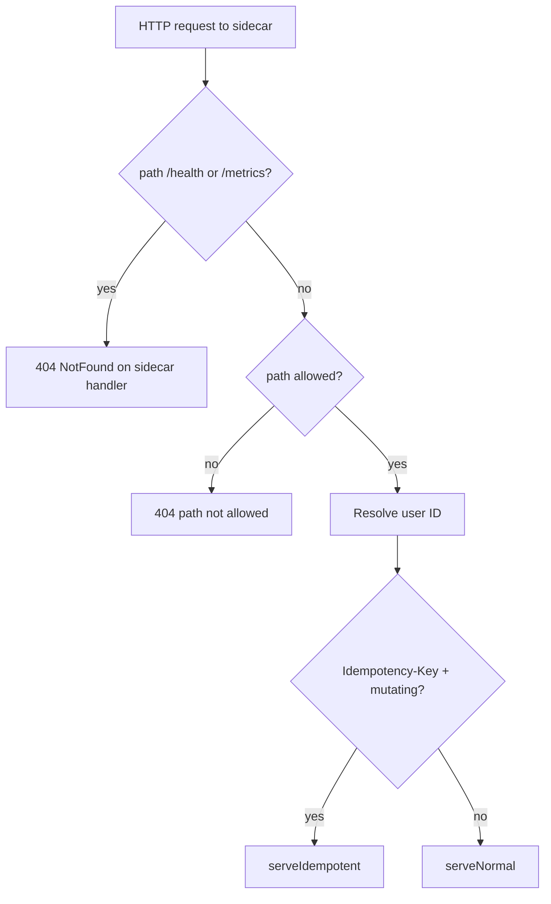
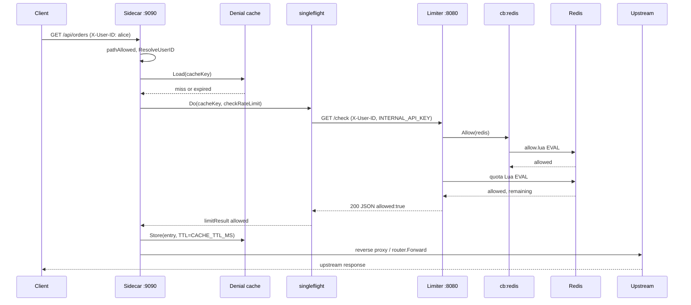
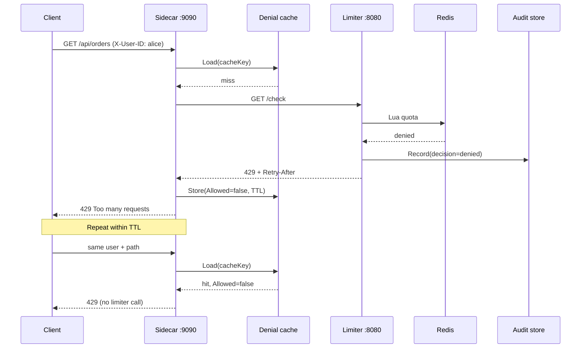
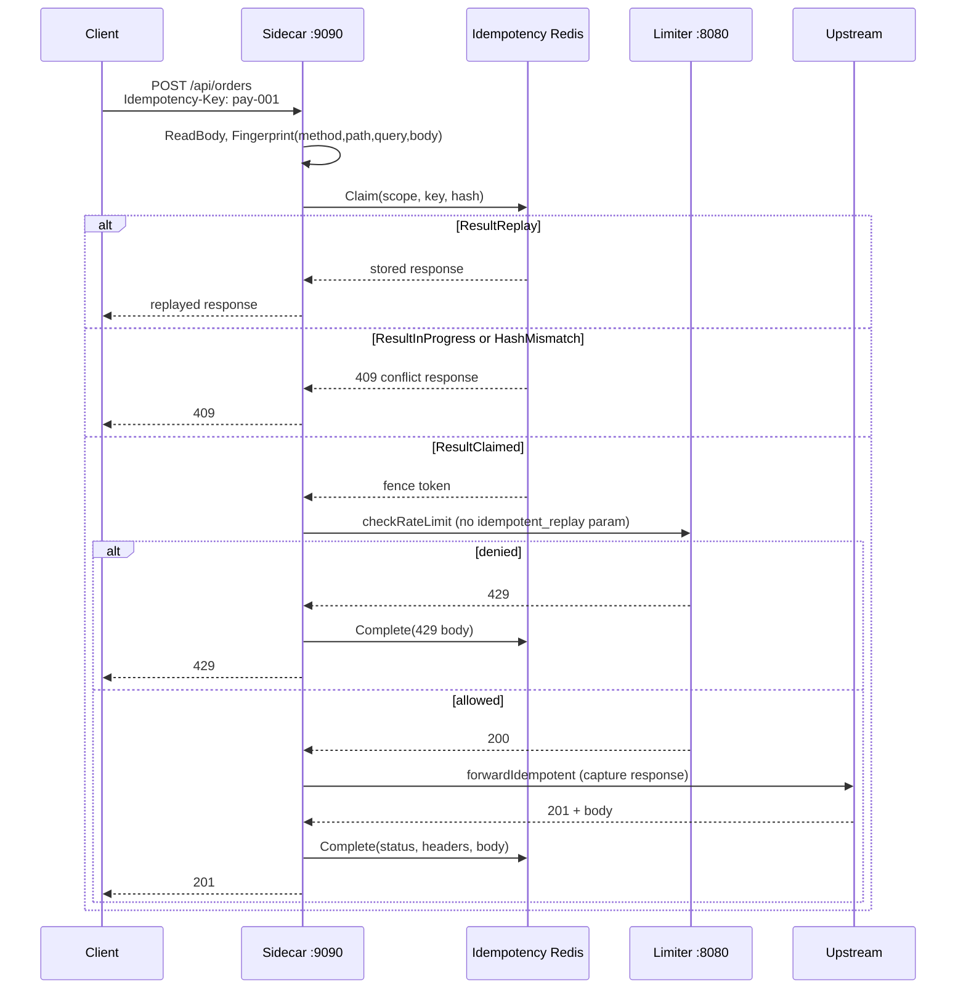
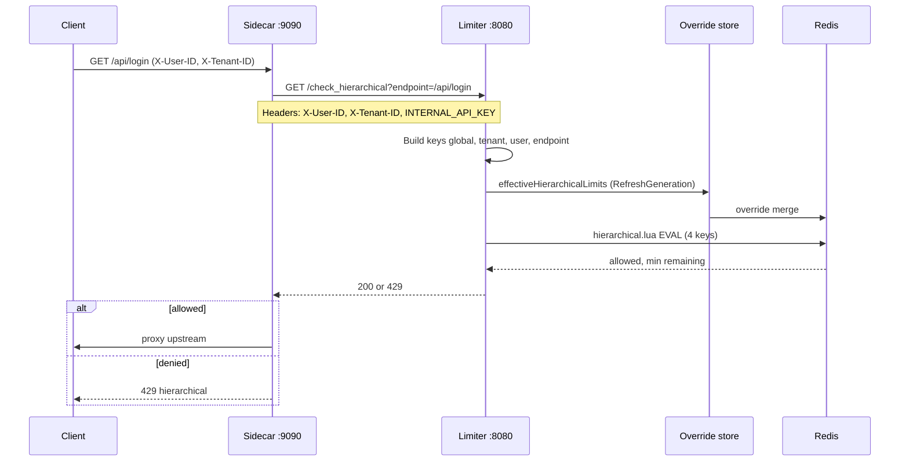
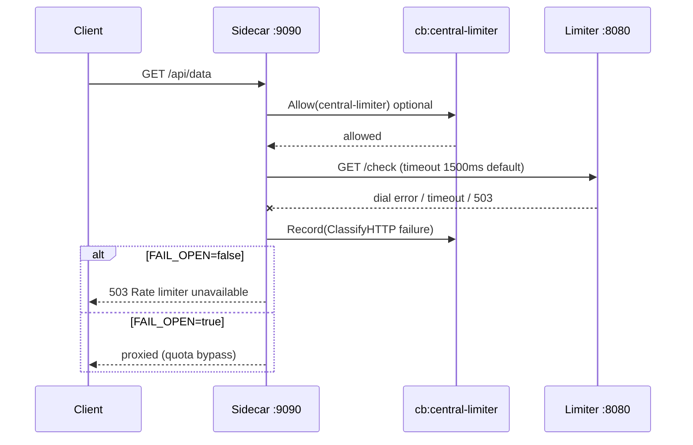

# Request Lifecycle

## Purpose

This document describes the sequential behavior of an HTTP request across the sidecar → limiter → Redis → upstream path under various scenarios (normal, denied, idempotent, hierarchical, redis failure, limiter failure), with sequence diagrams and implementation evidence.

## Executive Summary

All proxied requests enter through `ServeHTTP` in `cmd/sidecar/main.go`. After identity resolution, if `Idempotency-Key` is present and the method is mutating, the `serveIdempotent` path is used; otherwise `serveNormal`. Normal path: denial cache → singleflight → `checkRateLimit` → limiter HTTP → upstream proxy. The limiter runs Redis circuit guard and Lua quota on every check. Failure paths default to **fail-closed** (503); `FAIL_OPEN`, `IDEMPOTENCY_FAIL_OPEN`, and `CIRCUIT_FAIL_OPEN` are explicit opt-ins.

## Architecture

### Routing decision (entry)

### Cache key semantics

| Mode | `cacheKey` | Source |
|------|------------|-------|
| Flat (`USE_HIERARCHICAL=false`) | `userID` | `Sidecar.cacheKey` |
| Hierarchical | `tenantID\|userID\|path` | `Sidecar.cacheKey` |

## Mermaid Sequence Diagrams

### 1. Normal — allowed request

### 2. Denied — quota exhausted (with denial cache)

### 3. Idempotent — mutating POST with Idempotency-Key

**Note:** The sidecar standard idempotent path does **not** send `idempotent_replay=true` to the limiter (`checkRateLimit` with `idempotentReplay=false`). The limiter's `?idempotent_replay=true` shortcut is for trusted callers only (`cmd/limiter/main.go`).

### 4. Hierarchical — USE_HIERARCHICAL=true

### 5. Redis failure — limiter runtime

```mermaid
sequenceDiagram
    participant C as Client
    participant S as Sidecar :9090
    participant L as Limiter :8080
    participant CB as cb:redis
    participant R as Redis

    C->>S: GET /api/data
    S->>L: GET /check
    L->>CB: Allow(redis)
    CB->>R: allow.lua
    R-->>CB: error / open circuit
    alt circuit closed path with Lua error
        L->>R: quota Lua
        R-->>L: connection error
        L->>CB: Record(failure)
        L-->>S: 503 Rate limiter unavailable
    else circuit open
        L-->>S: 503 circuit_state: open
    end
    alt FAIL_OPEN=false default
        S-->>C: 503 Rate limiter unavailable
    else FAIL_OPEN=true
        S->>S: forwardRequest (warning log)
        S-->>C: upstream response
    end
```

### 6. Limiter failure — sidecar HTTP error / timeout

Sidecar limiter HTTP timeouts: `SIDECAR_LIMITER_HTTP_TIMEOUT_MS` default 1500ms (`cmd/sidecar/limiter_http.go`).

## State Ownership

| Lifecycle stage | Mutable state | Owner |
|---------------|---------------|-------|
| Identity resolution | None (derived from headers/query) | Sidecar |
| Idempotency claim | `idem:*` Redis keys | Sidecar + Redis Lua |
| Denial cache entry | `sync.Map` entry | Sidecar process |
| Quota mutation | `rate:*` / `sw:*` | Limiter Lua |
| Circuit samples | `cb:redis`, `cb:central-limiter` | Redis Lua |
| Audit event | `audit:event:{uuid}` | Limiter async workers |
| Upstream response (idempotent) | Idempotency completed record | Sidecar + Redis |

## Implementation Evidence

| File / Symbol | Responsibility |
|---------------|----------------|
| `cmd/sidecar/main.go` — `ServeHTTP` | Entry routing idempotent vs normal |
| `cmd/sidecar/main.go` — `serveNormal` | Cache → singleflight → forward/deny |
| `cmd/sidecar/main.go` — `serveIdempotent` | Claim → check → forward/complete/fail |
| `cmd/sidecar/main.go` — `checkRateLimit` | Limiter HTTP, circuit record, header parse |
| `cmd/limiter/main.go` — `/check` handler | Circuit, `limiterInstance.Allow`, audit |
| `cmd/limiter/main.go` — `/check_hierarchical` | Override merge, `hierarchicalLimiter.AllowWithParams` |
| `cmd/limiter/circuit.go` — `checkRedisCircuit` | Fail-closed 503 with `circuit_state` |
| `internal/idempotency/store.go` | Claim/Complete/Fail Redis semantics |
| `cmd/sidecar/limiter_http.go` — `LimiterHTTPConfig` | Outbound timeout bounds |

## Correctness Invariants

1. **Allow never cached for serve**: Expired or `Allowed=true` cache entries do **not** skip the limiter (`serveNormal` lines 377–394).
2. **Denial cache does not weaken quota**: Only previously denied state is replayed; new allows come from Redis.
3. **singleflight same key**: One limiter RTT in a concurrent burst (`limitFlight.Do(cacheKey, ...)`).
4. **Idempotent deny persists**: On 429, `Complete` — same denial on replay (`serveIdempotent` lines 295–300).
5. **Hierarchical endpoint**: Sidecar sends `r.URL.Path` as the `endpoint` query parameter.
6. **Status code separation**: 429 = quota; 503 = infrastructure/policy unavailable.

## Failure Semantics

| Trigger | Client status | Sidecar body | Recoverable |
|---------|---------------|--------------|-------------|
| Quota denied | 429 | `Too many requests` + `Retry-After` | Client backoff |
| Limiter 503 / network | 503 | `Rate limiter unavailable` | Restore Redis/limiter |
| `FAIL_OPEN=true` | Upstream status | (bypass) | Operational risk |
| Idempotency store down | 503 | `Idempotency store unavailable` | Redis restore |
| `IDEMPOTENCY_FAIL_OPEN` | Normal path | dedup disabled | Duplicate risk |
| Circuit open (limiter) | 503 | `circuit_state` in JSON | Cooldown / admin reset |
| Path not allowed | 404 | `path not allowed` | Config `ALLOWED_PATHS` |
| Missing user ID | 400 | identity error | Client fix headers |

## Concurrency

- **Normal allowed burst**: N concurrent same-user → singleflight → 1 Redis Lua; N upstream forwards after shared result.
- **Normal denied burst**: First miss → singleflight → 1 limiter call; rest share same flight; then cache serves 429.
- **Idempotent**: Claim Lua serializes same key; concurrent duplicates → `ResultInProgress` / replay.
- **Cross-sidecar**: No shared denial cache — duplicate limiter calls possible on two replicas (correctness preserved, optimization lost).

## Operational Behavior

- Default `CACHE_TTL_MS` = 30ms compose (`cmd/sidecar/main.go` `main()`).
- Idempotency: `ENABLE_IDEMPOTENCY=true` default compose; Redis mandatory at sidecar startup.
- Mutating methods: `idempotency.IsMutatingMethod` — GET checks do not enter idempotency path unless key present on GET (key + mutating gate).
- Limiter records audit on allow/deny/error when `ENABLE_AUDIT_TRAIL=true`.

## Verified Evidence

| Scenario | Type | Source |
|----------|--------|-------|
| Denial cache second hit = 0 extra limiter calls | TEST-PROVEN | `TestSidecar_DenialCache` |
| Allowance re-queries limiter despite cache entry | TEST-PROVEN | `TestSidecar_AllowanceCache` |
| 100 goroutines → 1 limiter call | TEST-PROVEN | `TestSidecar_SingleflightCollapse` |
| Redis closed → 503, no address leak | TEST-PROVEN | `TestRedisFailure_Handling` |
| Hierarchical handler four keys | SOURCE-PROVEN | `cmd/limiter/main.go` lines 287–303 |
| FAIL_OPEN logs warning on forward | SOURCE-PROVEN | `serveNormal` lines 416–421 |

## Known Limitations

- Idempotent path **not** exactly-once upstream — crash between upstream success and `Complete` may duplicate (`docs/limitations.md`).
- `idempotent_replay=true` limiter shortcut not used in sidecar idempotent flow.
- Hierarchical + flat cache key differs — tenant/path isolation only in hierarchical mode.
- k6 `singleflight.js` is functional; collapse ratio is not a dedicated metric (see `TestSidecar_SingleflightCollapse`).
