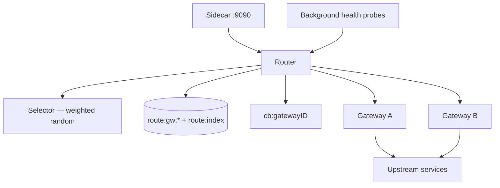
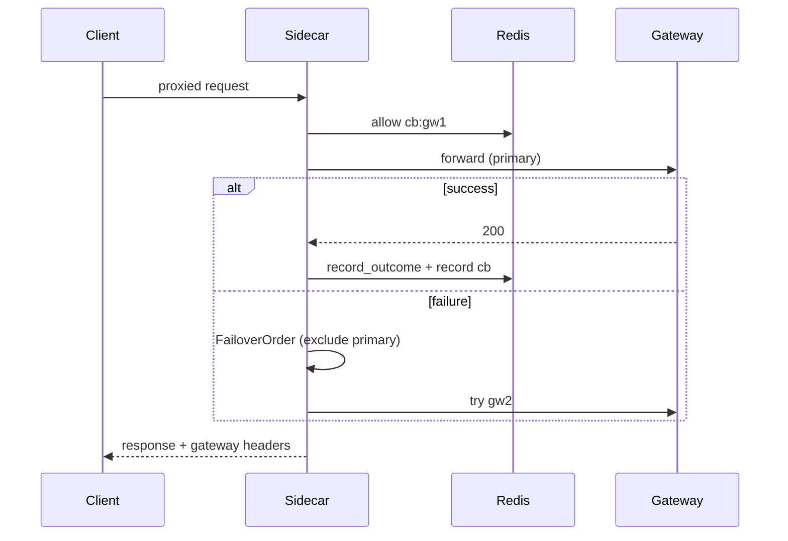

# Routing Architecture

Intelligent routing is an optional layer in the sidecar (`ENABLE_ROUTING=true`). Multiple upstream **gateways** register; passive **health probes** and request **outcomes** update Redis metrics; primary selection uses **weighted random** on computed score; on failure, **failover ordering** applies.

---

## Components



| Piece | Package | Role |
|-------|---------|------|
| `RedisStore` | `internal/routing` | Gateway registry + `record_outcome.lua` |
| `Router` | same | Forward + failover + probes |
| `Selector` | same | `PickPrimary`, `FailoverOrder` |
| `ComputeScore` | `scorer.go` | Weight × latency × health × error penalty |

---

## Gateway registry (Redis)

| Key | Fields |
|-----|--------|
| `route:gw:{id}` | `id`, `url`, `weight`, `enabled`, `health_score`, `latency_ema_ms`, `success_count`, `error_count`, `total_requests`, `updated_at` |
| `route:index` | SET of gateway IDs |

Startup: `Router.Seed()` registers gateways from static config (`cmd/sidecar` env `GATEWAYS_JSON` / config).

Admin: `:8082` routing endpoints — weight update, enable/disable, circuit reset.

---

## Health probes

`Router.StartHealthProbes(ctx)` — background goroutine:

```
interval = ROUTING_PROBE_INTERVAL_SEC (default > 0 enables)
each tick:
  for gateway in ListGateways():
    GET {url}/health
    UpdateHealthProbe(id, success, latency)
```

- Success: HTTP < 500, no transport error
- Updates `health_score`, `latency_ema_ms` via `record_outcome.lua`
- Cancel on sidecar SIGTERM (`probeCancel()` before HTTP drain)

**Passive + active:** request-level `RecordOutcome` also feeds metrics; probes push unhealthy gateways toward score=0.

---

## Weighted routing score

```go
score = weight × latencyFactor × healthFactor × errorFactor
```

| Factor | Rule |
|--------|------|
| `weight` | Static config (default 100 if 0) |
| `latencyFactor` | `TargetLatencyMs / latency_ema`, clamp [0.1, 2.0] |
| `healthFactor` | `health_score / 100` |
| `errorFactor` | `1 - (errorRate × ErrorPenalty)`, floor 0.05 |

`Selectable(cfg)`: disabled, circuit open, zero score → excluded.

### Primary selection (`PickPrimary`)

1. `RankScores` — descending score
2. Filter `score > 0`
3. **Weighted random:** `roll ∈ [0, totalScore)` — roulette wheel
4. Response headers: `X-Gateway-ID`, `X-Gateway-Score`

### Failover (`FailoverOrder`)

On primary failure, score-descending alternatives, `MaxFailoverTries` cap; `X-Gateway-Failover: true` on retry hops.

---

## Circuit breaker per gateway

Each gateway target `cb:{gatewayID}`:

1. `allow.lua` before forward
2. `record.lua` after response (success/failure/timeout classification)

Open gateway → `ComputeScore` returns 0 → excluded from weighted pool.

---

## Request path



Rate limit check still goes through the central limiter (routing upstream pick is separate).

---

## Configuration (representative)

| Env | Purpose |
|-----|---------|
| `ENABLE_ROUTING` | Feature gate |
| `ROUTING_PROBE_INTERVAL_SEC` | Probe ticker |
| `ROUTING_TARGET_LATENCY_MS` | Score target |
| `ROUTING_ERROR_PENALTY` | Error rate weight |
| `ROUTING_MAX_FAILOVER_TRIES` | Failover depth |

---

## Source references

| File | Role |
|------|------|
| `internal/routing/router.go` | Forward, probes |
| `internal/routing/selector.go` | Weighted pick |
| `internal/routing/scorer.go` | Score formula |
| `internal/routing/lua/record_outcome.lua` | Atomic metrics |
| `internal/routing/router.go` | Weighted selection |
