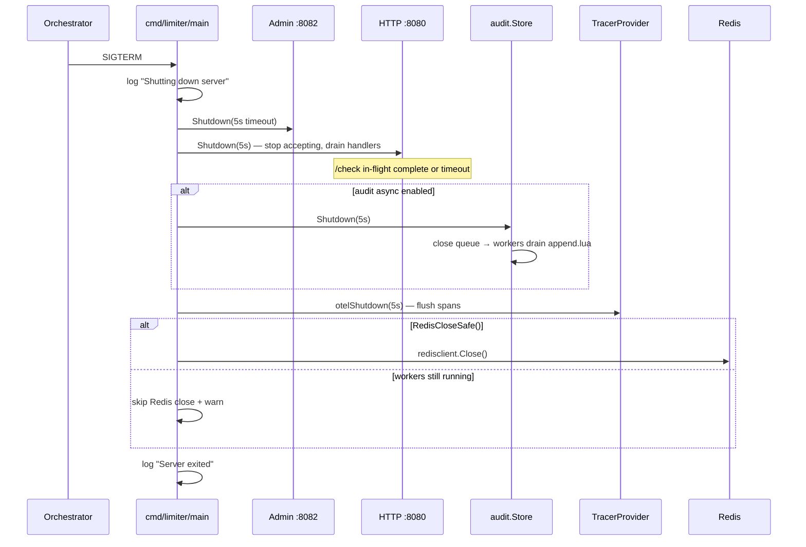
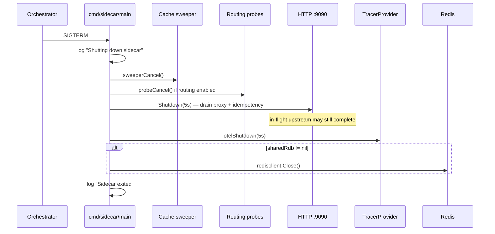

# Shutdown Lifecycle

Both binaries (`cmd/limiter`, `cmd/sidecar`) perform graceful drain on SIGINT/SIGTERM. During rolling deploy, in-flight requests should complete; on the limiter, the audit queue must flush before Redis close.

---

## Limiter SIGTERM sequence



### Timeouts

| Phase | Budget |
|-------|--------|
| HTTP + Admin drain | **5 s** (`context.WithTimeout`) |
| Audit worker wait | same parent ctx |
| OTEL flush | **10 s** internal (`telemetry.defaultShutdownTimeout`) |

Forced shutdown: HTTP `Shutdown` error → `Fatal` (limiter); sidecar same pattern.

---

## Sidecar SIGTERM sequence



Sidecar **no audit store** — simpler ordering.

Background tasks stopped **before** HTTP drain:

1. Denial cache sweeper (`StartCacheSweeper`, 10 s tick)
2. Gateway health probe goroutine

---

## In-flight request behavior

| Component | During drain |
|-----------|--------------|
| New connections | Rejected (server shutting down) |
| Active `/check` | Completes or 5 s ctx cancel |
| Active sidecar proxy | Up to `WriteTimeout` (10 s) |
| Async audit accepted | Queued items drained by workers |
| Async audit post-close | Dropped |

---

## Redis close safety

Limiter audit async path:

```go
if auditStore != nil && !auditStore.RedisCloseSafe() {
    logging.Warn("Skipping Redis close while audit workers are still active")
} else {
    redisclient.Close(rdb)
}
```

On `Shutdown` timeout, workers may still be alive — caller can retry `Shutdown` later (`shutdown_test.go: TestShutdown_TimeoutThenResume`).

---

## Kubernetes / Compose notes

- `terminationGracePeriodSeconds` ≥ **15 s** recommended (5 s HTTP + 5 s audit + OTEL margin)
- Readiness fail first → LB cuts traffic before SIGTERM
- `docker compose stop` sends SIGTERM — same code path

---

## Source references

| File | Role |
|------|------|
| `cmd/limiter/main.go` | Limiter shutdown block |
| `cmd/sidecar/main.go` | Sidecar shutdown block |
| `internal/audit/shutdown.go` | Audit drain semantics |
| `docs/operations/graceful-shutdown.md` | Ops runbook |
