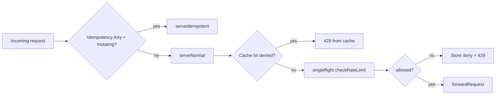
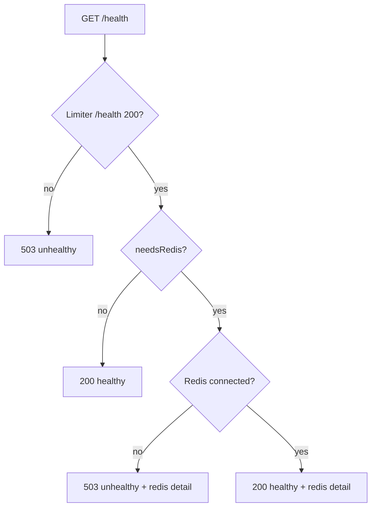

# Sidecar Architecture

## Purpose

This document describes the internal structure of `cmd/sidecar` — the edge proxy — with emphasis on **denial-only cache**, **singleflight** deduplication, **fail-open** policy, and **health/readiness** semantics. The sidecar is not the source of quota; it delegates to the central limiter and applies only safe process-local optimizations.

## Executive Summary

The sidecar is the client's single entry point (`PORT` default **9090**). On each proxied request it sends an HTTP GET to the central limiter (`RATE_LIMITER_URL`, typically `http://limiter:8080`) with the internal API key. The **denial cache** (`sync.Map`, TTL `CACHE_TTL_MS`) serves only `Allowed=false` entries — allowances always trigger a fresh limiter check. **singleflight** (`golang.org/x/sync/singleflight`) collapses concurrent misses on the same `cacheKey` into one limiter round-trip. **FAIL_OPEN** default `false`: limiter/Redis errors → 503; when `true`, forwards upstream with a warning log. Health: limiter `/health` mandatory; Redis check conditional on idempotency/routing.

## Architecture

```mermaid
flowchart TB
    subgraph Sidecar["Sidecar process :9090"]
        MUX["mux: /metrics, /health, /"]
        SH[Sidecar.ServeHTTP]
        MUX --> SH

        subgraph Optimizations["Process-local optimizations"]
            CK[cacheKey tenant|user|path]
            DC[sync.Map denial cache]
            SF[singleflight.Group limitFlight]
            SW[Cache sweeper goroutine 10s]
        end

        subgraph Optional["Optional layers"]
            IDEM[idempotency.Store]
            RT[routing.Router]
            LCB[circuitbreaker cb:central-limiter]
        end

        SH --> CK
        SH --> DC
        SH --> SF
        SH --> IDEM
        SH --> RT
        SH --> LCB
    end

    subgraph Outbound["Outbound HTTP"]
        HC[http.Client timeouts 1500ms]
        LIM[Limiter :8080 /check or /check_hierarchical]
        UP[UPSTREAM_URL or gateways]
    end

    SH --> HC --> LIM
    SH --> UP
    IDEM --> Redis[(Redis)]
    RT --> Redis
    LCB --> Redis
```

### Request path decision



## Denial Cache (deny only)

### Design rationale

Package comment (`cmd/sidecar/main.go` lines 6–7): denials briefly cacheable to protect Redis under abuse; **allowances always re-check** so token counts stay accurate.

### Behavior

| Event | Action |
|-------|--------|
| Cache miss | `metrics.RecordCacheMiss()`, proceed to singleflight |
| Cache hit, `Allowed=false`, not expired | `metrics.RecordCacheHit()`, `writeDenial` — **no limiter call** |
| Cache hit, `Allowed=true` | Entry **ignored**, limiter consulted |
| Entry expired | `cache.Delete`, treat as miss |
| After limiter response | `cache.Store` with `ExpiresAt = now + ttl` (both allow and deny stored, but only deny served) |

Default TTL: **30ms** (`CACHE_TTL_MS` env). Sweeper: every **10s** expired entries removed (`StartCacheSweeper`).

### Cache key

| `USE_HIERARCHICAL` | Key format |
|--------------------|------------|
| `false` | `userID` |
| `true` | `{tenantID}\|{userID}\|{path}` |

Tenant default: `default` (`cacheKey` method).

## singleflight

`limitFlight.Do(cacheKey, func() { return s.checkRateLimit(...) })` ensures concurrent requests sharing the same cache key execute **one** limiter HTTP call; waiters receive shared `limitResult`.

- Scope: per process — **not** cross sidecar replica
- Shared result cached afterward (deny entries then short-circuit)

## Fail-open

| Flag | Default | Trigger | Behavior |
|------|---------|---------|----------|
| `FAIL_OPEN` | `false` | `checkRateLimit` error in `serveNormal` / `serveIdempotent` | 503 to client |
| `FAIL_OPEN=true` | — | Same | `forwardRequest` / `forwardIdempotent` + `logging.Warn` |
| `IDEMPOTENCY_FAIL_OPEN` | `false` | Idempotency `Claim` error | 503 or bypass dedup |
| `CIRCUIT_FAIL_OPEN` (sidecar CB) | `false` | `limiterCircuit.Allow` error | Error returned to caller |

Startup warning when `FAIL_OPEN=true` (`main()` lines 665–670).

**Operational note:** Fail-open turns infrastructure outage into **unmetered upstream traffic** — production default remain fail-closed (`docker-compose.yml` `FAIL_OPEN=false`).

## Health

### Endpoint

`GET /health` — registered on separate mux route, **not** through `Sidecar.ServeHTTP` (which returns 404 for `/health`).

### Evaluation (`evaluateSidecarHealth`)



- `needsRedis = ENABLE_IDEMPOTENCY || ENABLE_ROUTING` (`main()` line 710)
- Limiter probe: `GET {RATE_LIMITER_URL}/health`, status must be 200 (`checkLimiterHealth`)
- Uses same `httpClient` as limiter checks (bounded timeouts)

Sidecar **does not** fail startup if limiter later unhealthy — runtime `/health` reflects dependency state.

## State Ownership

| State | Storage | Shared across replicas? |
|-------|---------|-------------------------|
| Denial cache entries | `Sidecar.cache` (`sync.Map`) | **No** |
| singleflight in-flight | `Sidecar.limitFlight` | **No** |
| `httputil.ReverseProxy` | Single instance per sidecar | N/A |
| Idempotency records | Redis | **Yes** |
| Routing gateway scores | Redis | **Yes** |
| `cb:central-limiter` | Redis | **Yes** |
| Quota | Redis via limiter | **Yes** (authoritative) |

## Implementation Evidence

| File / Symbol | Responsibility |
|---------------|----------------|
| `cmd/sidecar/main.go` — `Sidecar` struct | `cache`, `limitFlight`, `failOpen`, `ttl`, `useHierarchical` |
| `cmd/sidecar/main.go` — `serveNormal` | Denial cache read, singleflight, store, forward/deny |
| `cmd/sidecar/main.go` — `checkRateLimit` | Limiter HTTP, optional `limiterCircuit`, header propagation |
| `cmd/sidecar/main.go` — `writeDenial`, `writeRateLimitHeaders` | 429 + `X-RateLimit-*`, `Retry-After` |
| `cmd/sidecar/main.go` — `cacheKey` | Hierarchical vs flat scoping |
| `cmd/sidecar/main.go` — `StartCacheSweeper` | Periodic expired entry cleanup |
| `cmd/sidecar/main.go` — `main()` | Env load, Redis connect, idempotency/routing setup, port 9090 |
| `cmd/sidecar/health.go` — `evaluateSidecarHealth` | Limiter + conditional Redis readiness |
| `cmd/sidecar/limiter_http.go` — `newLimiterHTTPClient` | 1500ms client, 500ms dial, 1000ms header timeout |
| `cmd/sidecar/limiter_http.go` — `LimiterHTTPConfig` | Env-tunable `SIDECAR_LIMITER_*_TIMEOUT_MS` |
| `internal/metrics/metrics.go` | `RecordCacheHit`, `RecordCacheMiss` |
| `internal/circuitbreaker/types.go` — `TargetCentralLimiter` | `"central-limiter"` target |

### Limiter call construction

| Mode | URL |
|------|-----|
| Flat | `{RATE_LIMITER_URL}/check` |
| Hierarchical | `{RATE_LIMITER_URL}/check_hierarchical?endpoint={url.Path}` |

Headers forwarded: `X-User-ID`, `X-Tenant-ID` (if present), `X-API-Key` (internal).

## Correctness Invariants

1. **Deny-only serve**: `entry.Allowed == true` in cache never skips limiter (`serveNormal` lines 390–393).
2. **Store after check**: Cache populated for both outcomes, but only deny short-circuits — allows cannot stale-serve.
3. **singleflight key = cache key**: Same isolation semantics flat vs hierarchical.
4. **Quota not weakened**: Worst case extra limiter calls (cache miss, allow path); never extra allows from cache.
5. **Identity in headers to limiter**: `identity.UserIDHeader` — not browser-spoofable query in prod (`ALLOW_QUERY_USER_ID=false` recommended).
6. **Reverse proxy singleton**: `httputil.NewSingleHostReverseProxy` once — per-request creation would leak goroutines (comment line 71).

## Failure Semantics

| Failure | `FAIL_OPEN=false` | `FAIL_OPEN=true` |
|---------|-------------------|------------------|
| Limiter dial/timeout | 503 `Rate limiter unavailable` | Forward upstream + warn log |
| Limiter 503 response | 503 (treated as error in `checkRateLimit`) | Forward upstream |
| Limiter 429 | 429 to client (not an error) | 429 |
| `limiterCircuit` open | Error from `checkRateLimit` → 503 or fail-open | Same branch |
| Upstream unreachable | 502/503 from proxy or routing | — |
| Idempotency claim fail | 503 unless `IDEMPOTENCY_FAIL_OPEN` | Normal path without dedup |

Circuit recording: `checkRateLimit` defer calls `limiterCircuit.Record` with `ClassifyHTTP(callErr, statusCode, latency)` when circuit configured (idempotency or routing paths).

## Concurrency

- `sync.Map` safe for concurrent cache read/write.
- `singleflight` deduplicates goroutines per key during in-flight limiter call.
- Cache sweeper iterates `Range` — may delete while readers load; benign race (re-fetch on miss).
- Idempotency `Claim` Redis Lua provides cross-goroutine serialization per key.
- Tests: `TestSidecar_SingleflightCollapse` (100→1), `TestSidecar_ConcurrentDenialCacheMiss`, `TestSidecar_SingleflightKeyIsolation`.

## Operational Behavior

| Env var | Default (compose) | Role |
|---------|-------------------|------|
| `PORT` | 9090 | Listen address |
| `RATE_LIMITER_URL` | `http://limiter:8080` | Central limiter base |
| `CACHE_TTL_MS` | 30 | Denial cache TTL |
| `FAIL_OPEN` | `false` | Limiter error policy |
| `USE_HIERARCHICAL` | `false` | `/check_hierarchical` mode |
| `RATE_LIMIT` | 10 | Fallback header limit if limiter omits |
| `ALLOWED_PATHS` | `/` | Path prefix allowlist |
| `ENABLE_IDEMPOTENCY` | `true` | Redis + idempotency layer |
| `ENABLE_ROUTING` | `true` | Weighted gateways + shared Redis |
| `INTERNAL_API_KEY` | dev placeholder | Limiter auth |

Scale profile: second sidecar **`sidecar-b` on host `:9092`** — denial cache / singleflight **independent** per instance (`docker-compose.scale.yml`).

Metrics: `/metrics` on sidecar; optional `METRICS_REQUIRE_AUTH`. Health/metrics excluded from sidecar `ServeHTTP` proxy path.

## Verified Evidence

| Claim | Type | Source |
|------|--------|-------|
| Cached denial = 0 additional limiter calls | TEST-PROVEN | `cmd/sidecar/cache_test.go` — `TestSidecar_DenialCache` |
| Allowed cache entry ignored | TEST-PROVEN | `TestSidecar_AllowanceCache` |
| 100 concurrent → exactly 1 limiter call | TEST-PROVEN | `TestSidecar_SingleflightCollapse` |
| Cache isolation per user | TEST-PROVEN | `TestSidecar_CacheIsolation` |
| Sweeper removes expired entries | TEST-PROVEN | `TestSidecar_CacheSweeper` |
| Health 503 when limiter down | TEST-PROVEN | `cmd/sidecar/health_test.go` |
| Default port 9090 | SOURCE-PROVEN | `main.go` lines 784–787 |
| HTTP client 1500ms timeout | SOURCE-PROVEN | `limiter_http.go` default |
| sidecar-b maps 9092 not 9091 | SOURCE-PROVEN | `docker-compose.scale.yml` |

## Known Limitations

- **Process-local cache/singleflight**: Multi-replica deployments may see duplicate limiter calls — correctness OK, optimization partial (SOURCE + TEST + RUNTIME).
- **Short denial TTL** (30ms default): Reduces limiter load under abuse burst, not to zero.
- **FAIL_OPEN silent risk**: primarily log-based visibility when bypass occurs.
- **Health does not probe upstream**: Healthy sidecar + dead demo-backend still `/health` 200 if limiter OK.
- **Body buffering**: Idempotency + routing read full body — memory bound `IDEMPOTENCY_MAX_BODY_BYTES`.
- **No cross-replica denial cache**: 429 cache hit rate lower under load balancer round-robin.
