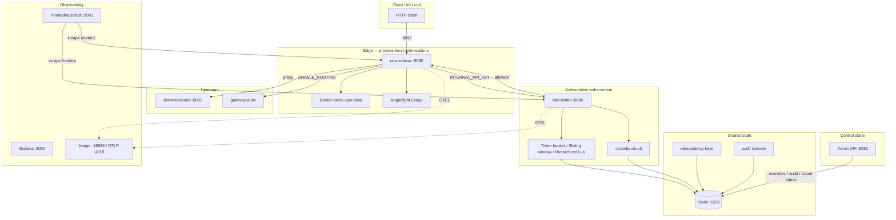

# System Overview

## Purpose

This document describes the end-to-end architecture, major processes, network surfaces, and state ownership of the Distributed Rate Limiter platform, based on source code (`cmd/`, `internal/`, `docker-compose*.yml`). Readers should understand which component listens on which port, who holds authoritative quota, and how responsibilities are split between sidecar, limiter, and Redis.

## Executive Summary

Client traffic enters through the **sidecar** (`:9090`). On each request, the sidecar queries the central **limiter** (`:8080`) via HTTP `GET /check` or `GET /check_hierarchical`. The limiter maintains Lua-atomic quota state in **Redis** — this is the fleet-wide source of truth. The sidecar's in-memory denial cache and singleflight are process-local optimizations only; they do not weaken global quota (SOURCE + TEST).

The **Admin API** runs on a separate port `:8082`: runtime overrides, idempotency inspect/purge, circuit reset, audit search. **Prometheus** in the default compose is mapped on host `:9091` (`9091:9090`); it is not a sidecar replica. The scale profile (`docker-compose.scale.yml`) exposes a second sidecar on **`:9092`**, deliberately leaving `:9091` for Prometheus.

## Architecture

### Component table

| Component | Binary / image | Host port (default compose) | Responsibility |
|------|----------------|------------------------------|-------------|
| **rate-sidecar** | `cmd/sidecar` | **9090** | Client entry, rate check, denial cache, singleflight, idempotency, optional routing |
| **rate-limiter** | `cmd/limiter` | **8080** (hot path), **8082** (admin) | Authoritative quota, circuit guard, audit emit, metrics |
| **Redis** | `redis:7-alpine` | 6379 (loopback bind) | Quota, circuit breaker, idempotency, routing scores, audit |
| **demo-backend** | `cmd/demo` | 8081 | Default upstream when routing is disabled |
| **gateway-a/b/c** | `cmd/gateway` | internal 8081 | Weighted routing targets (`ENABLE_ROUTING=true`) |
| **Prometheus** | `prom/prometheus` | **9091** → container 9090 | Scrape `limiter:8080`, `sidecar:9090`, `redis-exporter:9121` |
| **Grafana** | `grafana/grafana` | 3000 | Dashboards |
| **Jaeger** | `jaegertracing/all-in-one` | 16686 (UI), 4318 (OTLP HTTP) | Distributed tracing |
| **redis-exporter** | `oliver006/redis_exporter` | 9121 | Redis infra metrics |

### Scale profile (`docker-compose.scale.yml`, profile `scale`)

| Component | Host port | Note |
|------|-----------|------|
| limiter (primary) | 8080, 8082 | Unchanged |
| **limiter-b** | **8083** → 8080, **8084** → 8082 | Second limiter replica |
| sidecar (primary) | 9090 | Unchanged |
| **sidecar-b** | **9092** → 9090 | **9091 reserved for Prometheus** — `docker-compose.scale.yml` comment: `# 9091 is Prometheus in base compose` |
| Prometheus | **9091** | Not sidecar-b |

Both sidecar replicas use the same `RATE_LIMITER_URL=http://limiter:8080` and shared Redis; denial cache / singleflight remain **per process** (SOURCE-PROVEN).

### HTTP surfaces (limiter)

| Method | Path | Port | Auth | Role |
|--------|------|------|------|--------|
| GET | `/health` | 8080 | None | Redis connectivity JSON |
| GET | `/check` | 8080 | `INTERNAL_API_KEY` | Flat per-user limit |
| GET | `/check_hierarchical` | 8080 | `INTERNAL_API_KEY` | Four-level hierarchical limit |
| GET | `/metrics` | 8080 | Optional `METRICS_API_KEY` | Prometheus |
| * | `/admin/*` | **8082** | `ADMIN_API_KEY` | Overrides, idempotency, circuit, audit, routing |

Sidecar: all proxied paths on `/`; `/health` and `/metrics` are separate mux routes (`cmd/sidecar/main.go`).

### Data flow (typical)

1. Client → sidecar `:9090`
2. Sidecar identity resolve (`X-User-ID` or query `user_id` if `ALLOW_QUERY_USER_ID=true`)
3. Optional idempotency claim (mutating + `Idempotency-Key`)
4. Denial cache miss → singleflight → limiter HTTP
5. Limiter: Redis circuit → Lua quota → audit record
6. Allowed → reverse proxy upstream or weighted gateway

## State Ownership

| State | Owner | Storage | Replica view |
|-------|-------|---------|----------------|
| Quota tokens / window counts | **Limiter + Redis** | `rate:*`, `sw:*` keys | Fleet-wide consistent (Lua atomic) |
| Hierarchical buckets | **Limiter + Redis** | `rate:global`, `rate:tenant:*`, `rate:user:*`, `rate:endpoint:*` | Single Lua RTT, 4 keys |
| Runtime limit overrides | **Admin → Redis** | override keys + `config:generation` | Limiter local `sync.Map` cache, generation-validated |
| Redis circuit (`cb:redis`) | **Limiter** | Redis hash | Shared across limiter replicas |
| Central-limiter circuit (`cb:central-limiter`) | **Sidecar** | Redis hash | Per sidecar fleet, idempotency/routing paths |
| Denial cache | **Sidecar process** | `sync.Map` | **Not** shared across sidecar replicas |
| singleflight in-flight | **Sidecar process** | `singleflight.Group` | Process-local collapse only |
| Idempotency records | **Sidecar + Redis** | scope/key hashes | Shared; fencing tokens |
| Audit events | **Limiter + Redis** | `audit:event:*`, indexes | Best-effort async append |
| Routing gateway health | **Sidecar + Redis** | routing store keys | Probe loop per sidecar |

## Implementation Evidence

| File / Symbol | Responsibility |
|---------------|----------------|
| `cmd/sidecar/main.go` — `Sidecar`, `ServeHTTP` | Edge proxy, cache, singleflight, idempotency orchestration |
| `cmd/sidecar/main.go` — `main()` | Port default `9090`, mux `/health`, `/metrics`, `/` |
| `cmd/limiter/main.go` — `main()` | Redis fail-fast startup, algorithm switch, `/check`, `/check_hierarchical` |
| `cmd/limiter/config.go` — `LoadConfig` | `PORT=8080`, `ADMIN_PORT=8082` defaults |
| `cmd/limiter/admin_api.go` — `startAdminServer` | Admin API isolated port |
| `internal/limiter/redis_atomic_token_bucket.go` | Flat token bucket Lua (`rate:{userID}`) |
| `internal/limiter/redis_sliding_window.go` | Sliding window Lua (`sw:{userID}`) |
| `internal/limiter/hierarchical.go` | Four-level hierarchical Lua |
| `internal/circuitbreaker/store.go` | `cb:{target}` allow/record Lua |
| `internal/audit/store.go` | Async/sync audit append to Redis |
| `internal/override/override.go` | Generation-validated override cache |
| `docker-compose.yml` | Port mappings 8080/8082/9090/9091 |
| `docker-compose.scale.yml` | `sidecar-b` `9092:9090`, `limiter-b` `8083:8080` |
| `deploy/prometheus/prometheus.yml` | Scrape `limiter:8080`, `sidecar:9090` |

## Correctness Invariants

1. **Redis authoritative**: No sidecar local state becomes the source of global quota (`cmd/limiter/main.go` package comment).
2. **Deny-only cache**: On cache hit, the limiter is still called for allowances — only `Allowed=false` entries are served (`serveNormal`, lines 377–394).
3. **Atomic quota**: All algorithms perform refill + deduct inside Redis `EVAL` — race-free fleet-wide.
4. **Hierarchical all-or-nothing**: All four levels in one Lua; partial commit impossible (`hierarchical.go` comment).
5. **Flat `/check` ignores overrides**: Admin overrides merge only on the `/check_hierarchical` path (`docs/limitations.md`, SOURCE-PROVEN).
6. **503 ≠ 429**: Redis/circuit/limiter failure → 503; quota exhausted → 429 — distinct operational semantics.

## Failure Semantics

| Scenario | Sidecar | Limiter | Default policy |
|----------|---------|---------|----------------|
| Redis down | `/health` 503 if idempotency/routing needs Redis | Startup fatal; runtime `/health` 503 | Fail-closed |
| Limiter unreachable | 503 (`FAIL_OPEN=false`) | — | Sidecar `FAIL_OPEN=true` → forward with warning log |
| Redis circuit open (limiter) | Sidecar receives limiter 503 | `checkRedisCircuit` → 503 + `circuit_state` | `CIRCUIT_FAIL_OPEN=false` default |
| Idempotency Redis down | 503 unless `IDEMPOTENCY_FAIL_OPEN=true` | — | Fail-closed default |
| All gateways down (routing) | 503 `all gateways unavailable` | — | No upstream forward |

## Concurrency

- **Sidecar**: `sync.Map` denial cache; `singleflight.Group` per `cacheKey`; cache sweeper goroutine every 10s (`StartCacheSweeper`).
- **Limiter**: Stateless HTTP handlers; Redis Lua serializes per-key mutations.
- **Audit**: Optional async worker pool + bounded queue; full queue → drop + metric (`audit/store.go`).
- **Override cache**: `sync.Map` + generation stamp; admin write increments `config:generation`.

## Operational Behavior

- **Startup**: Limiter Redis `Ping` fail → `logging.Fatal`. Sidecar Redis required when `ENABLE_IDEMPOTENCY` or `ENABLE_ROUTING` (`needsRedis`).
- **Shutdown**: SIGINT/SIGTERM → 5s graceful `Server.Shutdown`; limiter drains audit queue if async enabled.
- **Health probes**: Docker healthcheck `wget http://localhost:8080/health` (limiter). Sidecar health requires limiter `/health` 200; Redis check conditional.
- **Metrics**: Prometheus 5s scrape interval (`deploy/prometheus/prometheus.yml`).
- **Tracing**: `OTEL_ENABLED=true` in default compose; spans `sidecar.proxy`, `limiter.check`, etc.

## Verified Evidence

| Claim | Type | Source |
|------|--------|-------|
| Denial cache hit skips limiter | TEST-PROVEN | `cmd/sidecar/cache_test.go` — `TestSidecar_DenialCache` |
| Allowance not served from cache | TEST-PROVEN | `cmd/sidecar/cache_test.go` — `TestSidecar_AllowanceCache` |
| 100 concurrent → 1 limiter call | TEST-PROVEN | `cmd/sidecar/concurrency_test.go` — `TestSidecar_SingleflightCollapse` |
| Redis failure → 503 on `/check` | TEST-PROVEN | `cmd/limiter/redis_failure_test.go` — `TestRedisFailure_Handling` |
| Scale sidecar-b on 9092, not 9091 | SOURCE-PROVEN | `docker-compose.scale.yml` line 76 |
| Prometheus on host 9091 | SOURCE-PROVEN | `docker-compose.yml` `9091:9090` |
| Multi-replica correctness (≤10 allowed / 60 concurrent) | RUNTIME-PROVEN | `docs/benchmarks/final-benchmark-report.md` §8 |

## Known Limitations

- Single Redis master in default compose — all subsystems share one process (SOURCE-PROVEN).
- Sidecar denial cache / singleflight **not cross-replica** — separate per sidecar instance (SOURCE + TEST).
- Hierarchical Lua 4 keys — not Redis Cluster hash-tag safe without redesign (SOURCE-PROVEN).
- Admin `:8082` binds `0.0.0.0` in dev — production requires network isolation.
- Dev secrets and `ALLOW_QUERY_USER_ID=true` in default compose (SOURCE-PROVEN).
- Benchmark numbers are **not** cited in this document — only in `docs/benchmarks/` and `docs/limitations.md` as BENCHMARK-PROVEN.
