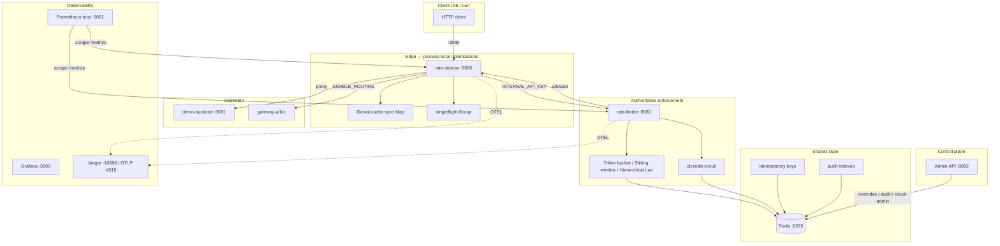

# System Overview

## Purpose

यह दस्तावेज़ Distributed Rate Limiter प्लेटफ़ॉर्म की end-to-end आर्किटेक्चर, प्रमुख प्रक्रियाएँ, नेटवर्क सतहें और state ownership को स्रोत कोड (`cmd/`, `internal/`, `docker-compose*.yml`) पर आधारित वर्णन करता है। पाठक को यह समझना चाहिए कि कौन-सा घटक किस पोर्ट पर सुनता है, कौन authoritative quota रखता है, और sidecar/limiter/redis के बीच जिम्मेदारी कैसे बँटी है।

## Executive Summary

क्लाइंट ट्रैफ़िक **sidecar** (`:9090`) से प्रवेश करती है। Sidecar प्रत्येक अनुरोध पर केंद्रीय **limiter** (`:8080`) को HTTP `GET /check` या `GET /check_hierarchical` से पूछता है। Limiter **Redis** में Lua-परमाणित quota state रखता है — यही fleet-wide सत्य का स्रोत है। Sidecar की in-memory denial cache और singleflight केवल प्रक्रिया-स्थानीय अनुकूलन हैं; वे global quota कमज़ोर नहीं करते (SOURCE + TEST)।

**Admin API** अलग पोर्ट `:8082` पर चलता है: runtime overrides, idempotency inspect/purge, circuit reset, audit search। **Prometheus** default compose में host `:9091` पर मैप है (`9091:9090`); यह sidecar replica नहीं है। Scale profile (`docker-compose.scale.yml`) दूसरा sidecar **`:9092`** पर expose करता है, जानबूझकर `:9091` Prometheus के लिए छोड़ा गया है।

## Architecture

### घटक सारणी

| घटक | बाइनरी / इमेज | Host पोर्ट (default compose) | जिम्मेदारी |
|------|----------------|------------------------------|-------------|
| **rate-sidecar** | `cmd/sidecar` | **9090** | क्लाइंट entry, rate check, denial cache, singleflight, idempotency, optional routing |
| **rate-limiter** | `cmd/limiter` | **8080** (hot path), **8082** (admin) | Authoritative quota, circuit guard, audit emit, metrics |
| **Redis** | `redis:7-alpine` | 6379 (loopback bind) | Quota, circuit breaker, idempotency, routing scores, audit |
| **demo-backend** | `cmd/demo` | 8081 | Default upstream जब routing बंद |
| **gateway-a/b/c** | `cmd/gateway` | internal 8081 | Weighted routing targets (`ENABLE_ROUTING=true`) |
| **Prometheus** | `prom/prometheus` | **9091** → container 9090 | `limiter:8080`, `sidecar:9090`, `redis-exporter:9121` scrape |
| **Grafana** | `grafana/grafana` | 3000 | Dashboards |
| **Jaeger** | `jaegertracing/all-in-one` | 16686 (UI), 4318 (OTLP HTTP) | Distributed tracing |
| **redis-exporter** | `oliver006/redis_exporter` | 9121 | Redis infra metrics |

### Scale profile (`docker-compose.scale.yml`, profile `scale`)

| घटक | Host पोर्ट | नोट |
|------|-----------|------|
| limiter (primary) | 8080, 8082 | अपरिवर्तित |
| **limiter-b** | **8083** → 8080, **8084** → 8082 | दूसरा limiter replica |
| sidecar (primary) | 9090 | अपरिवर्तित |
| **sidecar-b** | **9092** → 9090 | **9091 Prometheus के लिए रिज़र्व** — `docker-compose.scale.yml` टिप्पणी: `# 9091 is Prometheus in base compose` |
| Prometheus | **9091** | sidecar-b **नहीं** |

दोनों sidecar replicas एक ही `RATE_LIMITER_URL=http://limiter:8080` और shared Redis उपयोग करते हैं; denial cache / singleflight **प्रति प्रक्रिया** अलग रहते हैं (SOURCE-PROVEN)।

### HTTP सतहें (limiter)

| Method | Path | Port | Auth | भूमिका |
|--------|------|------|------|--------|
| GET | `/health` | 8080 | None | Redis connectivity JSON |
| GET | `/check` | 8080 | `INTERNAL_API_KEY` | Flat per-user limit |
| GET | `/check_hierarchical` | 8080 | `INTERNAL_API_KEY` | चार-स्तरीय hierarchical limit |
| GET | `/metrics` | 8080 | Optional `METRICS_API_KEY` | Prometheus |
| * | `/admin/*` | **8082** | `ADMIN_API_KEY` | Overrides, idempotency, circuit, audit, routing |

Sidecar: सभी proxied paths `/` पर; `/health` और `/metrics` अलग mux routes (`cmd/sidecar/main.go`).

### डेटा प्रवाह (सामान्य)

1. Client → sidecar `:9090`
2. Sidecar identity resolve (`X-User-ID` या query `user_id` यदि `ALLOW_QUERY_USER_ID=true`)
3. Optional idempotency claim (mutating + `Idempotency-Key`)
4. Denial cache miss → singleflight → limiter HTTP
5. Limiter: Redis circuit → Lua quota → audit record
6. Allowed → reverse proxy upstream या weighted gateway

## State Ownership

| State | Owner | Storage | Replicas दृश्य |
|-------|-------|---------|----------------|
| Quota tokens / window counts | **Limiter + Redis** | `rate:*`, `sw:*` keys | Fleet-wide consistent (Lua atomic) |
| Hierarchical buckets | **Limiter + Redis** | `rate:global`, `rate:tenant:*`, `rate:user:*`, `rate:endpoint:*` | Single Lua RTT, 4 keys |
| Runtime limit overrides | **Admin → Redis** | override keys + `config:generation` | Limiter local `sync.Map` cache, generation-validated |
| Redis circuit (`cb:redis`) | **Limiter** | Redis hash | Shared across limiter replicas |
| Central-limiter circuit (`cb:central-limiter`) | **Sidecar** | Redis hash | Per sidecar fleet, idempotency/routing paths |
| Denial cache | **Sidecar process** | `sync.Map` | **Not** shared across sidecar replicas |
| singleflight in-flight | **Sidecar process** | `singleflight.Group` | Process-local collapse only |
| Idempotency records | **Sidecar + Redis** | scope/key hashes | Shared; fencing tokens |
| Audit events | **Limiter + Redis** | `audit:event:*`, indexes | Best-effort async append |
| Routing gateway health | **Sidecar + Redis** | routing store keys | Probe loop per sidecar |

## Implementation Evidence

| File / Symbol | Responsibility |
|---------------|----------------|
| `cmd/sidecar/main.go` — `Sidecar`, `ServeHTTP` | Edge proxy, cache, singleflight, idempotency orchestration |
| `cmd/sidecar/main.go` — `main()` | Port default `9090`, mux `/health`, `/metrics`, `/` |
| `cmd/limiter/main.go` — `main()` | Redis fail-fast startup, algorithm switch, `/check`, `/check_hierarchical` |
| `cmd/limiter/config.go` — `LoadConfig` | `PORT=8080`, `ADMIN_PORT=8082` defaults |
| `cmd/limiter/admin_api.go` — `startAdminServer` | Admin API isolated port |
| `internal/limiter/redis_atomic_token_bucket.go` | Flat token bucket Lua (`rate:{userID}`) |
| `internal/limiter/redis_sliding_window.go` | Sliding window Lua (`sw:{userID}`) |
| `internal/limiter/hierarchical.go` | Four-level hierarchical Lua |
| `internal/circuitbreaker/store.go` | `cb:{target}` allow/record Lua |
| `internal/audit/store.go` | Async/sync audit append to Redis |
| `internal/override/override.go` | Generation-validated override cache |
| `docker-compose.yml` | Port mappings 8080/8082/9090/9091 |
| `docker-compose.scale.yml` | `sidecar-b` `9092:9090`, `limiter-b` `8083:8080` |
| `deploy/prometheus/prometheus.yml` | Scrape `limiter:8080`, `sidecar:9090` |

## Correctness Invariants

1. **Redis authoritative**: कोई भी sidecar local state global quota का स्रोत नहीं बनता (`cmd/limiter/main.go` package comment).
2. **Deny-only cache**: अनुमति (allow) cache hit पर भी limiter को फिर बुलाया जाता है — केवल `Allowed=false` entries serve होती हैं (`serveNormal`, lines 377–394).
3. **Atomic quota**: सभी algorithms Redis `EVAL` के भीतर refill + deduct करते हैं — race-free fleet-wide.
4. **Hierarchical all-or-nothing**: चारों स्तर एक Lua में; partial commit असंभव (`hierarchical.go` comment).
5. **Flat `/check` ignores overrides**: Admin overrides केवल `/check_hierarchical` path पर merge (`docs/limitations.md`, SOURCE-PROVEN).
6. **503 ≠ 429**: Redis/circuit/limiter failure → 503; quota exhausted → 429 — अलग operational semantics.

## Failure Semantics

| परिदृश्य | Sidecar | Limiter | Default policy |
|----------|---------|---------|----------------|
| Redis down | `/health` 503 यदि idempotency/routing needs Redis | Startup fatal; runtime `/health` 503 | Fail-closed |
| Limiter unreachable | 503 (`FAIL_OPEN=false`) | — | Sidecar `FAIL_OPEN=true` → forward with warning log |
| Redis circuit open (limiter) | Sidecar को limiter 503 | `checkRedisCircuit` → 503 + `circuit_state` | `CIRCUIT_FAIL_OPEN=false` default |
| Idempotency Redis down | 503 unless `IDEMPOTENCY_FAIL_OPEN=true` | — | Fail-closed default |
| All gateways down (routing) | 503 `all gateways unavailable` | — | No upstream forward |

## Concurrency

- **Sidecar**: `sync.Map` denial cache; `singleflight.Group` per `cacheKey`; cache sweeper goroutine हर 10s (`StartCacheSweeper`).
- **Limiter**: Stateless HTTP handlers; Redis Lua serializes per-key mutations.
- **Audit**: Optional async worker pool + bounded queue; full queue → drop + metric (`audit/store.go`).
- **Override cache**: `sync.Map` + generation stamp; admin write increments `config:generation`.

## Operational Behavior

- **Startup**: Limiter Redis `Ping` fail → `logging.Fatal`. Sidecar Redis required when `ENABLE_IDEMPOTENCY` or `ENABLE_ROUTING` (`needsRedis`).
- **Shutdown**: SIGINT/SIGTERM → 5s graceful `Server.Shutdown`; limiter drains audit queue if async enabled.
- **Health probes**: Docker healthcheck `wget http://localhost:8080/health` (limiter). Sidecar health requires limiter `/health` 200; Redis check conditional.
- **Metrics**: Prometheus 5s scrape interval (`deploy/prometheus/prometheus.yml`).
- **Tracing**: `OTEL_ENABLED=true` in default compose; spans `sidecar.proxy`, `limiter.check`, etc.

## Verified Evidence

| दावा | प्रकार | स्रोत |
|------|--------|-------|
| Denial cache hit skips limiter | TEST-PROVEN | `cmd/sidecar/cache_test.go` — `TestSidecar_DenialCache` |
| Allowance not served from cache | TEST-PROVEN | `cmd/sidecar/cache_test.go` — `TestSidecar_AllowanceCache` |
| 100 concurrent → 1 limiter call | TEST-PROVEN | `cmd/sidecar/concurrency_test.go` — `TestSidecar_SingleflightCollapse` |
| Redis failure → 503 on `/check` | TEST-PROVEN | `cmd/limiter/redis_failure_test.go` — `TestRedisFailure_Handling` |
| Scale sidecar-b on 9092, not 9091 | SOURCE-PROVEN | `docker-compose.scale.yml` line 76 |
| Prometheus on host 9091 | SOURCE-PROVEN | `docker-compose.yml` `9091:9090` |
| Multi-replica correctness (≤10 allowed / 60 concurrent) | RUNTIME-PROVEN | `docs/benchmarks/final-benchmark-report.md` §8 |

## Known Limitations

- Single Redis master default compose में — सभी subsystems एक process साझा करते हैं (SOURCE-PROVEN).
- Sidecar denial cache / singleflight **cross-replica नहीं** — प्रति sidecar instance अलग (SOURCE + TEST).
- Hierarchical Lua 4 keys — Redis Cluster hash-tag safe **नहीं** बिना redesign (SOURCE-PROVEN).
- Admin `:8082` dev में `0.0.0.0` bind — production में network isolation आवश्यक.
- Dev secrets और `ALLOW_QUERY_USER_ID=true` default compose में (SOURCE-PROVEN).
- Benchmark संख्याएँ इस दस्तावेज़ में उद्धृत **नहीं** — केवल `docs/benchmarks/` और `docs/limitations.md` में BENCHMARK-PROVEN रूप में।
