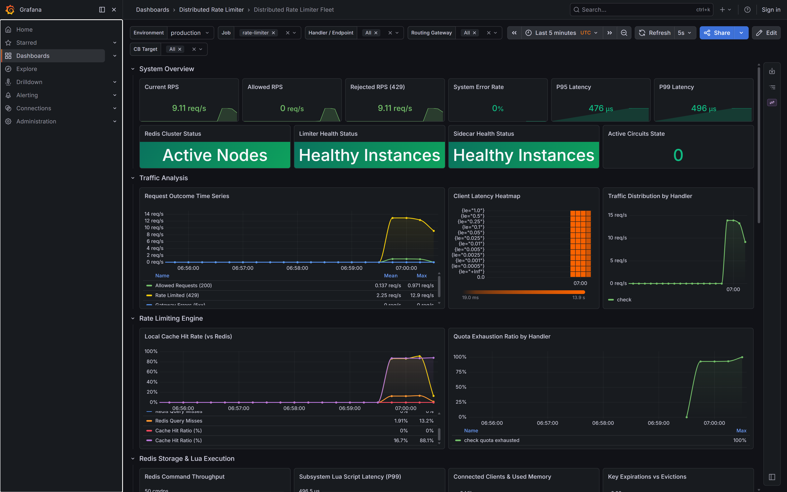
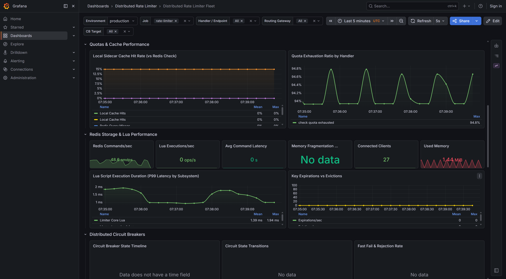

# Grafana Dashboard Tour

The pre-provisioned dashboard **Distributed Rate Limiter Fleet** is designed to immediately convey the health, correctness, scalability, and internal behavior of the rate limiter proxy.

> **Note:** Default `docker-compose.yml` sets `OTEL_ENABLED=false` on limiter and sidecar. Jaeger runs at `:16686`, but traces appear only after enabling OTEL. See `docs/OBSERVABILITY_FORENSIC_AUDIT.md` §7.

---

## Dashboard Rows and Layout

The dashboard is split logically into primary focus areas (panel titles from `deploy/grafana/dashboards/distributed-rate-limiter.json`):

### 1. Traffic Overview and Health KPIs
This row answers the question: *Is the system healthy, and is it actively rate limiting?*
* **System Health Cards**:
  - **Limiter Health Status**: `sum(up{job="rate-limiter"})`
  - **Sidecar Health Status**: `sum(up{job="sidecar"})`
  - **Redis Cluster Status**: `sum(redis_up{job="redis-exporter"})`
* **Quota Traffic**:
  - **Allowed RPS** / **Rejected RPS (429)**: `rate_limiter_requests_total` by `allowed` label
* **Limiter Decision Error Rate (%)**:
  - Fraction of quota evaluations that recorded `audit_events_total{decision="error"}` — requires `ENABLE_AUDIT_TRAIL=true` on the limiter (compose default). Panel description references audit telemetry; 0% when audit is disabled does not prove zero backend errors.

---

### 2. Redis and Client Round-Trip Telemetry
Lua executes on Redis, but Go histograms measure **client round-trip** latency to Redis (audit §12 — not server-side Lua duration):
* **Lua Executions/sec**: `rate(redis_commands_duration_seconds_count{cmd=~"eval|evalsha"}[...])` via redis-exporter
* **Avg Redis Command Latency**: redis-exporter command duration (server-side)
* **Go-Client Redis Round-Trip Latency (P99 by Subsystem)**: `rate_limiter_redis_duration_seconds`, `idempotency_redis_duration_seconds`, `routing_redis_duration_seconds`, `circuit_breaker_redis_duration_seconds`
* **Memory Fragmentation and Connections**: redis-exporter gauges

---

### 3. Stripe-Style Idempotency Metrics
Idempotency is a critical concurrency feature. This dedicated section monitors the claims and cache replay outcomes:
* **Claims / sec**: `idempotency_claims_total`
* **Replay Hits / sec**: `idempotency_claims_total{result="replay"}`
* **In Progress / sec**: `idempotency_claims_total{result="in_progress"}`
* **Hash Mismatches / sec**: `idempotency_claims_total{result="hash_mismatch"}`

---

### 4. Infrastructure, Audit, and Tracing
* **Go Resource Utilization**: `process_cpu_seconds_total`, `process_resident_memory_bytes`, `go_goroutines`, GC panels
* **Async Audit Trail**: `audit_events_total`, `audit_dropped_total`, append/search duration histograms (when audit enabled)
* **Distributed Tracing — Jaeger UI** (text panel): Traces export via OTLP HTTP to Jaeger when `OTEL_ENABLED=true`. Prometheus does not scrape Jaeger; former OTel collector metric panels were removed (audit §5).
