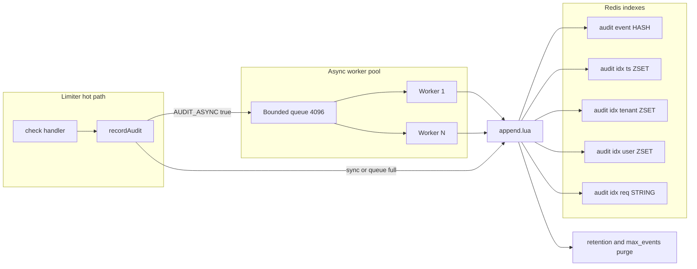

# Audit Flow

Async audit append with worker pool and Redis indexes.

```mermaid
flowchart LR
    subgraph hot ["Limiter hot path"]
        CHK[check handler]
        REC[recordAudit]
    end

    subgraph async ["Async worker pool"]
        Q[Bounded queue 4096]
        W1[Worker 1]
        W2[Worker N]
    end

    subgraph redis ["Redis indexes"]
        EV[audit event HASH]
        TS[audit idx ts ZSET]
        TN[audit idx tenant ZSET]
        US[audit idx user ZSET]
        RQ[audit idx req STRING]
    end

    CHK --> REC
    REC -->|AUDIT_ASYNC true| Q
    Q --> W1 --> APPEND[append.lua]
    Q --> W2 --> APPEND
    REC -->|sync or queue full| APPEND

    APPEND --> EV
    APPEND --> TS
    APPEND --> TN
    APPEND --> US
    APPEND --> RQ
    APPEND --> TRIM[retention and max_events purge]
```
