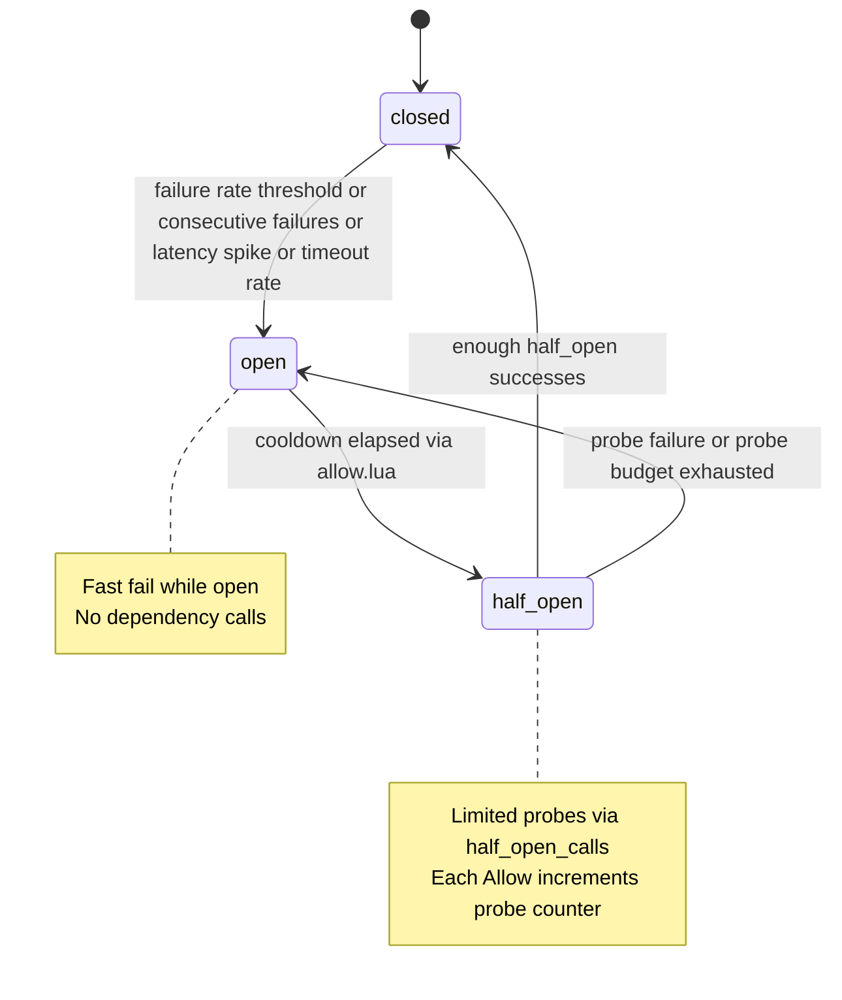

# Circuit Breaker

Three state circuit breaker transitions stored in Redis.

```mermaid
stateDiagram-v2
    [*] --> closed

    closed --> open: failure rate threshold or consecutive failures or latency spike or timeout rate

    open --> half_open: cooldown elapsed via allow.lua

    half_open --> closed: enough half_open successes
    half_open --> open: probe failure or probe budget exhausted

    note right of open
        Fast fail while open
        No dependency calls
    end note

    note right of half_open
        Limited probes via half_open_calls
        Each Allow increments probe counter
    end note
```
