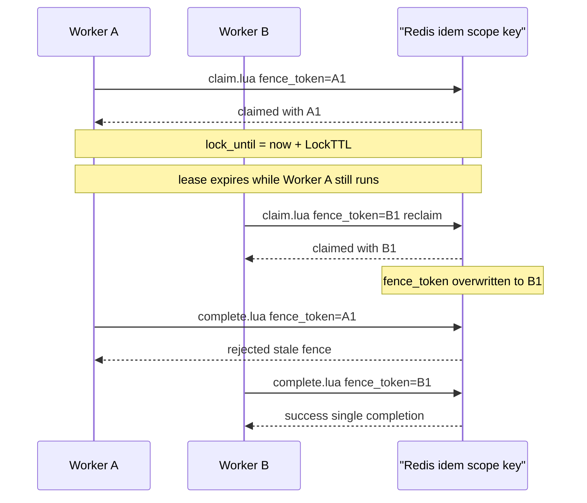

# Fencing Flow

Lease reclaim and stale worker rejection using fence tokens.

```mermaid
sequenceDiagram
    participant A as Worker A
    participant B as Worker B
    participant R as "Redis idem scope key"

    A->>R: claim.lua fence_token=A1
    R-->>A: claimed with A1
    Note over A,R: lock_until = now + LockTTL

    Note over A,R: lease expires while Worker A still runs

    B->>R: claim.lua fence_token=B1 reclaim
    R-->>B: claimed with B1
    Note over R: fence_token overwritten to B1

    A->>R: complete.lua fence_token=A1
    R-->>A: rejected stale fence

    B->>R: complete.lua fence_token=B1
    R-->>B: success single completion
```
