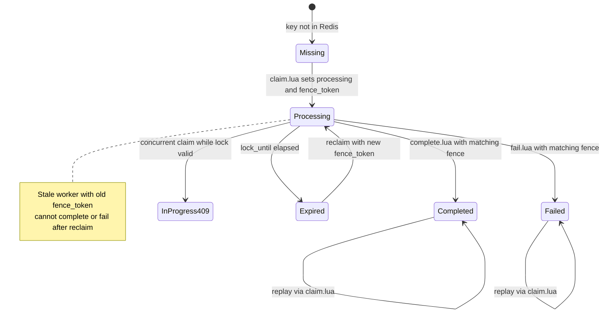

# Idempotency Flow

State machine for idempotency keys in Redis.

```mermaid
stateDiagram-v2
    [*] --> Missing: key not in Redis
    Missing --> Processing: claim.lua sets processing and fence_token

    Processing --> Completed: complete.lua with matching fence
    Processing --> Failed: fail.lua with matching fence
    Processing --> InProgress409: concurrent claim while lock valid
    Processing --> Expired: lock_until elapsed

    Expired --> Processing: reclaim with new fence_token

    Completed --> Completed: replay via claim.lua
    Failed --> Failed: replay via claim.lua

    note right of Processing
        Stale worker with old fence_token
        cannot complete or fail after reclaim
    end note
```
