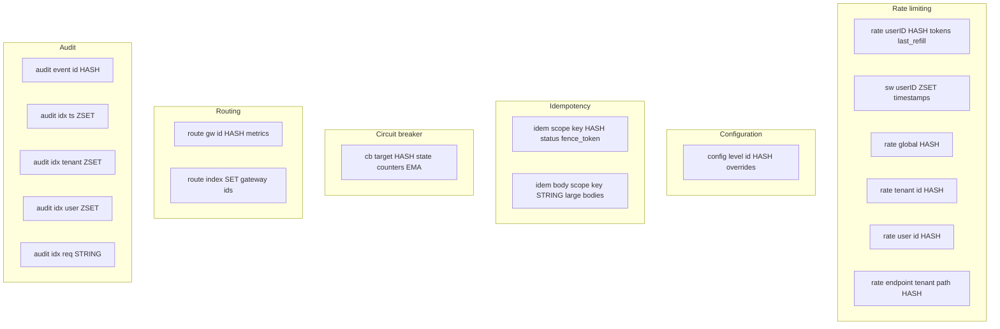

# Redis Layout

Key namespaces used across rate limiting, idempotency, routing, circuit breaker, and audit.

```mermaid
flowchart TB
    subgraph rate ["Rate limiting"]
        RU["rate userID HASH tokens last_refill"]
        SW["sw userID ZSET timestamps"]
        RG["rate global HASH"]
        RT["rate tenant id HASH"]
        RUSER["rate user id HASH"]
        RE["rate endpoint tenant path HASH"]
    end

    subgraph cfg [Configuration]
        OV["config level id HASH overrides"]
    end

    subgraph idem [Idempotency]
        IM["idem scope key HASH status fence_token"]
        IB["idem body scope key STRING large bodies"]
    end

    subgraph cb ["Circuit breaker"]
        CBK["cb target HASH state counters EMA"]
    end

    subgraph route [Routing]
        GW["route gw id HASH metrics"]
        GWI["route index SET gateway ids"]
    end

    subgraph audit [Audit]
        AE["audit event id HASH"]
        AITS["audit idx ts ZSET"]
        AITN["audit idx tenant ZSET"]
        AIU["audit idx user ZSET"]
        AIR["audit idx req STRING"]
    end
```
