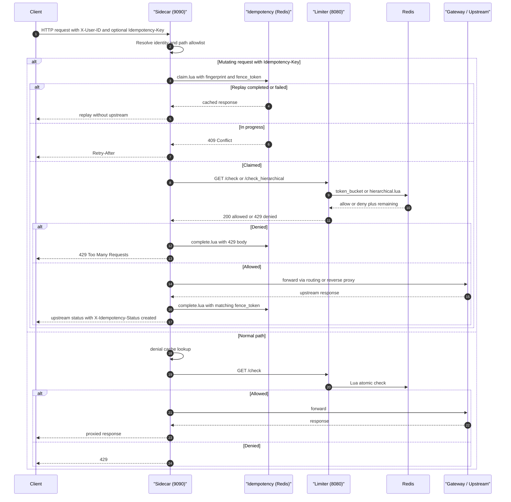

# Request Flow

End to end path from client through sidecar, limiter, Redis, and upstream.

```mermaid
sequenceDiagram
    autonumber
    participant C as Client
    participant SC as "Sidecar (9090)"
    participant ID as "Idempotency (Redis)"
    participant L as "Limiter (8080)"
    participant R as Redis
    participant GW as "Gateway / Upstream"

    C->>SC: HTTP request with X-User-ID and optional Idempotency-Key
    SC->>SC: Resolve identity and path allowlist

    alt Mutating request with Idempotency-Key
        SC->>ID: claim.lua with fingerprint and fence_token
        alt Replay completed or failed
            ID-->>SC: cached response
            SC-->>C: replay without upstream
        else In progress
            ID-->>SC: 409 Conflict
            SC-->>C: Retry-After
        else Claimed
            SC->>L: GET /check or /check_hierarchical
            L->>R: token_bucket or hierarchical.lua
            R-->>L: allow or deny plus remaining
            L-->>SC: 200 allowed or 429 denied
            alt Denied
                SC->>ID: complete.lua with 429 body
                SC-->>C: 429 Too Many Requests
            else Allowed
                SC->>GW: forward via routing or reverse proxy
                GW-->>SC: upstream response
                SC->>ID: complete.lua with matching fence_token
                SC-->>C: upstream status with X-Idempotency-Status created
            end
        end
    else Normal path
        SC->>SC: denial cache lookup
        SC->>L: GET /check
        L->>R: Lua atomic check
        alt Allowed
            SC->>GW: forward
            GW-->>SC: response
            SC-->>C: proxied response
        else Denied
            SC-->>C: 429
        end
    end
```
