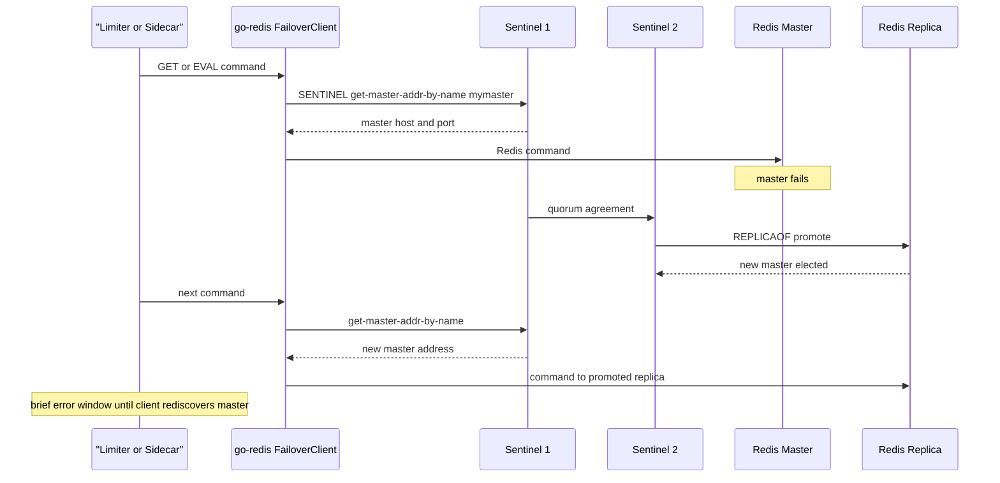

# Sentinel Failover

Redis Sentinel promotion and go-redis FailoverClient rediscovery.

```mermaid
sequenceDiagram
    participant App as "Limiter or Sidecar"
    participant FC as go-redis FailoverClient
    participant S1 as Sentinel 1
    participant S2 as Sentinel 2
    participant M as Redis Master
    participant R as Redis Replica

    App->>FC: GET or EVAL command
    FC->>S1: SENTINEL get-master-addr-by-name mymaster
    S1-->>FC: master host and port
    FC->>M: Redis command

    Note over M: master fails

    S1->>S2: quorum agreement
    S2->>R: REPLICAOF promote
    R-->>S2: new master elected

    App->>FC: next command
    FC->>S1: get-master-addr-by-name
    S1-->>FC: new master address
    FC->>R: command to promoted replica

    Note over App: brief error window until client rediscovers master
```
