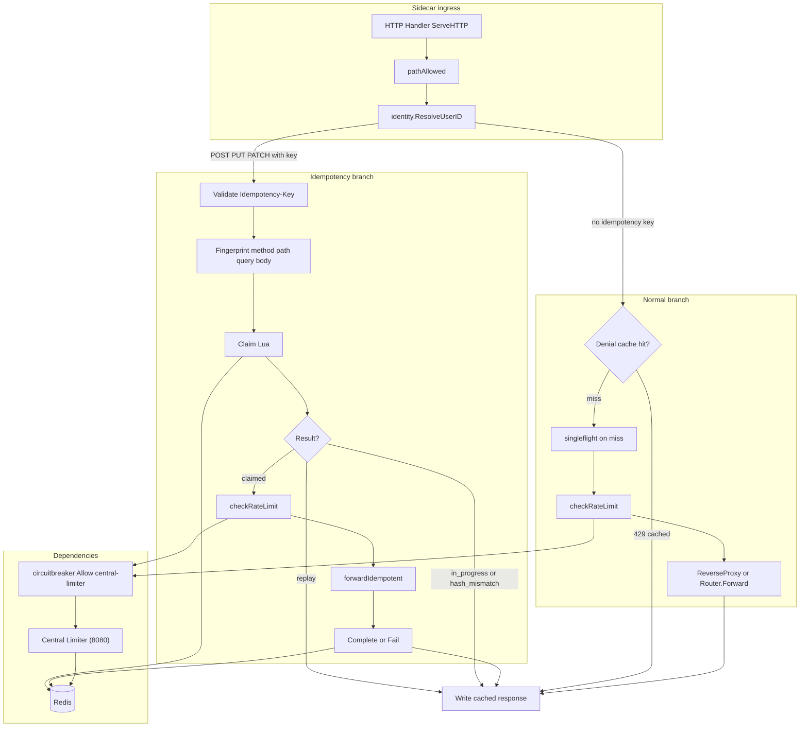

# Sidecar Flow

Internal branches inside the sidecar proxy on port 9090.

```mermaid
flowchart TB
    subgraph ingress ["Sidecar ingress"]
        H[HTTP Handler ServeHTTP]
        P[pathAllowed]
        I[identity.ResolveUserID]
    end

    subgraph idem ["Idempotency branch"]
        V[Validate Idempotency-Key]
        FP[Fingerprint method path query body]
        CL[Claim Lua]
        RP{Result?}
        RL2[checkRateLimit]
        FWD[forwardIdempotent]
        CMP[Complete or Fail]
    end

    subgraph normal ["Normal branch"]
        CACHE{Denial cache hit?}
        SF[singleflight on miss]
        RL[checkRateLimit]
        PROXY[ReverseProxy or Router.Forward]
    end

    subgraph deps [Dependencies]
        LIM["Central Limiter (8080)"]
        CB[circuitbreaker Allow central-limiter]
        REDIS[(Redis)]
    end

    H --> P --> I
    I -->|POST PUT PATCH with key| V --> FP --> CL --> RP
    RP -->|replay| OUT[Write cached response]
    RP -->|in_progress or hash_mismatch| OUT
    RP -->|claimed| RL2 --> FWD --> CMP --> OUT

    I -->|no idempotency key| CACHE
    CACHE -->|429 cached| OUT
    CACHE -->|miss| SF --> RL --> PROXY --> OUT

    RL --> CB --> LIM
    RL2 --> CB
    CL --> REDIS
    CMP --> REDIS
    LIM --> REDIS
```
