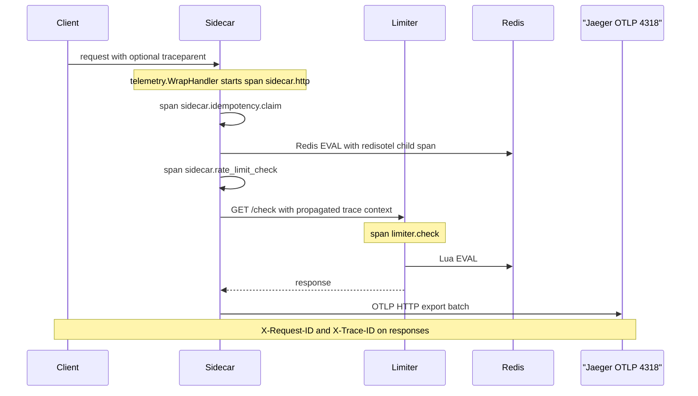

# Tracing Flow

OpenTelemetry spans across sidecar, limiter, Redis, and Jaeger.

```mermaid
sequenceDiagram
    participant C as Client
    participant SC as Sidecar
    participant L as Limiter
    participant R as Redis
    participant J as "Jaeger OTLP 4318"

    C->>SC: request with optional traceparent
    Note over SC: telemetry.WrapHandler starts span sidecar.http
    SC->>SC: span sidecar.idempotency.claim
    SC->>R: Redis EVAL with redisotel child span
    SC->>SC: span sidecar.rate_limit_check
    SC->>L: GET /check with propagated trace context
    Note over L: span limiter.check
    L->>R: Lua EVAL
    L-->>SC: response
    SC->>J: OTLP HTTP export batch

    Note over C,J: X-Request-ID and X-Trace-ID on responses
```
