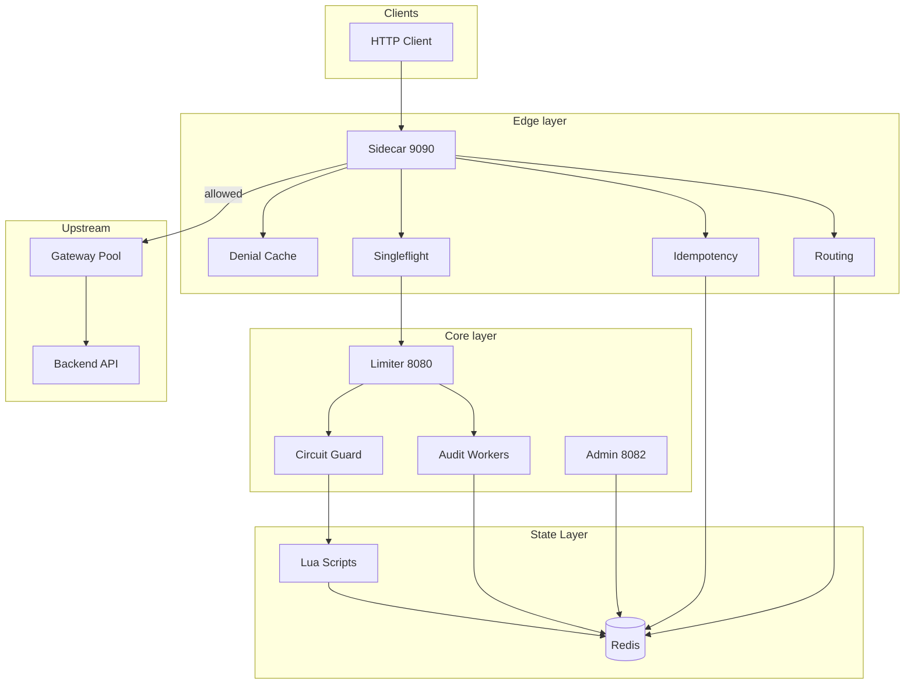

# System Design Discussion. Interview Guide

This is how I would walk through a 45-minute system design interview using this project as the reference implementation. I structure it as phases. requirements, estimates, API, data model, high-level design, deep dives, bottlenecks. the way interviewers actually run the session.

---

## Problem Statement

**Prompt (as I would receive it):**  
*"Design a distributed rate limiting system for a multi-tenant API platform. Clients send HTTP requests through a load balancer to stateless application servers. Enforce per-user and per-tenant limits. Handle duplicate writes safely. The system should degrade gracefully when infrastructure fails."*

**My clarifying questions:**

| Question | Answer I assume |
|----------|-----------------|
| Scale? | ~10k RPS peak, ~1M users, ~10k tenants |
| Consistency? | Strong for quota. no over-admission |
| Latency budget? | <10 ms added p99 at moderate load |
| Algorithms? | Token bucket + optional sliding window |
| Mutating APIs? | POST retries must not double-execute |
| Multi-level limits? | Yes. platform, tenant, user, endpoint |
| Deploy model? | Kubernetes, horizontal pod autoscaling |

**Functional requirements I state back:**

1. Allow or deny each request with remaining quota
2. Hierarchical limits across four dimensions
3. Idempotent replay for POST with `Idempotency-Key`
4. Runtime limit changes without redeploy
5. Audit trail for denials

**Non-functional requirements:**

1. Fail closed on coordination store outage (with documented opt-out)
2. p99 < 10 ms enforcement overhead at ~1k RPS per shard
3. Observable: metrics, traces, searchable audit
4. No per-user metrics cardinality explosion

---

## Why the problem exists

I explain the three failures of naive designs before drawing boxes:

```
Naive in-memory limiter:
  Pod A: user:42 → 99/100
  Pod B: user:42 → 99/100   ← both allow → 101/100 total

Naive Redis GET/SET:
  T1: GET tokens=1
  T2: GET tokens=1
  T1: SET tokens=0, ALLOW
  T2: SET tokens=0, ALLOW   ← should be one ALLOW

Naive allow-cache at edge:
  Cache[user:42] = ALLOW (TTL 30s)
  User sends 10,000 requests → none decrement Redis
```

This frames why I need **shared atomic state** and **denial-only edge caching**.

---

## Design goals

I write these on the virtual whiteboard before components:

| Priority | Goal |
|----------|------|
| P0 | No silent over-admission |
| P0 | Fleet-wide consistent quota |
| P1 | <10 ms p99 at sustainable load |
| P1 | Clear 429 vs 503 semantics |
| P2 | Runtime config changes |
| P2 | Idempotent POST without app changes |
| P3 | Gateway routing under degradation |

---

## Alternative approaches considered

### Phase: High-level options (2 minutes)

| Option | Verdict |
|--------|---------|
| **A. Embedded limiter per app** | Reject. state fragmentation |
| **B. API gateway (Kong/Envoy) only** | Reject for scope. still need shared store for hierarchy + idempotency |
| **C. Central service + sidecar** | **Select**. matches Envoy/Istio mental model |
| **D. Sidecar talks to Redis directly** | Defer. splits quota logic across N sidecar versions |

**My choice:** Option C. central limiter owns algorithms; sidecar is thin proxy.

### Phase: Coordination store

| Store | Verdict |
|-------|---------|
| PostgreSQL | Too slow for hot path |
| etcd | Wrong access pattern for counters |
| **Redis + Lua** | **Select**. atomic scripts, TTL, sub-ms |

---

## Final architecture

### Phase: Back-of-envelope (3 minutes)

```
10k RPS peak
× ~500 bytes per Redis op
≈ 5 MB/s Redis traffic. trivial

~100 bytes per counter key
× 1M active users
≈ 100 MB. fits one Redis master

Bottleneck: Redis single-threaded Lua execution
→ measured knee ~1,000 RPS per pair (my benchmarks)
→ production needs sharding or multiple Redis primaries per tenant shard
```

### Phase: API design (5 minutes)

**Data plane (sidecar-facing):**

```
POST /check
  { "user_id", "capacity", "refill_rate" }
  → { "allowed", "remaining", "retry_after_ms" }

POST /check_hierarchical
  { "tenant_id", "user_id", "endpoint", overrides... }
  → { "allowed", "remaining": { global, tenant, user, endpoint } }
```

**Control plane (admin):**

```
PUT  /admin/overrides/{level}/{id}
GET  /admin/audit/search?tenant=&user=&from=&to=
POST /admin/circuit/reset/{target}
GET  /admin/idempotency/{scope}/{key}
```

**Sidecar (client-facing):**

```
* /*  → proxy with X-User-ID resolution
*     → rate limit check
*     → optional idempotency claim/replay
*     → forward to backend if allowed
```

### Phase: Component diagram (10 minutes)



### Phase: Data model (5 minutes)

| Key pattern | Purpose |
|-------------|---------|
| `rate:{user_id}` | Token bucket hash (tokens, last_refill) |
| `sw:{user_id}` | Sliding window ZSET |
| `rate:global` / `rate:tenant:{id}` / `rate:user:{id}` / `rate:endpoint:{tenant}:{path}` | Hierarchical buckets (`cmd/limiter/main.go`) |
| `config:{level}:{id}` | Runtime override JSON |
| `idem:{scope}:{key}` | Idempotency metadata + response cache |
| `cb:{target}` | Circuit breaker state |
| `route:gw:{id}` | Gateway registry + EMA metrics |
| `audit:event:{id}` | Immutable audit events + ZSET indexes |

See [redis-layout.md](../diagrams/redis-layout.md).

### Phase: Request flow deep dive (10 minutes)

**Happy path (GET, under quota):**

1. Client → sidecar with `X-User-ID`
2. Sidecar checks denial cache → miss
3. Singleflight coalesces concurrent checks for same key
4. HTTP POST to limiter `/check_hierarchical`
5. Limiter checks `cb:redis` → closed → Lua EVAL
6. Lua: refill all four buckets, check all four, deduct if all pass
7. Return `{ allowed: true, remaining: {...} }`
8. Sidecar proxies to backend
9. Audit worker enqueues allow event (async)

**Denied path:**

1. Steps 1 to 6 same, Lua returns `allowed: false`
2. Sidecar returns 429 with `Retry-After`
3. Sidecar caches denial 30 ms
4. Audit enqueues deny event

**Idempotent POST path:**

1. Sidecar extracts `Idempotency-Key`
2. `claim.lua` → claimed | replay | in_progress | hash_mismatch
3. If replay → return cached response, no upstream
4. If claimed → forward, on success `complete.lua` with fence token
5. Concurrent duplicate → 409 until complete

See [request-flow.md](../diagrams/request-flow.md).

---

## Tradeoffs

I state these during the design, not only when asked:

| Decision | Tradeoff |
|----------|----------|
| Central limiter | +consistency, −one network hop |
| Lua atomicity | +correctness, −Redis CPU per hot key |
| Denial-only cache | +safe edge optimization, −allows always hit Redis |
| Fail-closed | +protects upstream, −503 during outage |
| Async audit | +fast hot path, −possible event loss |
| Separate admin port | +security isolation, −two surfaces |

---

## Failure modes

### Phase: "What breaks?" (5 minutes)

| Component fails | Behavior |
|-----------------|----------|
| Redis | Circuit opens → 503; no quota corruption |
| Limiter | Sidecar 503; optional fail-open |
| Sidecar | LB routes to other sidecars |
| Single gateway | Routing fails over to next weight |
| Audit worker saturated | Events dropped; enforcement OK |
| Sentinel failover | Brief write errors; client reconnects |

I mention chaos tests: `chaos/chaos_test.ps1`, `chaos/network_partition.py`.

---

## Operational concerns

### Phase: "How do you run it?" (3 minutes)

- Limiter Deployment (2+ replicas), sidecar as DaemonSet or sidecar container, Redis Sentinel for HA
- Config: Overrides via admin API; env vars for algorithms, cache TTL, circuit thresholds
- Secrets: `INTERNAL_API_KEY`, `ADMIN_API_KEY`. separate rotation
- Dashboards: Allow/deny ratio, redis duration p99, circuit state, audit dropped, routing failovers
- Alerts: `redis.connected=false`, circuit open > 1 min, error rate > 1%, p99 > 100 ms

---

## Performance implications

### Phase: Bottlenecks and scaling (5 minutes)

**Measured (my hardware):**

| Load | Actual RPS | p99 | Errors |
|------|------------|-----|--------|
| Sustainable | 1,000 | <100 ms | 0% |
| Saturated | 1,353 | 3.5 s | 10% |

**Scaling levers I would discuss:**

1. Stateless; Redis is still single-writer for a key
2. Hash tenant_id to shard; sidecar/limiter route by tenant
3. Quota is regional; global limits become approximate or use CRDT (out of scope)
4. Local token bucket with periodic Redis sync; eventual consistency trade
5, not useful for writes; quota checks are read-modify-write

**What I would NOT claim:** linear scaling to 100k RPS on one Redis master.

---

## Lessons learned

### Closing the interview (2 minutes)

**Summary script:**

> I separated data plane from control plane, centralized quota logic in a limiter service with atomic Redis Lua, and used sidecars for edge enforcement without modifying apps. I fail closed by default, cache denials only, and async audit so the hot path stays fast. I benchmarked to ~1k sustainable RPS and know Redis single-threading is the knee. For 10k+ I'd shard by tenant. I have chaos tests proving 503 on Redis death without quota corruption.

**If time permits. extensions I'd mention:**

- Rate limit the admin API itself
- Per-tenant Redis isolation for noisy neighbor containment
- Adaptive cache TTL based on denial rate
- gRPC limiter API for lower overhead than HTTP

**Red flags I avoid saying:**

- "We'd just scale Redis vertically" (without measuring knee)
- "Eventual consistency is fine for billing limits" (not without explicit product approval)
- "Cache allows for performance" (quota bypass)

---

## Related documents

- [Design decisions](./design-decisions.md)
- [Common questions](./common-questions.md)
- [Architecture overview](../architecture/overview.md)
- [Request flow](../architecture/request-flow.md)
- [Hierarchical quotas deep dive](../deep-dives/hierarchical-quotas.md)
